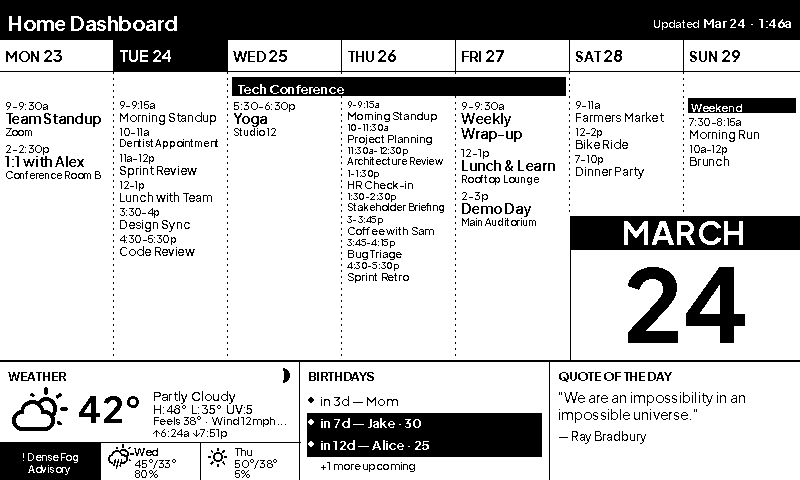
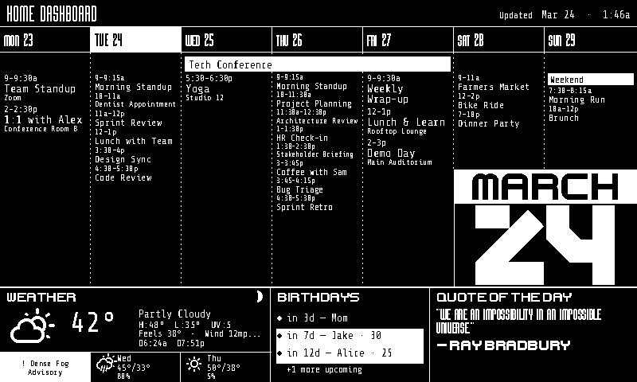
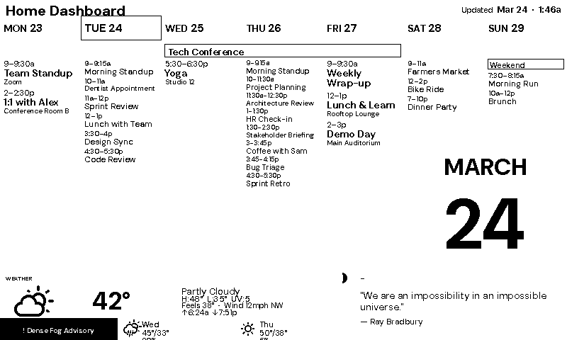
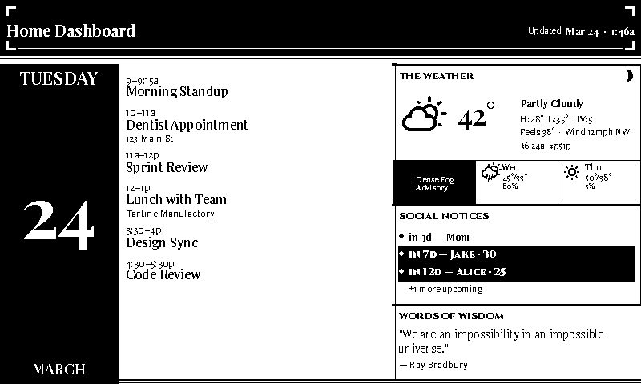
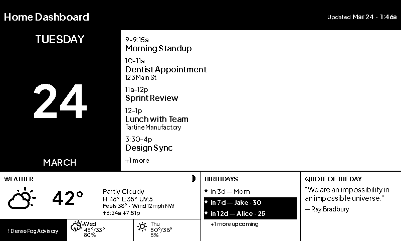
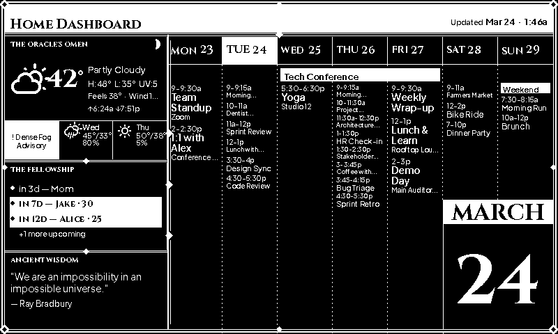
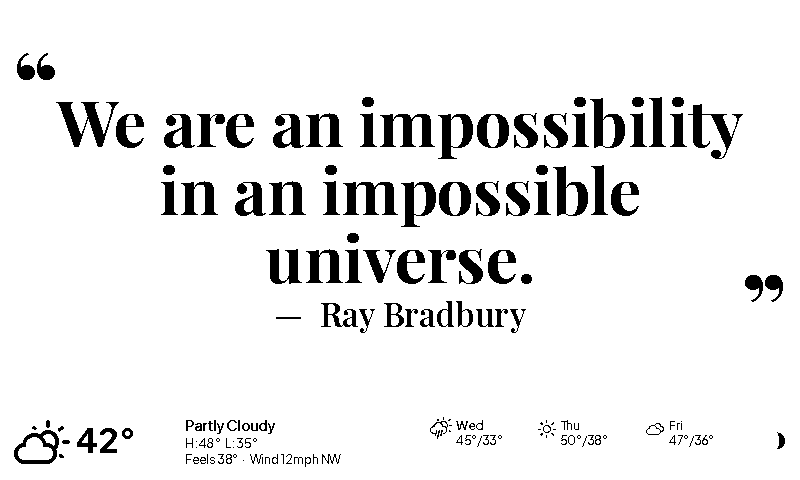
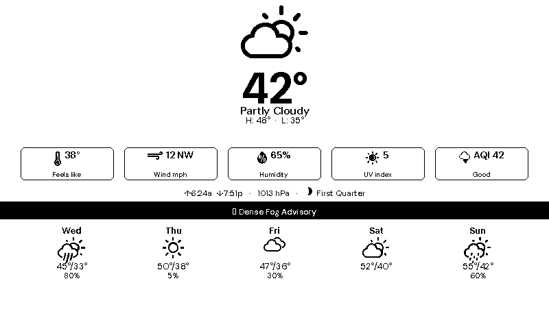
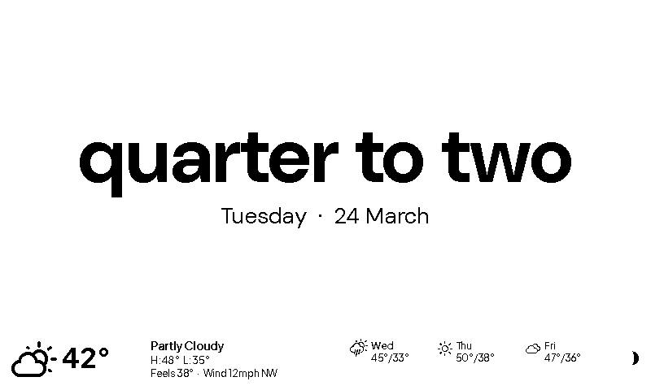

# Home Dashboard

A Python eInk dashboard for Raspberry Pi. Displays your weekly calendar, current weather,
upcoming birthdays, and a daily quote on any supported Waveshare black-and-white eInk
display.



---

## Quick Start

### 1. Clone and install

```bash
git clone https://github.com/gkoch02/Dashboard-v4.git
cd Dashboard-v4
make setup
```

This creates a virtual environment, installs dependencies, and copies the config template
to `config/config.yaml`.

### 2. Configure

Open `config/config.yaml` and fill in the required fields:

```yaml
display:
  model: "epd7in5_V2"          # your Waveshare model (see supported list below)

google:
  service_account_path: "credentials/service_account.json"
  calendar_id: "abc123@group.calendar.google.com"

weather:
  api_key: "your-openweathermap-key"
  latitude: 40.7128
  longitude: -74.0060
  units: "imperial"             # "imperial" (F) or "metric" (C)

timezone: "America/New_York"    # IANA timezone, or "local" for system clock
```

See [Google Calendar Setup](#google-calendar-setup) for how to get a service account and
calendar ID. Get a free weather API key at [openweathermap.org](https://openweathermap.org/api).

### 3. Preview with dummy data

```bash
make dry
```

Opens `output/latest.png` with realistic dummy data. No API keys or hardware needed.

### 4. Preview with live data

```bash
venv/bin/python -m src.main --dry-run --config config/config.yaml
```

Fetches real calendar/weather data and renders to `output/latest.png`.

### 5. Validate your config

```bash
make check
```

Reports errors (must fix) and warnings (may cause issues) in your configuration.

---

## Themes

Switch the entire dashboard layout and visual style with one line in `config.yaml`:

```yaml
theme: terminal   # default | terminal | minimalist | old_fashioned | today | fantasy | qotd | weather | fuzzyclock | random
```

Or override it from the command line without editing your config:

```bash
venv/bin/python -m src.main --dry-run --dummy --theme terminal
```

The `--theme` flag takes precedence over `config.yaml`. All ten values are accepted,
including `random` (which triggers the daily rotation logic as normal).

Themes control component positions, proportions, fonts, and visual style -- not just
colors. Each theme can hide sections, rearrange panels, or use entirely different fonts.

### Random daily rotation

Set `theme: random` to automatically pick a different theme each day:

```yaml
theme: random
```

A theme is chosen once per day on the first refresh after midnight and reused for every
subsequent refresh that day. The selection is persisted to
`output/random_theme_state.json` so restarts mid-day do not re-roll the theme.

Use `random_theme` to control which themes are in the rotation:

```yaml
theme: random
random_theme:
  include: []          # allowlist — only these themes rotate (empty = all themes)
  exclude: []          # denylist — never use these themes
```

**Examples:**

```yaml
# Only rotate among calm, readable themes
random_theme:
  include: ["default", "minimalist", "terminal"]

# Rotate everything except the full-screen quote theme
random_theme:
  exclude: ["qotd"]
```

- `include` is applied first; `exclude` is applied after.
- If both are empty, all 10 themes are eligible.
- If the pool is empty after filtering, the dashboard falls back to `"default"`.
- Run `make check` to catch invalid theme names in either list.

### Built-in themes

#### default

Classic layout. Black text on white. Filled black header, today column, and all-day
event bars. 7-day calendar grid with weather/birthdays/quote along the bottom.


#### terminal

Inverted canvas: **black background** with white text. Compact 34px header. Tighter event
spacing (0.85× scale). Today's column and all-day event bars both pop as white-fill/black-text
blocks. Multi-font typographic system: Share Tech Mono for event body text; Maratype for the
dashboard title, day column headers, and quote body; UESC Display for the month band, section
labels (WEATHER / BIRTHDAYS / QUOTE OF THE DAY), and quote attribution; Synthetic Genesis for
the large today date numeral. The month band font scales down automatically so long names
(FEBRUARY, SEPTEMBER) always fit the cell.



#### minimalist

Bauhaus editorial: form follows function. Ultra-slim 22px header with no fill or border.
The week grid dominates at 358px. Today's column is marked with a subtle outline (no fill).
All-day event bars are outlined, not filled. Events pack to a tight 1.0× grid. A 100px
bottom strip splits asymmetrically: weather at 500px, quote at 300px (labelled with a
single em dash). Section labels are 8pt regular — data leads. No structural borders or
separator lines. DM Sans font. Birthdays panel hidden.



#### old_fashioned

Victorian broadsheet layout. A 70px inverted masthead with white corner-bracket ornaments
and a thin inner frame rule. A triple-rule band separates the masthead from the body. The
left column (490px) shows today's schedule with Playfair Display serif body text. The right
sidebar (310px) stacks three panels — **The Weather**, **Social Notices**, and **Words of
Wisdom** — divided by double horizontal rules with diamond dingbats. A double vertical
column rule with a centre diamond separates the two columns. Cinzel Black Roman caps for
section labels. Double-rule bottom border.



#### today

Single-day focused view. Large inverted date panel on the left, spacious event list on the
right with full time ranges and locations. 60px header, 140px bottom strip. Ideal for a
desk display.



#### fantasy

D&D-inspired aesthetic. Black canvas with Cinzel Bold headers and sword-glyph accents in
the masthead. A 240px left sidebar ("Arcane Tower") stacks three panels — **The Oracle's
Omen** (weather), **The Fellowship** (birthdays), and **Ancient Wisdom** (quote). The
**Quest Log** (week view) fills the right 560px. A thick ornamental double-frame border runs
the full canvas, with concentric diamond corner ornaments at every inner-frame corner.
Triple-line vertical divider between sidebar and quest log with diamond ticks at 1/3, 1/2,
and 2/3 of the body height. Plus Jakarta Sans for event body text.



#### qotd

Quote of the day, full screen. Forgoes the calendar, birthdays, and info panel entirely.
The display is devoted to a single quote in large Playfair Display Bold, centered
typographically. Font size scales automatically — from 64px down to 20px — so the full
quote always fits without truncation. A compact full-width weather banner runs across the
bottom 80px: current conditions, hi/lo, feels-like, wind, a 3-day forecast strip, and
moon phase.



#### weather

Full-screen weather station. Devotes the entire 800×480 canvas to a rich weather display
inspired by iOS Weather and Foreca Weather. The upper two-thirds show current conditions at
a glance — an 80px weather icon, hero temperature in bold 72px DM Sans, description, and
hi/lo line. Below the hero sits a row of metric cards: feels-like, wind speed and direction,
humidity, UV index, and — when a PurpleAir sensor is configured — an AQI card showing the
EPA air quality index and category (Good / Moderate / Unhealthy / etc.). A details bar spans
the full width with sunrise/sunset times, barometric pressure, and moon phase. If an active
weather alert is present it appears as a prominent inverted full-width banner. The lower
third shows a clean five-day forecast grid with icon, hi/lo temperatures, and precipitation
probability for each day. All standard components (header, calendar, birthdays, quote) are
hidden — the display is weather only. Font: DM Sans throughout.



#### fuzzyclock

Natural-language clock. The current time is expressed as a human-readable phrase —
"half past seven", "quarter to nine", "twenty five past eleven" — rendered large and
centred in DM Sans Bold. The day name and date sit below in smaller regular weight. A
compact full-width weather banner fills the bottom 80px (identical to the `qotd` strip:
current conditions, hi/lo, feels-like, wind, 3-day forecast, moon phase). The calendar,
birthdays, and quote panels are hidden entirely.

Time phrases snap to the nearest 5-minute boundary, so the display changes at most twelve
times per hour. The default systemd timer runs every 5 minutes; the image-hash check
ensures no eInk refresh occurs when the phrase hasn't changed.



### Creating your own theme

Two steps -- no changes to any component code:

**1. Create `src/render/themes/<name>.py`:**

```python
from src.render.theme import ComponentRegion, Theme, ThemeLayout, ThemeStyle

def retro_theme() -> Theme:
    return Theme(
        name="retro",
        layout=ThemeLayout(
            canvas_w=800, canvas_h=480,
            header=ComponentRegion(0, 0, 800, 48),
            week_view=ComponentRegion(0, 48, 540, 432),
            weather=ComponentRegion(540, 48, 260, 144),
            birthdays=ComponentRegion(540, 192, 260, 144),
            info=ComponentRegion(540, 336, 260, 144),
        ),
        style=ThemeStyle(
            invert_header=True,
            invert_today_col=True,
            invert_allday_bars=False,
            spacing_scale=1.1,
        ),
    )
```

**2. Register in `src/render/theme.py`:**

Add a clause to `load_theme()` and add the name to `AVAILABLE_THEMES`.

Then preview:

```bash
venv/bin/python -m src.main --dry-run --dummy --config /dev/stdin <<'EOF'
theme: retro
display:
  model: "epd7in5_V2"
weather:
  api_key: "dummy"
  latitude: 40.7
  longitude: -74.0
google:
  service_account_path: "credentials/service_account.json"
  calendar_id: "dummy@group.calendar.google.com"
EOF
```

See the theme reference tables and font customization guide in [`CLAUDE.md`](CLAUDE.md).

---

## Upgrading from v3

v4 is a drop-in upgrade. Your existing credentials and `config.yaml` work without changes.

### Step 1 -- Clone the new repo

```bash
git clone https://github.com/gkoch02/Dashboard-v4.git
cd Dashboard-v4
```

### Step 2 -- Copy your config and credentials

```bash
cp /path/to/Dashboard-v3/config/config.yaml config/config.yaml
cp /path/to/Dashboard-v3/credentials/service_account.json credentials/service_account.json
```

If you had a `config/birthdays.json`, copy that too:

```bash
cp /path/to/Dashboard-v3/config/birthdays.json config/birthdays.json
```

### Step 3 -- Install dependencies

```bash
make setup
```

The dependency list is identical to v3; `make setup` creates a fresh venv.

### Step 4 -- Clear the old cache

Delete v3's output files before the first run to avoid stale cache conflicts:

```bash
rm -f output/calendar_cache.json output/weather_cache.json \
      output/birthday_cache.json output/calendar_sync_state.json \
      output/last_image_hash.txt
```

### Step 5 -- Validate your config

```bash
make check
```

### Step 6 -- Test

```bash
make dry            # renders output/latest.png with dummy data
venv/bin/python -m src.main --dry-run --config config/config.yaml   # live data
```

### Step 7 -- Redeploy to Pi

```bash
make deploy
ssh pi@raspberrypi.local "cd ~/home-dashboard && make setup"
make install        # reinstall systemd timer (unit file has changed)
```

### What's new in v4.1

Your existing config is fully compatible. These are opt-in additions:

| Feature | How to enable |
|---|---|
| **PurpleAir air quality** | Add `purpleair.api_key` and `purpleair.sensor_id` to `config.yaml`; an AQI metric card appears in the `weather` theme |

### What's new in v4

Your existing config is fully compatible. These are opt-in additions:

| Feature | How to enable |
|---|---|
| **Versioning** (`--version` flag) | Run `python -m src.main --version` or `make version` to print the current version |
| **Themes** (9 built-in layouts) | Add `theme: terminal` (or `minimalist`, `old_fashioned`, `today`, `fantasy`, `qotd`, `weather`, `fuzzyclock`) to `config.yaml`, or pass `--theme THEME` on the command line |
| **Random daily theme rotation** | Set `theme: random`; optionally add a `random_theme:` block to include/exclude specific themes |
| **Event filtering** | Add a `filters:` block — hide events by calendar name, keyword, or all-day status |
| **Configurable cache TTLs** | Add a `cache:` block to tune per-source TTL and fetch intervals |
| **Circuit breaker tuning** | `cache.max_failures` and `cache.cooldown_minutes` |
| **API quota warnings** | `google.daily_quota_warning: 500` logs a warning when calls exceed the threshold |
| **`--check-config` flag** | Validate config and exit without running the dashboard |
| **`--force-full-refresh` flag** | Bypass fetch intervals and circuit breaker for a one-off forced refresh |

---

## Google Calendar Setup

The dashboard reads your calendar via a **Google service account** (no interactive login
needed).

### Step 1 -- Create a Google Cloud project

1. Go to [console.cloud.google.com](https://console.cloud.google.com) and sign in
2. Click the project dropdown > **New Project** > name it > **Create**

### Step 2 -- Enable the Calendar API

1. Go to **APIs & Services > Library**
2. Search **Google Calendar API** > **Enable**

### Step 3 -- Create a service account

1. Go to **APIs & Services > Credentials > + Create Credentials > Service account**
2. Name it (e.g. `dashboard-reader`) > **Create and Continue** > **Done**

### Step 4 -- Download the key

1. Click the service account > **Keys** tab > **Add Key > Create new key > JSON**
2. Move the downloaded file to `credentials/service_account.json`

> The `credentials/` directory is git-ignored.

### Step 5 -- Share your calendar

1. Copy the service account email (looks like `dashboard-reader@your-project.iam.gserviceaccount.com`)
2. In [Google Calendar](https://calendar.google.com), click the three-dot menu next to your
   calendar > **Settings and sharing > Share with specific people > + Add people**
3. Paste the email, set permission to **See all event details**, click **Send**

### Step 6 -- Find your Calendar ID

1. In the same calendar settings page, scroll to **Integrate calendar**
2. Copy the **Calendar ID** and paste it into `google.calendar_id` in `config.yaml`

To display events from additional calendars, share them with the same service account
and list their IDs:

```yaml
google:
  additional_calendars:
    - "family@group.calendar.google.com"
    - "work@group.calendar.google.com"
```

---

## Birthday Configuration

Set `birthdays.source` in config to one of three modes:

### `file` (default)

Create `config/birthdays.json`:

```json
[
  {"name": "Alice", "date": "1990-03-20"},
  {"name": "Bob",   "date": "07-04"}
]
```

Use `YYYY-MM-DD` to show age, or `MM-DD` for date only.

### `calendar`

Events containing the keyword `"Birthday"` (configurable via `calendar_keyword`) are
picked up automatically from your Google Calendar.

### `contacts`

Reads birthdays from Google Contacts via the People API. Requires a **Google Workspace**
account with domain-wide delegation:

1. Enable the **People API** in Cloud Console
2. In [Google Workspace Admin](https://admin.google.com) > **Security > API controls >
   Manage domain-wide delegation > Add new**: enter the service account's client ID and
   scope `https://www.googleapis.com/auth/contacts.readonly`
3. Set in `config.yaml`:

```yaml
google:
  contacts_email: "you@yourdomain.com"

birthdays:
  source: "contacts"
```

---

## Raspberry Pi Deployment

### Step 1 -- Enable SPI

```bash
sudo raspi-config
# Interface Options > SPI > Yes > reboot
```

### Step 2 -- Deploy the project

From your development machine:

```bash
make deploy
```

Rsyncs to `~/home-dashboard/` on `pi@raspberrypi.local` by default. Override
the target via Make variables:

```bash
make deploy PI_USER=myuser PI_HOST=mypi.local PI_DIR=~/dashboard
```

### Step 3 -- Set up on the Pi

```bash
sudo apt install swig liblgpio-dev
cd ~/home-dashboard
make setup
venv/bin/pip install -r requirements-pi.txt
```

### Step 4 -- Install Waveshare display drivers

```bash
git clone https://github.com/waveshare/e-Paper ~/e-Paper
cd ~/home-dashboard
venv/bin/pip install ~/e-Paper/RaspberryPi_JetsonNano/python/
venv/bin/python -c "import waveshare_epd; print('OK')"
```

### Step 5 -- Test

```bash
venv/bin/python -m src.main --config config/config.yaml
```

### Step 6 -- Install the systemd timer

> **Note:** The `deploy/dashboard.service` file contains hardcoded paths
> (`/home/pi/home-dashboard`). Edit them if your Pi user or install directory
> differs from the defaults.

```bash
make install
ssh pi@raspberrypi.local "systemctl status dashboard.timer"
```

The timer fires every 5 minutes. The app handles scheduling internally:

| Time window | Behaviour |
|---|---|
| `quiet_hours_start` to `quiet_hours_end` | Process exits immediately -- no fetch, render, or display write |
| First run after quiet hours end | Forces a full eInk refresh |
| All other active hours | eInk refreshed only when image content changes (hash check); API calls gated by per-source fetch intervals |

Configure quiet hours:

```yaml
schedule:
  quiet_hours_start: 23   # 11 PM
  quiet_hours_end: 6      # 6 AM
```

---

## Supported Displays

| Model | Resolution | Notes |
|---|---|---|
| `epd7in5` | 640x384 | V1 (older) |
| `epd7in5_V2` | 800x480 | **Default / recommended** |
| `epd7in5_V3` | 800x480 | V3 variant |
| `epd7in5b_V2` | 800x480 | B/W/Red model -- renders B&W only |
| `epd7in5_HD` | 880x528 | HD variant |
| `epd9in7` | 1200x825 | 9.7 inch |
| `epd13in3k` | 1600x1200 | 13.3 inch |

Set `display.model` in `config.yaml`. Width and height are derived automatically from the
model. The dashboard renders at 800x480 base resolution and scales to the display's native
resolution via LANCZOS resampling.

---

## Hardware

### Bill of materials

A minimal build (Pi Zero 2 W + 7.5" display) costs approximately **$65--75**.

| Component | Recommended | Price |
|---|---|---|
| **Raspberry Pi** | [Pi Zero 2 WH](https://www.raspberrypi.com/products/raspberry-pi-zero-2-w/) (with headers) | ~$15 |
| **eInk display** | [Waveshare 7.5" HAT V2](https://www.waveshare.com/7.5inch-e-paper-hat.htm) (800x480) | ~$30--35 |
| **MicroSD card** | 32 GB Class 10 / A1 | ~$8--10 |
| **Power supply** | 5V 2.5A micro-USB (or USB-C for Pi 4) | ~$8--12 |

Optional: picture frame, 3D-printed stand, short USB cable for routing inside an enclosure.

---

## Advanced Configuration

### Full config reference

All fields are optional. Missing fields use defaults shown below.

```yaml
display:
  model: "epd7in5_V2"             # Waveshare model name
  # width: 800                    # override auto-derived width
  # height: 480                   # override auto-derived height
  enable_partial_refresh: false    # use partial eInk refresh (faster, lower quality)
  max_partials_before_full: 6     # partial refreshes before forcing a full one
  week_days: 7                    # number of days in the week view
  show_weather: true
  show_birthdays: true
  show_info_panel: true

google:
  service_account_path: "credentials/service_account.json"
  calendar_id: "primary"
  additional_calendars: []
  # contacts_email: "you@yourdomain.com"  # required for birthdays.source: "contacts"
  daily_quota_warning: 500         # log warning when daily API calls exceed this

weather:
  api_key: ""
  latitude: 0.0
  longitude: 0.0
  units: "imperial"                # "imperial", "metric", or "standard"

purpleair:                         # optional — adds AQI card to the weather theme
  api_key: ""                      # get a free key at develop.purpleair.com
  sensor_id: 0                     # find at map.purpleair.com (click sensor → URL)

birthdays:
  source: "file"                   # "file", "calendar", or "contacts"
  file_path: "config/birthdays.json"
  calendar_keyword: "Birthday"
  lookahead_days: 30

schedule:
  quiet_hours_start: 23            # hour (0-23)
  quiet_hours_end: 6               # hour (0-23)

timezone: "local"                  # IANA name or "local"
title: "Home Dashboard"            # text shown in the header bar
theme: "default"                   # default | terminal | minimalist | old_fashioned | today | fantasy | qotd | weather | fuzzyclock | random

random_theme:                      # only used when theme: random
  include: []                      # allowlist (empty = all themes eligible)
  exclude: []                      # denylist (e.g. ["fantasy", "qotd"])

purpleair:
  api_key: ""
  sensor_id: 0

cache:
  weather_ttl_minutes: 60          # data older than 4x TTL is discarded
  events_ttl_minutes: 120
  birthdays_ttl_minutes: 1440
  air_quality_ttl_minutes: 30
  weather_fetch_interval: 30       # skip API call if cache is younger
  events_fetch_interval: 120
  birthdays_fetch_interval: 1440
  air_quality_fetch_interval: 15
  max_failures: 3                  # circuit breaker: failures before tripping
  cooldown_minutes: 30             # circuit breaker: wait before probing

filters:
  exclude_calendars: []            # case-insensitive substring match
  exclude_keywords: []             # case-insensitive match against event summary
  exclude_all_day: false

output:
  dry_run_dir: "output"

logging:
  level: "INFO"
```

### Cache and staleness

Cached data progresses through four levels based on age relative to its TTL:

| Level | Age vs TTL | Behaviour |
|---|---|---|
| **FRESH** | <= TTL | Normal display |
| **AGING** | 1--2x TTL | Normal display |
| **STALE** | 2--4x TTL | Header shows "! Stale" indicator |
| **EXPIRED** | > 4x TTL | Data discarded, not displayed |

### Fetch intervals

Each data source has an independent fetch interval. When cached data is younger than the
interval, the API call is skipped entirely. This reduces API quota usage significantly.

| Source | Default interval | Default TTL |
|---|---|---|
| Weather | 30 min | 60 min |
| Calendar events | 120 min | 120 min |
| Birthdays | 1440 min (24h) | 1440 min |
| Air quality (PurpleAir) | 15 min | 30 min |

### Event filtering

```yaml
filters:
  exclude_calendars: ["US Holidays", "Spam Calendar"]
  exclude_keywords: ["OOO", "Focus Time", "Block"]
  exclude_all_day: false
```

Filters use case-insensitive substring matching. Filtered events remain in cache for
incremental sync correctness -- they are only hidden at render time.

### Circuit breaker

After 3 consecutive failures (configurable), a source is "tripped" and goes straight to
cache on subsequent runs. After the cooldown period, a single probe request is sent. If it
succeeds, normal fetching resumes.

### Conditional display refresh

The dashboard computes a SHA-256 hash of each rendered image and compares it to the
previous render. When nothing has changed (common overnight or on quiet days), the eInk
refresh is skipped entirely. This extends display lifespan and saves power.
`--force-full-refresh` bypasses this check.

### Incremental calendar sync

After the first full sync, subsequent fetches download only changed events using Google
Calendar sync tokens. This dramatically reduces API quota usage. Sync state is persisted
to `output/calendar_sync_state.json`.

---

## Development

### Prerequisites

- **Python 3.9+**
- **git**
- **make** (pre-installed on macOS/Linux; use WSL on Windows)

### Makefile targets

| Command | What it does |
|---|---|
| `make setup` | Create venv, install dependencies, create config from template |
| `make dry` | Render with dummy data to `output/latest.png` |
| `make test` | Run `pytest tests/ -v` (850+ tests across 34 files) |
| `make check` | Validate config file and exit |
| `make version` | Print the current version (e.g. `main.py 4.1.0`) |
| `make deploy` | rsync project to Raspberry Pi (`PI_USER`, `PI_HOST`, `PI_DIR` configurable) |
| `make install` | Copy systemd timer/service to Pi and enable |

### CLI flags

| Flag | Description |
|---|---|
| `--dry-run` | Save to PNG instead of writing to display |
| `--dummy` | Use built-in dummy data (no API calls needed) |
| `--config PATH` | Config file path (default: `config/config.yaml`) |
| `--theme THEME` | Override the theme set in `config.yaml`. Choices: `default`, `terminal`, `minimalist`, `old_fashioned`, `today`, `fantasy`, `qotd`, `weather`, `fuzzyclock`, `random` |
| `--date YYYY-MM-DD` | Override today's date for the dry-run preview (requires `--dry-run`) |
| `--force-full-refresh` | Force full eInk refresh; bypasses fetch intervals and circuit breaker |
| `--check-config` | Validate config and exit |
| `--version` | Print version and exit |

### Offline development

```bash
venv/bin/python -m src.main --dry-run --dummy
```

No API keys, credentials, or hardware needed. Renders to `output/latest.png`.

### Linting

```bash
flake8 src/ tests/ --max-line-length=100
```

---

## Project Structure

```
Dashboard-v4/
├── config/
│   ├── config.example.yaml       # Configuration template
│   └── quotes.json               # Daily quote pool (125 entries)
├── credentials/                  # Git-ignored -- Google service account JSON
├── deploy/
│   ├── dashboard.service         # Systemd service unit
│   └── dashboard.timer           # Systemd timer (fires every 5 min)
├── fonts/                        # Bundled TTF fonts
├── output/                       # Mostly git-ignored
│   └── latest.png                # Latest dry-run preview (tracked)
├── src/
│   ├── main.py                   # CLI entry point + fetcher orchestration
│   ├── _version.py               # Version constant (__version__ = "4.1.0")
│   ├── config.py                 # YAML -> typed Config dataclass + validation
│   ├── dummy_data.py             # Realistic dummy data for --dummy / dev previews
│   ├── filters.py                # Event filtering (calendar, keyword, all-day)
│   ├── data/
│   │   └── models.py             # Pure dataclasses (no I/O)
│   ├── display/
│   │   ├── driver.py             # DisplayDriver ABC, DryRunDisplay, WaveshareDisplay
│   │   └── refresh_tracker.py    # Partial vs full refresh state
│   ├── fetchers/
│   │   ├── calendar.py           # Google Calendar + incremental sync + birthdays
│   │   ├── weather.py            # OpenWeatherMap (current + forecast + alerts + UV)
│   │   ├── purpleair.py          # PurpleAir sensor → PM2.5 / AQI
│   │   ├── cache.py              # Per-source JSON cache with TTL staleness
│   │   ├── circuit_breaker.py    # Per-source circuit breaker
│   │   └── quota_tracker.py      # Daily API call counter
│   └── render/
│       ├── canvas.py             # Top-level render orchestrator (theme-driven)
│       ├── theme.py              # Theme system (ComponentRegion, ThemeLayout, ThemeStyle)
│       ├── random_theme.py       # Daily random theme selection + persistence
│       ├── layout.py             # Default pixel geometry constants
│       ├── fonts.py              # Font loader with @lru_cache
│       ├── icons.py              # OWM icon code -> Weather Icons glyph
│       ├── moon.py               # Pure-math moon phase calculator
│       ├── primitives.py         # Shared draw helpers (truncation, wrapping, fmt_time, events_for_day, deg_to_compass)
│       ├── themes/               # Built-in theme factories
│       │   ├── terminal.py
│       │   ├── minimalist.py
│       │   ├── old_fashioned.py
│       │   ├── today.py
│       │   ├── fantasy.py
│       │   ├── qotd.py
│       │   ├── weather.py
│       │   └── fuzzyclock.py
│       └── components/           # One file per UI region
│           ├── header.py
│           ├── week_view.py
│           ├── weather_panel.py
│           ├── weather_full.py
│           ├── birthday_bar.py
│           ├── today_view.py
│           ├── info_panel.py
│           ├── qotd_panel.py
│           └── fuzzyclock_panel.py
├── tests/                        # 34 test files, 850+ tests
├── Makefile
├── requirements.txt              # Core dependencies
└── requirements-pi.txt           # Raspberry Pi hardware dependencies
```

---

## Typography

| Font | Used for |
|---|---|
| [Plus Jakarta Sans](https://fonts.google.com/specimen/Plus+Jakarta+Sans) | Default UI text (all themes) |
| [Weather Icons](https://erikflowers.github.io/weather-icons/) | Weather condition icons + moon phase glyphs |
| [Share Tech Mono](https://fonts.google.com/specimen/Share+Tech+Mono) | `terminal` theme — event body text |
| Maratype | `terminal` theme — dashboard title, day column headers, quote body |
| UESC Display | `terminal` theme — month band, section labels, quote attribution |
| Synthetic Genesis | `terminal` theme — large today date numeral |
| [DM Sans](https://fonts.google.com/specimen/DM+Sans) | `minimalist` theme; `weather` theme; `fuzzyclock` theme |
| [Playfair Display](https://fonts.google.com/specimen/Playfair+Display) | `old_fashioned` theme; `qotd` quote text |
| [Cinzel](https://fonts.google.com/specimen/Cinzel) | `fantasy` theme |

Custom fonts can be added per-theme via `ThemeStyle` font callables -- see
[Creating your own theme](#creating-your-own-theme) and [`CLAUDE.md`](CLAUDE.md).

---

## Dependencies

### Core (all platforms)

- [Pillow](https://pillow.readthedocs.io/) -- image rendering
- [google-api-python-client](https://googleapis.github.io/google-api-python-client/) -- Google Calendar and Contacts APIs
- [google-auth](https://google-auth.readthedocs.io/) -- service account authentication
- [requests](https://requests.readthedocs.io/) -- OpenWeatherMap API
- [PyYAML](https://pyyaml.org/) -- configuration parsing

### Raspberry Pi only

- [RPi.GPIO](https://pypi.org/project/RPi.GPIO/) -- GPIO pin control
- [spidev](https://pypi.org/project/spidev/) -- SPI communication with display
