← [README](../README.md) · [Themes](themes.md)

# Inky Previews

Every built-in theme rendered for the **Inky Impression 7.3"** (Spectra 6) — the
same catalog as [Themes](themes.md), mapped to the panel's six inks instead of
black and white.

- [How color is assigned](#how-color-is-assigned)
- [Theme previews](#theme-previews)
  - [Week-view themes](#week-view-themes)
  - [Full-screen focused themes](#full-screen-focused-themes)
  - [Specialized themes](#specialized-themes)
  - [Dithered art themes](#dithered-art-themes)
  - [Utility themes](#utility-themes)
- [Regenerating these images](#regenerating-these-images)

---

## How color is assigned

Themes are authored in black and white. Nothing in a theme file names an RGB
value — color is applied at render time, only when `display.provider: inky`, in
two layers:

**Semantic accent roles** carry the same meaning everywhere, and default to:

| Role | Ink | Typical use |
|---|---|---|
| `accent_info` | blue | neutral status, secondary readings |
| `accent_warn` | yellow | caution thresholds |
| `accent_alert` | red | weather alerts, unhealthy AQI, the event in progress |
| `accent_good` | green | healthy or nominal values |

A theme may override any of those four for its own plate; where one does, the
entry below says so. `qotd` is the only one today — it takes green for
`accent_info`.

**A per-theme accent pair** — `(primary, secondary)` — carries whatever that
theme wants emphasized: the sun ring on `halftone`, the red rules on `almanac`,
the green phosphor on `terminal`. The pair is usually the one registered beside
the theme, but an explicit `ThemeStyle.accent_primary` / `accent_secondary`
wins over it — so each entry names what the theme *resolves* to, not what it
registers. (`qotd` registers a red primary and then overrides it to blue.)
`make docs-check` recomputes every line below from the theme modules and fails
when one goes stale.

Everything else falls back to black on white, so a theme with no color story
still reads correctly on the panel.

> **Note:** these are PNGs on a computer, not photographs of hardware. They go
> through the dashboard's real limited-palette render path, so the ink
> assignments are accurate — but a physical Spectra 6 panel is lower-contrast
> and warmer than your monitor.

---

## Theme previews

### Week-view themes

#### default

Accents: **blue** primary, **red** secondary · [description in Themes ↗](themes.md#default)

[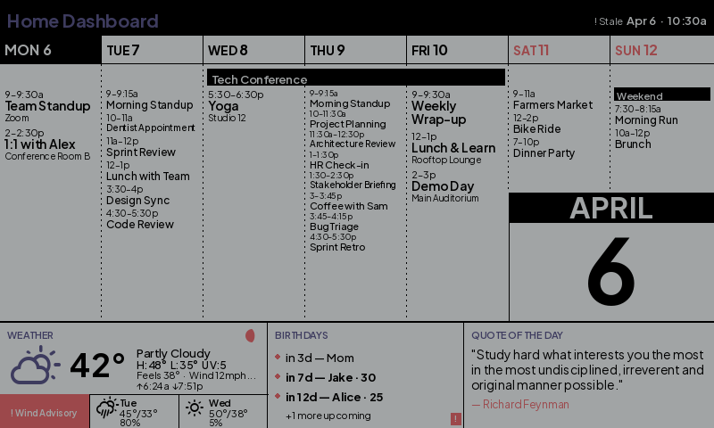](../assets/previews/theme_default_inky.png)

#### agenda

Accents: **red** primary, **black** secondary · [description in Themes ↗](themes.md#agenda)

[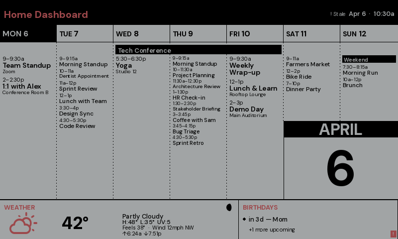](../assets/previews/theme_agenda_inky.png)

#### terminal

Accents: **green** primary, **yellow** secondary · [description in Themes ↗](themes.md#terminal)

[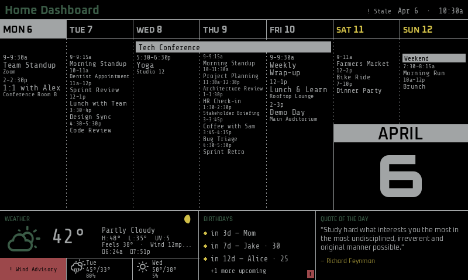](../assets/previews/theme_terminal_inky.png)

#### minimalist

Accents: **blue** primary, **red** secondary · [description in Themes ↗](themes.md#minimalist)

[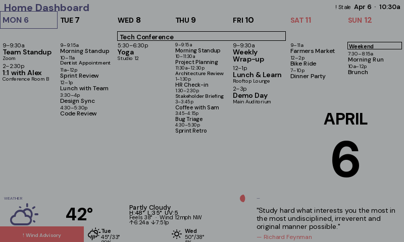](../assets/previews/theme_minimalist_inky.png)

#### old_fashioned

Accents: **red** primary, **yellow** secondary · [description in Themes ↗](themes.md#old_fashioned)

[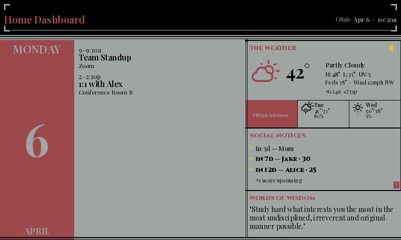](../assets/previews/theme_old_fashioned_inky.png)

#### today

Accents: **blue** primary, **red** secondary · [description in Themes ↗](themes.md#today)

[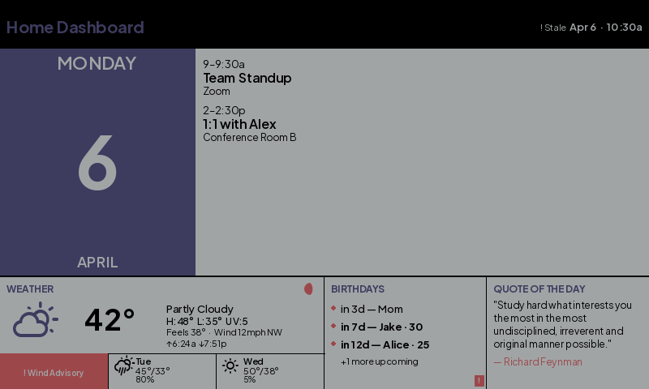](../assets/previews/theme_today_inky.png)

#### fantasy

Accents: **red** primary, **yellow** secondary · [description in Themes ↗](themes.md#fantasy)

[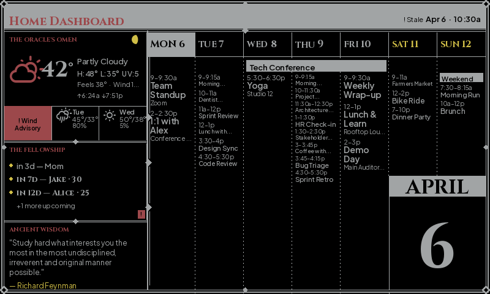](../assets/previews/theme_fantasy_inky.png)

### Full-screen focused themes

#### qotd

Accents: **blue** primary, **blue** secondary · overrides `accent_info` → green · [description in Themes ↗](themes.md#qotd)

[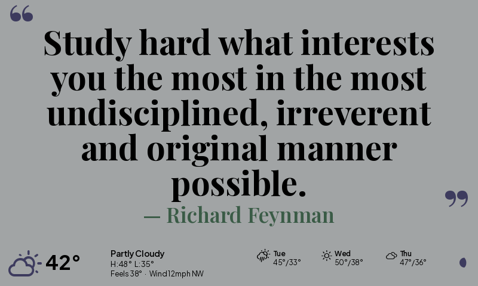](../assets/previews/theme_qotd_inky.png)

#### qotd_invert

Accents: **yellow** primary, **red** secondary · [description in Themes ↗](themes.md#qotd_invert)

[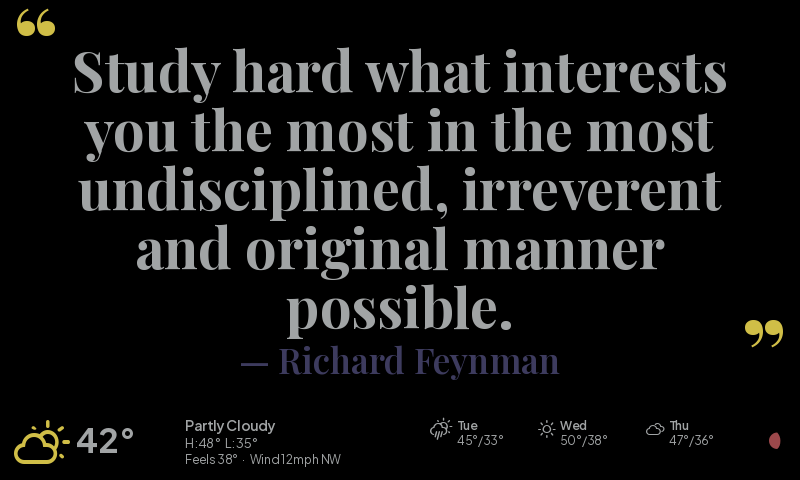](../assets/previews/theme_qotd_invert_inky.png)

#### weather

Accents: **blue** primary, **yellow** secondary · [description in Themes ↗](themes.md#weather)

[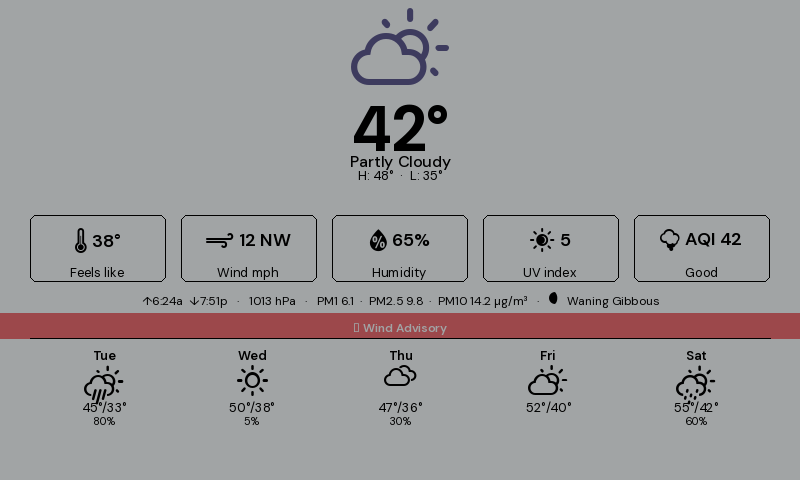](../assets/previews/theme_weather_inky.png)

#### fuzzyclock

Accents: **yellow** primary, **blue** secondary · [description in Themes ↗](themes.md#fuzzyclock)

[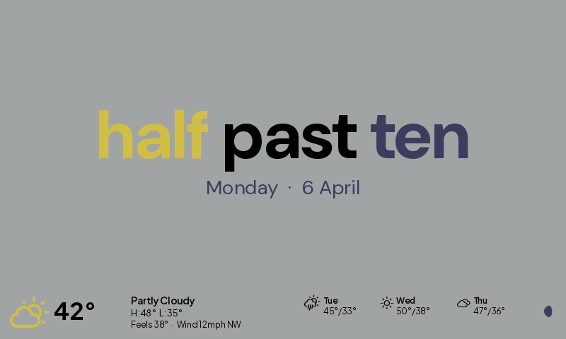](../assets/previews/theme_fuzzyclock_inky.png)

#### fuzzyclock_invert

Accents: **yellow** primary, **blue** secondary · [description in Themes ↗](themes.md#fuzzyclock_invert)

[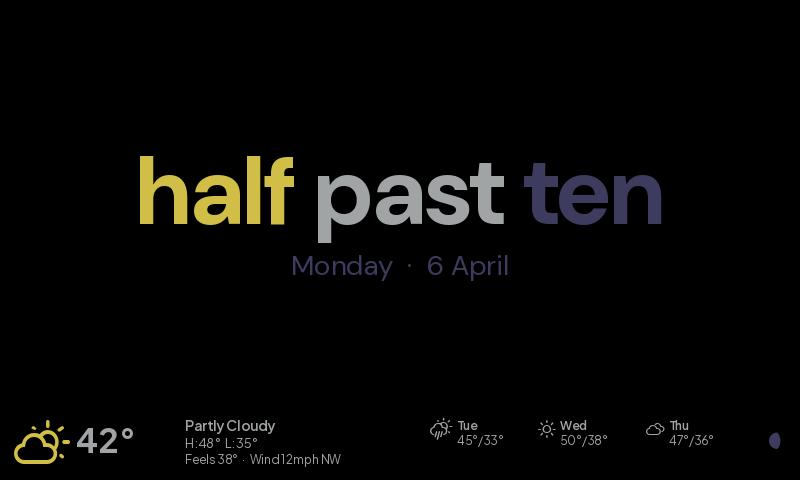](../assets/previews/theme_fuzzyclock_invert_inky.png)

#### moonphase

Accents: **blue** primary, **yellow** secondary · [description in Themes ↗](themes.md#moonphase)

[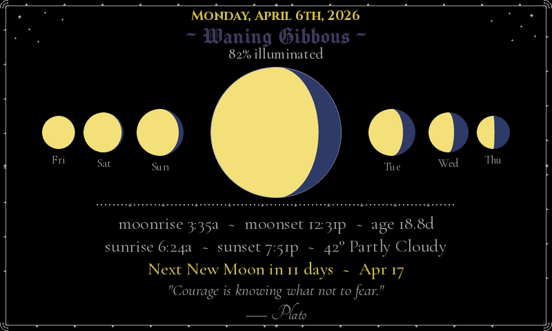](../assets/previews/theme_moonphase_inky.png)

#### moonphase_invert

Accents: **yellow** primary, **blue** secondary · [description in Themes ↗](themes.md#moonphase_invert)

[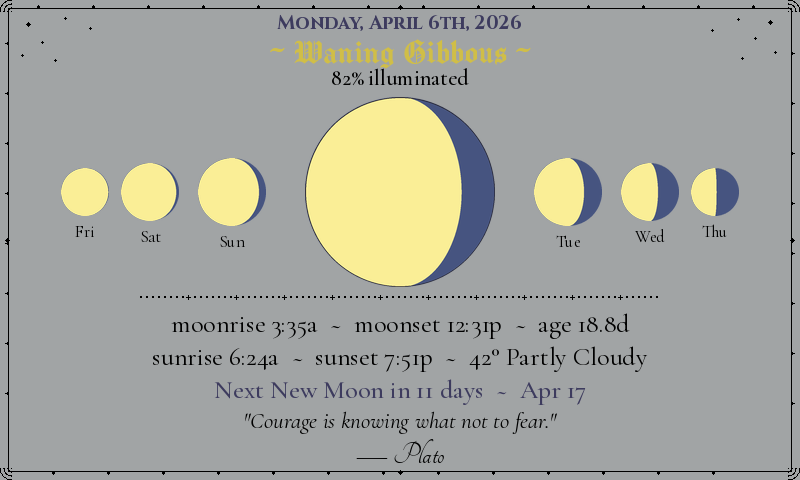](../assets/previews/theme_moonphase_invert_inky.png)

#### moonphase_photo

Accents: **blue** primary, **yellow** secondary · [description in Themes ↗](themes.md#moonphase_photo)

[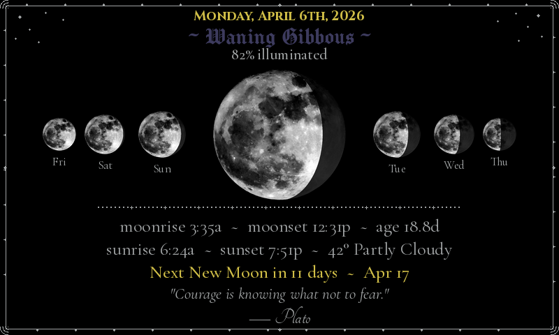](../assets/previews/theme_moonphase_photo_inky.png)

#### photo

Accents: **blue** primary, **red** secondary · [description in Themes ↗](themes.md#photo)

[](../assets/previews/theme_photo_inky.png)

### Specialized themes

#### air_quality

Accents: **blue** primary, **green** secondary · [description in Themes ↗](themes.md#air_quality)

[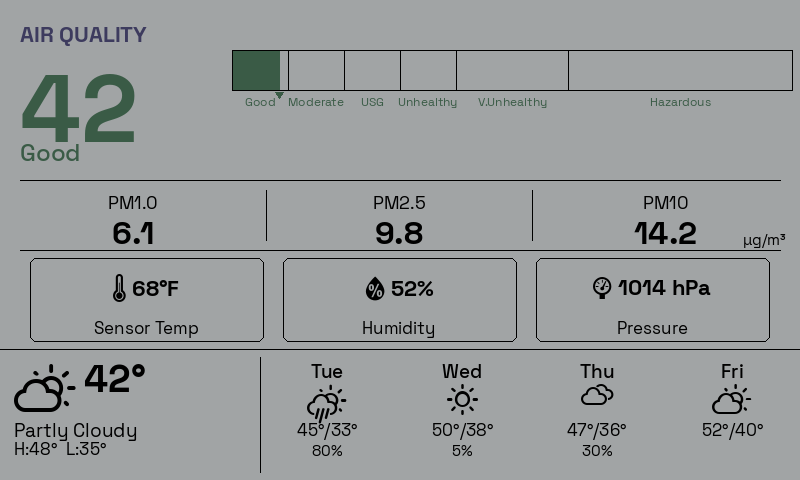](../assets/previews/theme_air_quality_inky.png)

#### almanac

Accents: **red** primary, **black** secondary · [description in Themes ↗](themes.md#almanac)

[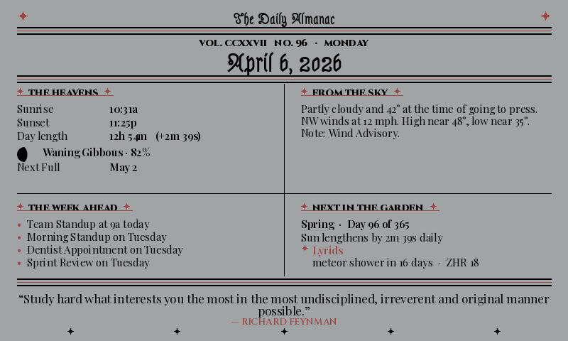](../assets/previews/theme_almanac_inky.png)

#### astronomy

Accents: **blue** primary, **yellow** secondary · [description in Themes ↗](themes.md#astronomy)

[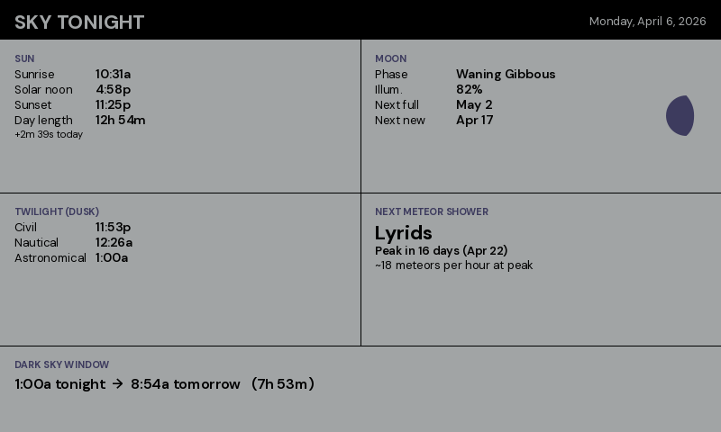](../assets/previews/theme_astronomy_inky.png)

#### constellation_map

Accents: **yellow** primary, **blue** secondary · [description in Themes ↗](themes.md#constellation_map)

[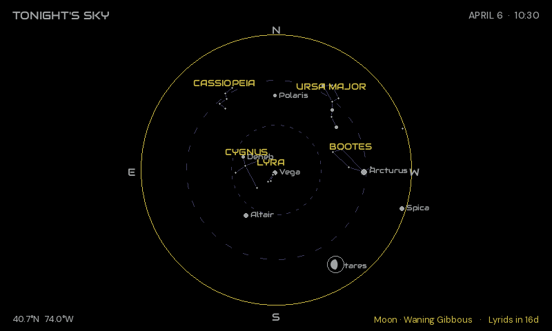](../assets/previews/theme_constellation_map_inky.png)

#### day_arc

Accents: **yellow** primary, **red** secondary · [description in Themes ↗](themes.md#day_arc)

[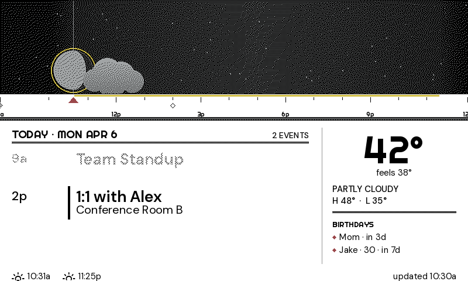](../assets/previews/theme_day_arc_inky.png)

#### halftone

Accents: **black** primary, **yellow** secondary · [description in Themes ↗](themes.md#halftone)

[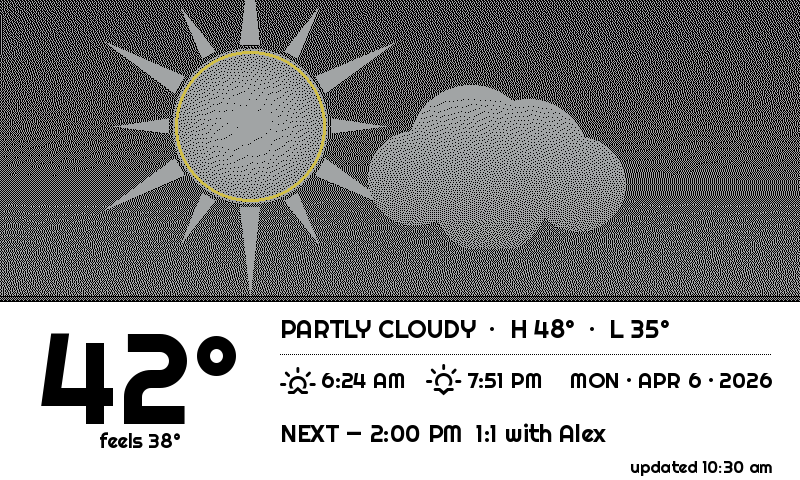](../assets/previews/theme_halftone_inky.png)

#### halftone_agenda

Accents: **yellow** primary, **red** secondary · [description in Themes ↗](themes.md#halftone_agenda)

[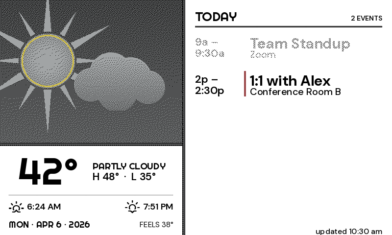](../assets/previews/theme_halftone_agenda_inky.png)

#### timeline

Accents: **blue** primary, **red** secondary · [description in Themes ↗](themes.md#timeline)

[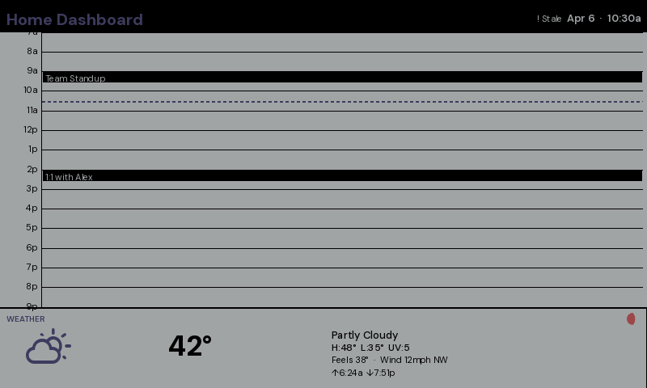](../assets/previews/theme_timeline_inky.png)

#### trends

Accents: **blue** primary, **yellow** secondary · [description in Themes ↗](themes.md#trends)

[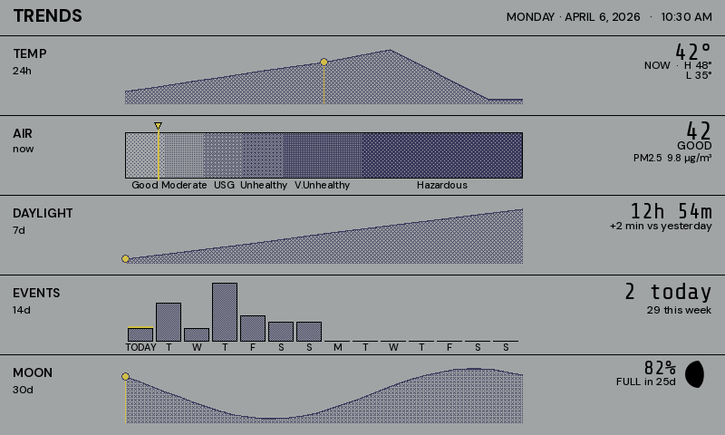](../assets/previews/theme_trends_inky.png)

#### year_pulse

Accents: **green** primary, **blue** secondary · [description in Themes ↗](themes.md#year_pulse)

[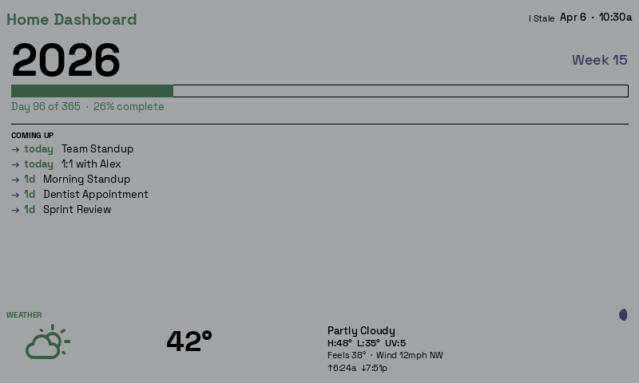](../assets/previews/theme_year_pulse_inky.png)

#### monthly

Accents: **yellow** primary, **red** secondary · [description in Themes ↗](themes.md#monthly)

[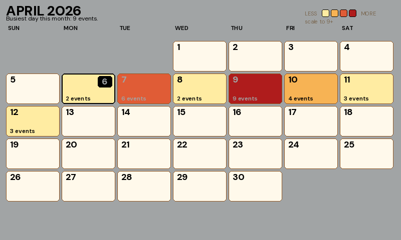](../assets/previews/theme_monthly_inky.png)

#### sunrise

Accents: **yellow** primary, **red** secondary · [description in Themes ↗](themes.md#sunrise)

[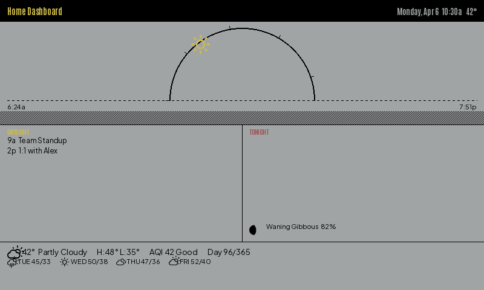](../assets/previews/theme_sunrise_inky.png)

#### light_cycle

Accents: **yellow** primary, **blue** secondary · [description in Themes ↗](themes.md#light_cycle)

[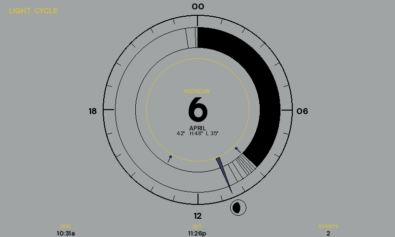](../assets/previews/theme_light_cycle_inky.png)

#### scorecard

Accents: **red** primary, **blue** secondary · [description in Themes ↗](themes.md#scorecard)

[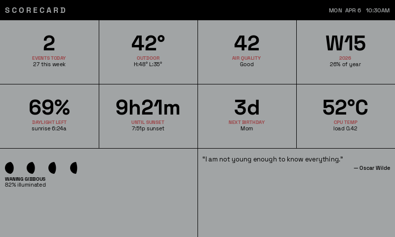](../assets/previews/theme_scorecard_inky.png)

#### tides

Accents: **blue** primary, **yellow** secondary · [description in Themes ↗](themes.md#tides)

[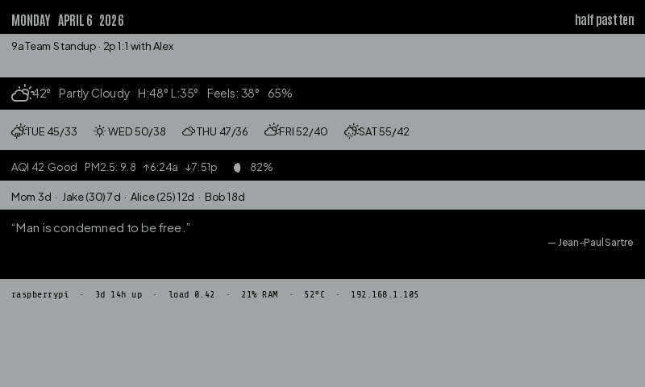](../assets/previews/theme_tides_inky.png)

#### weatherglass

Accents: **yellow** primary, **red** secondary · [description in Themes ↗](themes.md#weatherglass)

[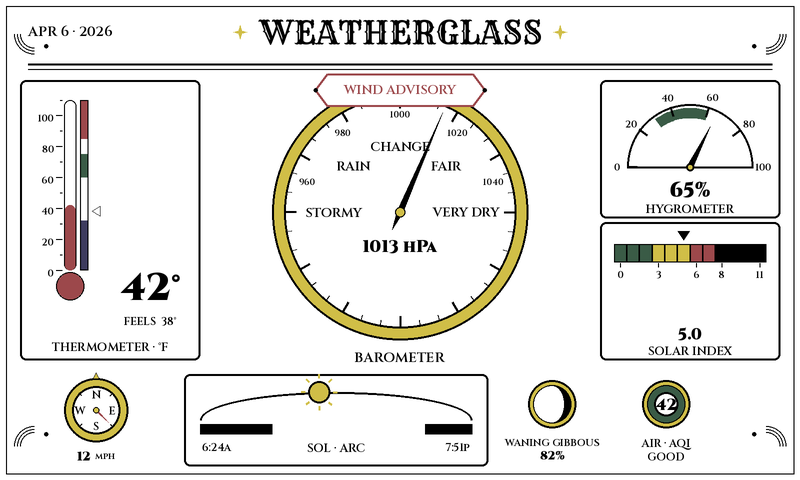](../assets/previews/theme_weatherglass_inky.png)

### Dithered art themes

#### postcard

Accents: **red** primary, **black** secondary · [description in Themes ↗](themes.md#postcard)

[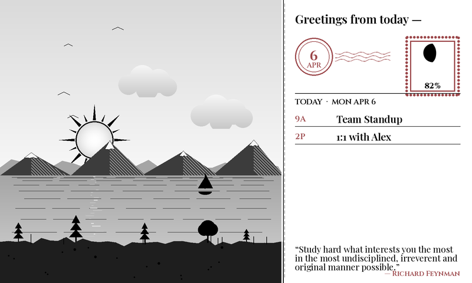](../assets/previews/theme_postcard_inky.png)

#### naturalist

Accents: **red** primary, **black** secondary · [description in Themes ↗](themes.md#naturalist)

[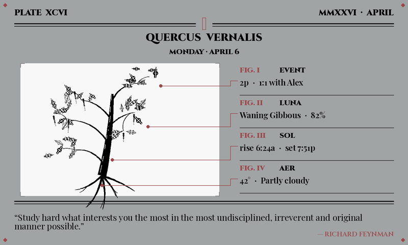](../assets/previews/theme_naturalist_inky.png)

### Utility themes

#### countdown

Accents: **red** primary, **blue** secondary · [description in Themes ↗](themes.md#countdown)

[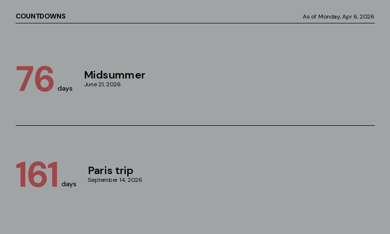](../assets/previews/theme_countdown_inky.png)

#### message

Accents: **red** primary, **blue** secondary · [description in Themes ↗](themes.md#message)

[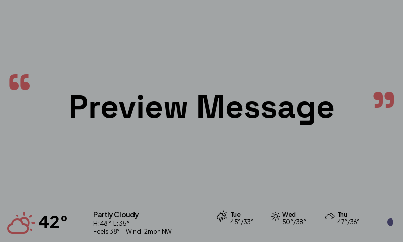](../assets/previews/theme_message_inky.png)

#### diags

Accents: **green** primary, **blue** secondary · [description in Themes ↗](themes.md#diags)

[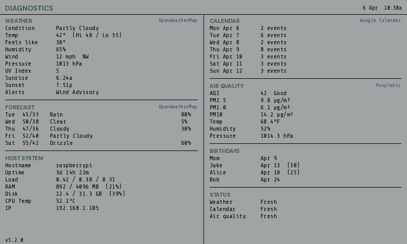](../assets/previews/theme_diags_inky.png)

---

## Regenerating these images

```bash
make previews-inky
```

That writes `assets/previews/theme_<name>_inky.png` for every registered theme.
See [Previews](previews.md#inky-color-preview-set) for the flags, the pinned
render date, and how to render a single theme.

For the monochrome Waveshare catalog and the per-theme descriptions, see
[Themes](themes.md).
