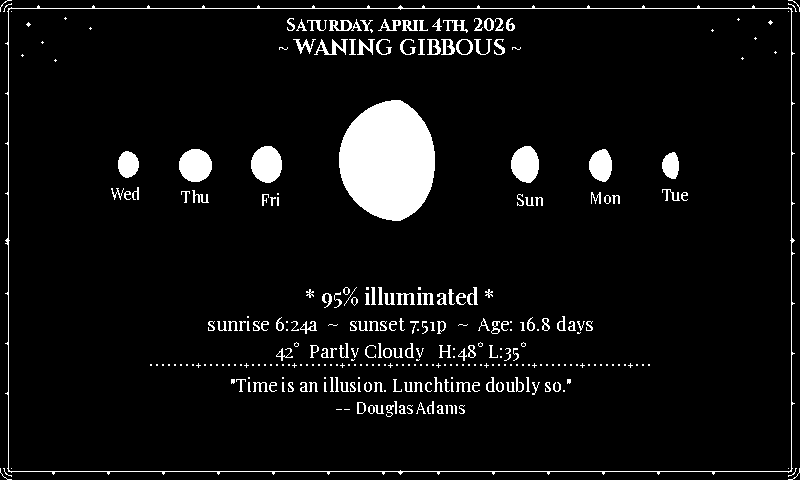
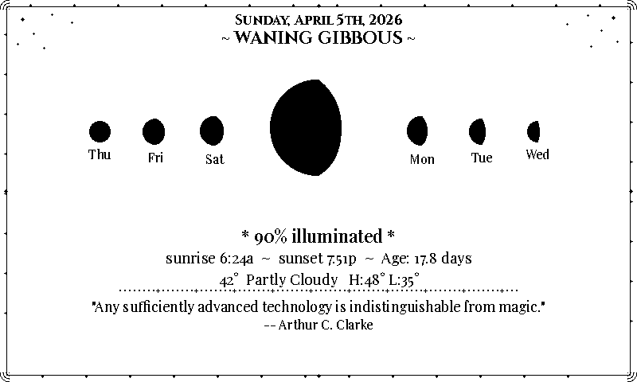
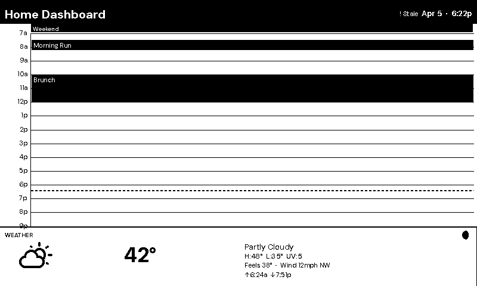
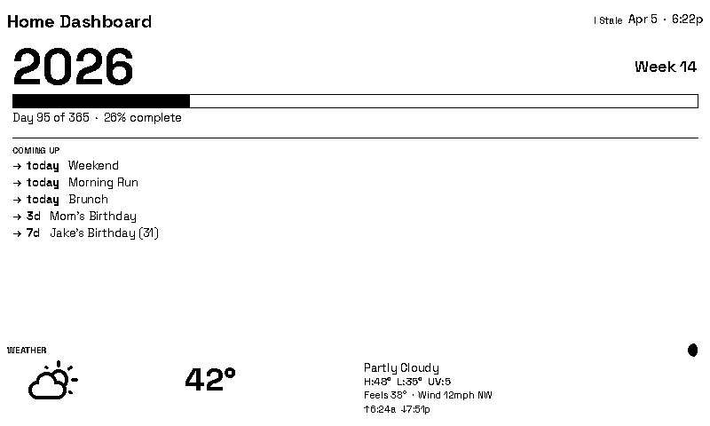
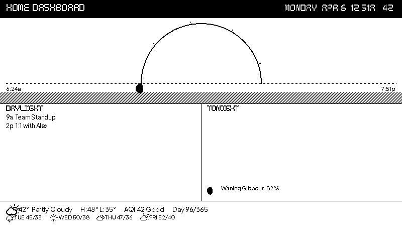
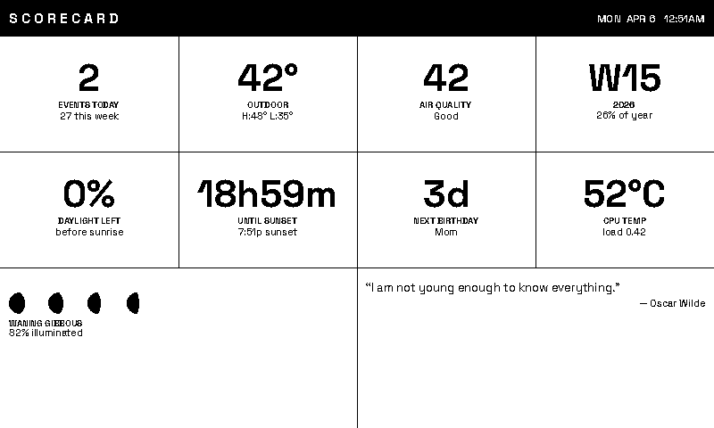
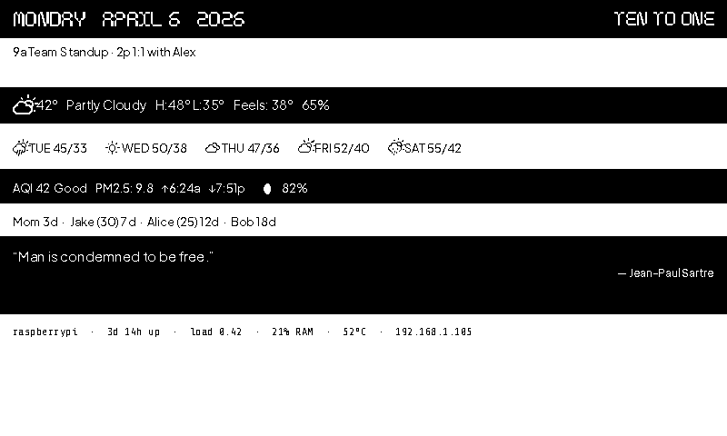
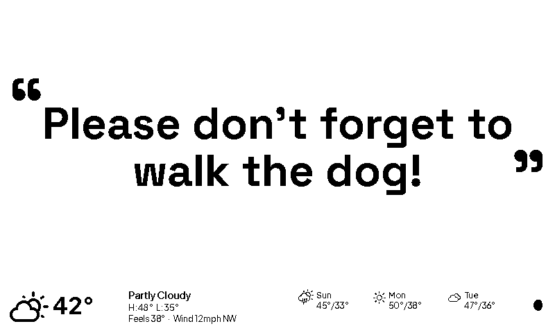

← [README](../README.md)

# Themes

- [Switching themes](#switching-themes)
- [Random rotation](#random-rotation)
- [Time-of-day theme schedule](#time-of-day-theme-schedule)
- [Built-in themes](#built-in-themes) — 20 themes plus pseudo-themes
  - **Standard week-view**: [default](#default), [terminal](#terminal), [minimalist](#minimalist), [old\_fashioned](#old_fashioned), [today](#today), [fantasy](#fantasy)
  - **Full-screen focused**: [qotd](#qotd), [qotd\_invert](#qotd_invert), [fuzzyclock](#fuzzyclock), [fuzzyclock\_invert](#fuzzyclock_invert), [weather](#weather), [moonphase](#moonphase), [moonphase\_invert](#moonphase_invert)
  - **Specialized views**: [timeline](#timeline), [year\_pulse](#year_pulse), [sunrise](#sunrise), [air\_quality](#air_quality), [scorecard](#scorecard), [tides](#tides)
  - **Utility**: [message](#message), [diags](#diags)
- [Creating your own theme](#creating-your-own-theme)
- [Typography](#typography)

---

## Switching themes

Switch the entire dashboard layout and visual style with one line in `config.yaml`:

```yaml
theme: terminal   # default | terminal | minimalist | old_fashioned | today | fantasy | moonphase | moonphase_invert | qotd | qotd_invert | weather | fuzzyclock | fuzzyclock_invert | air_quality | message | diags | timeline | year_pulse | sunrise | scorecard | tides | random | random_daily | random_hourly
```

Or override it from the command line without editing your config:

```bash
venv/bin/python -m src.main --dry-run --dummy --theme terminal
```

The `--theme` flag takes precedence over `config.yaml`. All values are accepted,
including `random_daily` and `random_hourly` (which trigger the rotation logic as normal).

Themes control component positions, proportions, fonts, and visual style -- not just
colors. Each theme can hide sections, rearrange panels, or use entirely different fonts.

---

## Random rotation

Two rotation cadences are available:

| Theme value | Rotates | State file |
|---|---|---|
| `random_daily` | Once per day, at first refresh after midnight | `state/random_theme_state.json` |
| `random_hourly` | Once per hour, at first refresh after the hour turns | `state/random_theme_hourly_state.json` |
| `random` | Alias for `random_daily` (backwards compatible) | `state/random_theme_state.json` |

```yaml
theme: random_daily    # or random_hourly
```

The selected theme is persisted to the state file so restarts within the same
bucket (day or hour) do not re-roll the theme.

Use `random_theme` to control which themes are in the rotation — the same
`include`/`exclude` lists apply to both cadences:

```yaml
theme: random_daily    # or random_hourly
random_theme:
  include: []          # allowlist — only these themes rotate (empty = all themes)
  exclude: []          # denylist — never use these themes
```

**Examples:**

```yaml
# Only rotate among calm, readable themes
random_theme:
  include: ["default", "minimalist", "terminal"]

# Rotate everything except the full-screen quote theme
random_theme:
  exclude: ["qotd"]
```

- `include` is applied first; `exclude` is applied after.
- If both are empty, all standard themes are eligible (`diags` and `message` are always
  excluded from the pool — `diags` is a utility/diagnostic view; `message` requires a
  `--message` argument and is intended for manual runs only).
- If the pool is empty after filtering, the dashboard falls back to `"default"`.
- Run `make check` to catch invalid theme names in either list.

---

## Time-of-day theme schedule

Automatically switch themes at specific times of day without any manual intervention:

```yaml
theme_schedule:
  - time: "06:00"
    theme: "default"
  - time: "20:00"
    theme: "minimalist"
  - time: "22:00"
    theme: "fuzzyclock_invert"
```

The active theme is determined by the last entry whose `time` (HH:MM, 24-hour) is ≤ the
current local time. Before the first entry fires — e.g. at 4 AM when the first entry is
`06:00` — the normal `theme:` / random logic applies.

**Priority order (highest → lowest):**
1. `--theme` CLI flag — always wins; schedule is never consulted.
2. `theme_schedule` — the matching time window.
3. `theme:` in `config.yaml` (may be `random_daily`, `random_hourly`, or `random`).

The schedule works alongside random rotation: if no schedule entry matches, the dashboard
falls through to `theme: random_daily` / `random_hourly` as usual. `make check` validates
all time strings and theme names in the schedule.

---

## Built-in themes

### default

Classic layout. Black text on white. Filled black header, today column, and all-day
event bars. 7-day calendar grid with weather/birthdays/quote along the bottom.


### terminal

Inverted canvas: **black background** with white text. Compact 34px header. Tighter event
spacing (0.85× scale). Today's column and all-day event bars both pop as white-fill/black-text
blocks. Multi-font typographic system: Share Tech Mono for event body text; Maratype for the
dashboard title, day column headers, and quote body; UESC Display for the month band, section
labels (WEATHER / BIRTHDAYS / QUOTE OF THE DAY), and quote attribution; Synthetic Genesis for
the large today date numeral. The month band font scales down automatically so long names
(FEBRUARY, SEPTEMBER) always fit the cell.


### minimalist

Bauhaus editorial: form follows function. Ultra-slim 22px header with no fill or border.
The week grid dominates at 358px. Today's column is marked with a subtle outline (no fill).
All-day event bars are outlined, not filled. Events pack to a tight 1.0× grid. A 100px
bottom strip splits asymmetrically: weather at 500px, quote at 300px (labelled with a
single em dash). Section labels are 8pt regular — data leads. No structural borders or
separator lines. DM Sans font. Birthdays panel hidden.


### old_fashioned

Victorian broadsheet layout. A 70px inverted masthead with white corner-bracket ornaments
and a thin inner frame rule. A triple-rule band separates the masthead from the body. The
left column (490px) shows today's schedule with Playfair Display serif body text. The right
sidebar (310px) stacks three panels — **The Weather**, **Social Notices**, and **Words of
Wisdom** — divided by double horizontal rules with diamond dingbats. A double vertical
column rule with a centre diamond separates the two columns. Cinzel Black Roman caps for
section labels. Double-rule bottom border.


### today

Single-day focused view. Large inverted date panel on the left, spacious event list on the
right with full time ranges and locations. 60px header, 140px bottom strip. Ideal for a
desk display.


### fantasy

D&D-inspired aesthetic. Black canvas with Cinzel Bold headers and sword-glyph accents in
the masthead. A 240px left sidebar ("Arcane Tower") stacks three panels — **The Oracle's
Omen** (weather), **The Fellowship** (birthdays), and **Ancient Wisdom** (quote). The
**Quest Log** (week view) fills the right 560px. A thick ornamental double-frame border runs
the full canvas, with concentric diamond corner ornaments at every inner-frame corner.
Triple-line vertical divider between sidebar and quest log with diamond ticks at 1/3, 1/2,
and 2/3 of the body height. Plus Jakarta Sans for event body text.


### moonphase

Celestial moon phase display. The current moon phase is rendered as a large 140px Weather
Icons glyph at the centre of the canvas, flanked by three days on each side at graduated
sizes (42/36/30px) showing the lunar progression from past to future. Below the moon arc
sits the illumination percentage, sunrise and sunset times, moon age in days, and a compact
weather strip with current conditions and hi/lo temperatures. A small centered daily quote
fills the bottom. The entire canvas is framed by a whimsical vine border with triangular
leaf buds along each edge, concentric-arc corner flourishes, and scattered stars in the
upper corners. Dark canvas (white on black) for a night-sky aesthetic. Fonts: Cinzel Bold
for the date and phase name, Playfair Display for body text and quote.



### moonphase_invert

Same layout as `moonphase` — central hero moon glyph, flanking day moons, celestial info
strip, weather, and quote — but with the color scheme inverted: black on white for a
parchment / fairy-tale illustrated-manuscript feel. The vine border, leaf buds, corner
flourishes, and star scatter adapt automatically to the inverted palette. Maximum eInk
contrast.



### qotd

Quote of the day, full screen. Forgoes the calendar, birthdays, and info panel entirely.
The display is devoted to a single quote in large Playfair Display Bold, centered
typographically. Font size scales automatically — from 64px down to 20px — so the full
quote always fits without truncation. A compact full-width weather banner runs across the
bottom 80px: current conditions, hi/lo, feels-like, wind, a 3-day forecast strip, and
moon phase.


### qotd_invert

Same layout as `qotd` — full-screen centered quote with compact weather banner — but with the
color scheme inverted: white Playfair Display text on a black canvas. The high-contrast strokes
of this transitional serif read especially well reversed out of a dark ground.


### weather

Full-screen weather station. Devotes the entire 800×480 canvas to a rich weather display
inspired by iOS Weather and Foreca Weather. The upper two-thirds show current conditions at
a glance — an 80px weather icon, hero temperature in bold 72px DM Sans, description, and
hi/lo line. Below the hero sits a row of metric cards: feels-like, wind speed and direction,
humidity, UV index, and — when a PurpleAir sensor is configured — an AQI card showing the
EPA air quality index and category (Good / Moderate / Unhealthy / etc.). A details bar spans
the full width with sunrise/sunset times, barometric pressure, and moon phase; when a
PurpleAir sensor is present this bar also shows a PM1 · PM2.5 · PM10 µg/m³ breakdown. If an
active weather alert is present it appears as a prominent inverted full-width banner. The
lower third shows a clean five-day forecast grid with icon, hi/lo temperatures, and
precipitation probability for each day. All standard components (header, calendar, birthdays,
quote) are hidden — the display is weather only. Font: DM Sans throughout.


### fuzzyclock

Natural-language clock. The current time is expressed as a human-readable phrase —
"half past seven", "quarter to nine", "twenty five past eleven" — rendered large and
centred in DM Sans Bold. The day name and date sit below in smaller regular weight. A
compact full-width weather banner fills the bottom 80px (identical to the `qotd` strip:
current conditions, hi/lo, feels-like, wind, 3-day forecast, moon phase). The calendar,
birthdays, and quote panels are hidden entirely.

Time phrases snap to the nearest 5-minute boundary, so the display changes at most twelve
times per hour. The default systemd timer runs every 5 minutes; the image-hash check
ensures no eInk refresh occurs when the phrase hasn't changed.


### fuzzyclock_invert

Same layout as `fuzzyclock` — full-screen natural-language clock phrase with compact weather
banner — but with the color scheme inverted: white DM Sans text on a black canvas. The geometric
shapes of this screen-optimised sans-serif hold up well at large sizes when reversed out of a
dark background.


### air_quality

Full-screen environmental health dashboard. Devotes the entire 800×480 canvas to PurpleAir
sensor data, organised into four horizontal zones:

- **AQI hero** (top 38%): the EPA Air Quality Index number in large bold type on the left,
  with the category label (Good / Moderate / Unhealthy for Sensitive Groups / Unhealthy /
  Very Unhealthy / Hazardous) below. On the right, a 6-zone health scale bar fills
  progressively from left to the current reading, with a triangle position indicator and
  zone labels.
- **Particulate matter row** (15%): PM1.0 · PM2.5 · PM10 readings in µg/m³, centred in
  three equal columns. Only fields returned by the sensor are shown.
- **Ambient sensor cards** (21%): up to three rounded-rect cards for sensor temperature (°F),
  relative humidity (%), and barometric pressure (hPa). PurpleAir sensor readings are used
  when available; for any field the sensor does not report, the corresponding OWM value is
  used as a fallback. The temperature card is hidden when both sources lack the value.
- **Weather + forecast strip** (bottom 27%): current conditions (icon, temperature,
  description, hi/lo) on the left; a 4-day forecast grid (day name, icon, hi/lo, precipitation
  probability) on the right.

Requires a configured PurpleAir sensor (`purpleair.api_key` + `purpleair.sensor_id` in
`config.yaml`). Weather data is optional — the strip degrades gracefully if unavailable.
Font: Space Grotesk — a proportional sans derived from Space Mono whose quirky
letterforms (a, G, R, t) give the data-dashboard layout personality while remaining legible
at all eInk display sizes.


### timeline

Hourly day-view that makes free time and busy stretches immediately obvious. The standard
7-day week grid is replaced by a single-day vertical timeline running from **7 AM to 9 PM**
(14 visible hours).

- **Left axis (52px):** Hour labels right-aligned against the axis (7a, 8a … 12p … 9p).
  Subtle horizontal grid lines cross the timeline area at every hour boundary.

- **Event blocks:** Each timed event is rendered as a filled inverted rectangle spanning its
  start-to-end time proportionally. Event titles are drawn in white inside the block.
  Overlapping events are automatically placed in adjacent columns using a greedy column
  assignment algorithm — no two overlapping events share a column.

- **Now line:** When today's date matches the display date, a dashed horizontal line
  (4px-on / 3px-off, 2px thick) marks the current time. It moves every 5-minute timer tick
  and the image-hash check prevents needless eInk refreshes when nothing has changed.

- **All-day strip (top):** If there are any all-day events, a narrow 14px strip runs across
  the full width above the hourly grid, dividing available horizontal space equally between
  events.

- **Weather strip (bottom 100px):** A compact full-width weather banner shows current
  conditions, hi/lo, UV index, feels-like, and wind speed/direction. The four detail rows
  are spread evenly across the strip height; no forecast grid is shown.

Font: DM Sans throughout — the same screen-optimised geometric sans used by `minimalist`,
`weather`, and `fuzzyclock`.



### year_pulse

Zooms out from the usual week-at-a-glance to show **where you are in the year**. Useful as
a periodic big-picture check-in alongside the regular weekly themes.

- **Year stats (top ~120px):** A large **year number** in bold (56px) anchors the top-left.
  The current **week number** appears right-aligned at the same vertical position. Below both
  sits a full-width **year progress bar**: the outline rect spans the whole content width;
  the filled portion corresponds to the fraction of the year elapsed. A label beneath the bar
  reads "Day X of Y · Z% complete" in regular weight.

- **Countdown list (bottom ~200px):** After a horizontal rule and a "COMING UP" section
  label, a list of upcoming items appears — one row per item. Each row shows a right-arrow
  glyph, a bold days-until indicator (`3d`, `23d`, `today`), and the event or birthday name
  truncated to the available width. The list merges:
    - **Calendar events** from the next 14 days (first occurrence per summary/date pair)
    - **Birthdays** from the next 120 days (next annual occurrence; age at next birthday
      shown in parentheses when known)
  
  Items are sorted by days-until ascending. Up to five items are shown; the list truncates
  cleanly when the region fills.

- **Weather strip (bottom 100px):** Same compact weather banner as `timeline` — current conditions, hi/lo, UV index, feels-like, and wind. No forecast grid.

Feb 29 birthdays in non-leap years are gracefully shifted to Feb 28 of the next year, so
they always appear in the countdown without crashing.

Font: Space Grotesk — the same data-dashboard sans used by `air_quality` and `message`. Its
quirky proportional letterforms (a, G, R, t) suit numeric data display at all eInk sizes.



### sunrise

Sun-centric daylight dashboard that organises the day around the sun's arc across the sky.
A semicircular arc at the top of the canvas shows the sun's calculated position between
sunrise and sunset — the glyph moves along the arc proportionally with time. Before sunrise
or after sunset, the moon phase glyph replaces the sun. A dashed horizon line marks the
transition between sky and ground, with sunrise/sunset times as labels. Below the horizon,
a stippled dot-pattern fill creates a textured "ground" — a unique visual technique not
used by any other theme.

Today's events are split into two columns by sunset time: **DAYLIGHT** events (before
sunset) on the left and **TONIGHT** events (after sunset) on the right. When evening events
are sparse, the moon phase name and illumination percentage appear in the bottom of the
right column. A compact full-width footer packs weather conditions (icon, temperature,
description, hi/lo), air quality (AQI + category), and year progress (Day X/365) into a
single dense strip, with a second row showing a 4-day forecast with weather icons.

Font: NuCore Condensed for the header and section labels (the first theme to use this
previously unused bundled font); Plus Jakarta Sans for event text.



### scorecard

At-a-glance numeric dashboard inspired by sports scoreboards and financial tickers.
Everything is reduced to **big hero numbers** in a 4-column, 3-row tile grid — each tile
is a large centred numeral (Space Grotesk Bold, 42px) with a small ALL CAPS label and a
context sub-line beneath.

**Row 1 — primary metrics:**
- Events today (with "X this week" context)
- Outdoor temperature (with hi/lo)
- Air quality index (with category)
- Week number and year (with year-progress percentage)

**Row 2 — computed metrics (unique to this theme):**
- Daylight remaining (percentage of time between sunrise and sunset)
- Sunset countdown (hours and minutes until sunset)
- Next birthday (days until, with name and age)
- CPU temperature or system load (from host data)

**Row 3 — moon + quote:**
- 4-day moon phase glyph progression (yesterday, today, tomorrow, day after) showing the
  lunar cycle animation in Weather Icons glyphs
- Daily quote filling the remaining space

Tiles gracefully show "—" when their data source is unavailable (no AQI configured, no
host data, etc.). Font: Space Grotesk throughout for labels and context lines.



### tides

Maximum information density in a striking zebra-stripe layout. The entire canvas is divided
into **eight full-width horizontal bands** that flow top to bottom, alternating between
inverted (white text on black fill) and normal (black text on white). This exploits eInk's
strength — crisp high-contrast black/white — for a visually distinctive result.

| Band | Style | Content |
|------|-------|---------|
| 1 | Inverted | Date (day, month, year) + fuzzy clock phrase (e.g. "ten to one") |
| 2 | Normal | Today's events as flowing inline text with `·` separators |
| 3 | Inverted | Current weather: icon, temperature, description, hi/lo, feels-like, humidity |
| 4 | Normal | 5-day forecast inline with weather icons |
| 5 | Inverted | AQI + category + PM2.5, sunrise/sunset arrows, moon phase glyph + illumination |
| 6 | Normal | Birthday countdowns inline with `·` separators |
| 7 | Inverted | Daily quote (largest band for visual breathing room) |
| 8 | Normal | Host diagnostics: hostname, uptime, load, RAM%, CPU temp, IP address |

This is the only theme that displays **all eight data sources** on a single screen. It also
uniquely combines the fuzzy clock with other data — no other theme does this. Bands with
missing data (no weather, no AQI, no host) are dynamically skipped and remaining bands
expand to fill the canvas.

Fonts: NuCore Condensed for inverted bands; Share Tech Mono for the host diagnostics band
(terminal aesthetic); Plus Jakarta Sans for normal bands.



### message

Custom message display. Forgoes the calendar, birthdays, and info panel entirely.
The display is devoted to a single user-supplied message in large Space Grotesk Bold,
centered typographically. Font size scales automatically — from 64px down to 20px — so
the full message always fits without truncation. Decorative oversized quotation marks frame
the text as corner accents. A compact full-width weather banner runs across the bottom 80px
(identical to the `qotd` strip: current conditions, hi/lo, feels-like, wind, 3-day
forecast, and moon phase).

Intended for manual one-off runs — pipe a reminder, announcement, or note to the display
without touching `config.yaml`. Use `--message` to provide the text:

```bash
venv/bin/python -m src.main --dry-run --dummy --theme message --message "Dentist at 3pm"
```

This theme is excluded from random rotation (`random_daily` / `random_hourly`) and must
always be specified explicitly via `--theme message`.



### diags

Diagnostic text readout. Devotes the entire 800×480 canvas to a structured two-column
key-value display of every available data field. No icons, no decorations — only labeled
sections rendered in a clean monospace font (Share Tech Mono for data rows, DM Sans Bold for
section labels).

**Left column:** WEATHER (condition, temperature, hi/lo, feels-like, humidity, wind speed and
direction, barometric pressure, UV index, sunrise/sunset, active alerts) followed by a
FORECAST strip (up to six days of date, hi/lo, description, and precipitation probability).

**Right column (top-to-bottom):** CALENDAR (per-day event counts for the current Mon–Sun week),
AIR QUALITY (AQI, PM2.5, PM1.0, PM10, plus PurpleAir ambient temperature/humidity/pressure
when configured), BIRTHDAYS (name, date, and age for upcoming birthdays), and STATUS (data
freshness level per source: Fresh / Aging / Stale / Expired).

Each section label includes a right-aligned source attribution (`OpenWeatherMap`, `Google
Calendar`, `PurpleAir`). `diags` is intentionally excluded from the random rotation pool —
it is a utility/sanity-check view, not a daily aesthetic.


---

## Creating your own theme

Two steps -- no changes to any component code:

**1. Create `src/render/themes/<name>.py`:**

```python
from src.render.theme import ComponentRegion, Theme, ThemeLayout, ThemeStyle

def retro_theme() -> Theme:
    return Theme(
        name="retro",
        layout=ThemeLayout(
            canvas_w=800, canvas_h=480,
            header=ComponentRegion(0, 0, 800, 48),
            week_view=ComponentRegion(0, 48, 540, 432),
            weather=ComponentRegion(540, 48, 260, 144),
            birthdays=ComponentRegion(540, 192, 260, 144),
            info=ComponentRegion(540, 336, 260, 144),
        ),
        style=ThemeStyle(
            invert_header=True,
            invert_today_col=True,
            invert_allday_bars=False,
            spacing_scale=1.1,
        ),
    )
```

**2. Register in `src/render/theme.py`:**

Add a clause to `load_theme()` and add the name to `AVAILABLE_THEMES`. New themes are
automatically included in the random rotation pool. To exclude a theme from the pool (e.g.
utility or diagnostic views), add its name to `_EXCLUDED_FROM_POOL` in
`src/render/random_theme.py`.

Then preview:

```bash
venv/bin/python -m src.main --dry-run --dummy --config /dev/stdin <<'EOF'
theme: retro
display:
  model: "epd7in5_V2"
weather:
  api_key: "dummy"
  latitude: 40.7
  longitude: -74.0
google:
  service_account_path: "credentials/service_account.json"
  calendar_id: "dummy@group.calendar.google.com"
EOF
```

See the theme reference tables and font customization guide in [`CLAUDE.md`](../CLAUDE.md).

---

## Greyscale themes (opt-in)

All 20 built-in themes render in strict black/white (1-bit canvas).  For themes that need
intermediate grey values — photo backgrounds, gradients, soft shadows — you can opt in to
greyscale rendering by setting `canvas_mode = "L"` on `ThemeLayout`:

```python
from src.render.theme import ComponentRegion, Theme, ThemeLayout, ThemeStyle

def soft_theme() -> Theme:
    return Theme(
        name="soft",
        layout=ThemeLayout(
            canvas_w=800, canvas_h=480,
            canvas_mode="L",          # ← opt in to 8-bit greyscale canvas
            header=ComponentRegion(0, 0, 800, 40),
            week_view=ComponentRegion(0, 40, 800, 440),
        ),
        style=ThemeStyle(
            fg=0,    # black  (0 in L mode — same as always)
            bg=255,  # white  (255 in L mode — must be 255, not 1)
            invert_header=True,
        ),
    )
```

**Rules for L-mode themes:**

| Rule | Reason |
|---|---|
| Use `fg=0, bg=255` (not `bg=1`) | In L mode, `1` is near-black (1/255 grey), not white. Existing themes use `bg=1` which is only correct in 1-bit mode. |
| Inverted palette: `fg=255, bg=0` | `255` is white in L mode. |
| Components draw with 0–255 fill values | Full greyscale range is available; use any value 0–255. |

**How the final output is produced:**

The L canvas is quantized to 1-bit at the very end of `render_dashboard()`, using the
`display.quantization_mode` setting from `config.yaml` (default: `threshold`).  Choose
`floyd_steinberg` or `ordered` for better apparent grey rendering:

```yaml
display:
  quantization_mode: "floyd_steinberg"  # or "ordered" for Bayer halftone
```

See [Quantization mode](configuration.md#quantization-mode) for mode descriptions.

The output contract is unchanged: `render_dashboard()` always returns a 1-bit PIL Image.
Existing display drivers, image hashing, and dry-run preview all work without modification.

---

## Typography

| Font | Used for |
|---|---|
| [Plus Jakarta Sans](https://fonts.google.com/specimen/Plus+Jakarta+Sans) | Default UI text (all themes) |
| [Weather Icons](https://erikflowers.github.io/weather-icons/) | Weather condition icons + moon phase glyphs |
| [Share Tech Mono](https://fonts.google.com/specimen/Share+Tech+Mono) | `terminal` theme — event body text; `diags` theme — all data rows |
| Maratype | `terminal` theme — dashboard title, day column headers, quote body |
| UESC Display | `terminal` theme — month band, section labels, quote attribution |
| Synthetic Genesis | `terminal` theme — large today date numeral |
| [DM Sans](https://fonts.google.com/specimen/DM+Sans) | `minimalist` theme; `weather` theme; `fuzzyclock` theme; `timeline` theme; `diags` theme — section labels |
| [Playfair Display](https://fonts.google.com/specimen/Playfair+Display) | `old_fashioned` theme; `qotd` quote text; `moonphase` body text and quote |
| [Cinzel](https://fonts.google.com/specimen/Cinzel) | `fantasy` theme; `old_fashioned` section labels; `moonphase` date and phase name |
| [Space Grotesk](https://fonts.google.com/specimen/Space+Grotesk) | `air_quality` theme; `message` theme; `year_pulse` theme; `scorecard` theme — hero numbers, labels, and context |
| NuCore / NuCore Condensed | `sunrise` theme — header and section labels; `tides` theme — inverted band text |

Custom fonts can be added per-theme via `ThemeStyle` font callables — see
[Creating your own theme](#creating-your-own-theme) and [`CLAUDE.md`](../CLAUDE.md).
