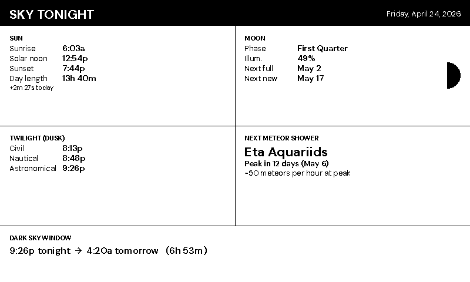
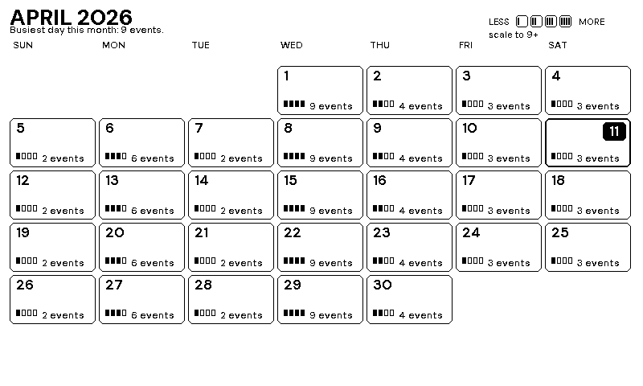
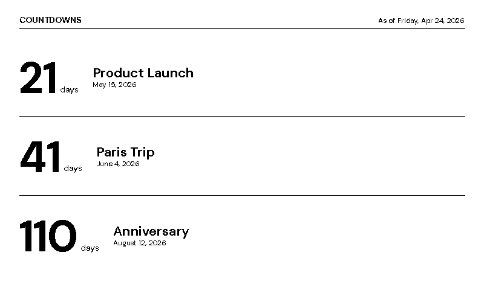

← [README](../README.md)

# Themes

Use this page to pick a theme, set up scheduled or context-aware switching, or browse the catalog of built-in themes.

- [Switching themes](#switching-themes)
- [Random rotation](#random-rotation)
- [Time-of-day theme schedule](#time-of-day-theme-schedule)
- [Context-aware theme rules](#context-aware-theme-rules)
- [Built-in themes](#built-in-themes)
- [Creating your own theme](#creating-your-own-theme)
- [Typography](#typography)
- [Regenerating preview images](previews.md)

---

## Switching themes

Set one concrete theme in `config.yaml`:

```yaml
theme: terminal
```

Valid values:

- **Week-view**: `default`, `terminal`, `minimalist`, `old_fashioned`, `today`, `fantasy`
- **Full-screen focused**: `qotd`, `qotd_invert`, `weather`, `fuzzyclock`, `fuzzyclock_invert`, `moonphase`, `moonphase_invert`, `photo`
- **Specialized**: `air_quality`, `astronomy`, `timeline`, `year_pulse`, `monthly`, `sunrise`, `scorecard`, `tides`
- **Utility**: `countdown`, `message`, `diags`
- **Rotation**: `random_daily` (alias `random`), `random_hourly`

Or override it from the CLI:

```bash
venv/bin/python -m src.main --dry-run --dummy --theme terminal
```

The `--theme` flag takes precedence over `config.yaml`.

Themes control layout, font system, panel visibility, and rendering style. Some are week-view layouts, some are full-screen focused displays, and some are operator utilities.

To regenerate the preview images embedded below after a theme edit, see [Previews](previews.md).

---

## Random rotation

Three theme values trigger rotation logic:

| Theme value | Rotates | State file |
|---|---|---|
| `random_daily` | Once per day, at first refresh after midnight | `state/random_theme_state.json` |
| `random_hourly` | Once per hour, at first refresh after the hour turns | `state/random_theme_hourly_state.json` |
| `random` | Alias for `random_daily` | `state/random_theme_state.json` |

```yaml
theme: random_daily
random_theme:
  include: []
  exclude: []
```

- `include` is an allowlist. Empty means all eligible themes.
- `exclude` is a denylist applied after `include`.
- `diags`, `message`, `photo`, and `countdown` are excluded from the random pool by design — they all need manual input (a message text, a photo path, or countdown events) and aren't useful as random picks.
- If the pool ends up empty, the app falls back to `default`.
- Run `make check` to validate theme names.

---

## Time-of-day theme schedule

Use `theme_schedule` to switch themes at specific local times:

```yaml
theme_schedule:
  - time: "06:00"
    theme: "default"
  - time: "20:00"
    theme: "minimalist"
  - time: "22:00"
    theme: "fuzzyclock_invert"
```

Priority order:
1. `--theme`
2. `theme_rules`
3. `theme_schedule`
4. `theme` in `config.yaml`

The active entry is the last row whose `time` is less than or equal to the current local time. When no row applies yet, normal fixed or random theme selection runs.

---

## Context-aware theme rules

`theme_rules` evaluates live context (weather, time-of-day, season, weekday, calendar) and picks a theme when a condition matches. Rules fire **before** `theme_schedule`, so they can override the time-of-day schedule when the conditions warrant it.

```yaml
theme_rules:
  - when: { weather_alert_present: true }
    theme: "message"
  - when: { calendar: "birthday_today" }
    theme: "today"
  - when: { calendar: "upcoming_soon" }
    theme: "today"
  - when: { calendar: ["empty", "done"] }
    theme: "qotd"
  - when: { weather: ["rain", "snow", "thunderstorm"] }
    theme: "weather"
  - when: { daypart: "night", weather: "clear" }
    theme: "moonphase"
  - when: { weekday: "weekend" }
    theme: "today"
```

Rules are evaluated top-to-bottom; the **first matching** rule wins. A rule matches when every `when:` field it sets evaluates true against the current context (AND semantics). Unset fields don't constrain.

Supported conditions:

| Field | Values | Notes |
|---|---|---|
| `weather` | OWM description substring (scalar or list) | `"rain"`, `"snow"`, `"clear"`, `"clouds"`, `"thunderstorm"`, `"fog"`, ... Matches against the current weather description — any listed token hitting as a substring counts as a match. |
| `weather_alert_present` | `true` / `false` | Fires when any OWM alert is active (or explicitly when no alert is active). |
| `daypart` | `"dawn"`, `"morning"`, `"afternoon"`, `"dusk"`, `"night"`, or `"day"` (scalar or list) | With weather data: `dawn` = sunrise ±90min, `dusk` = sunset ±60min, `morning` = after dawn before local noon, `afternoon` = after noon before dusk, `night` = otherwise. `day` is a convenience alias for morning ∪ afternoon. Without weather data, fixed clock ranges are used. |
| `season` | `"spring"`, `"summer"`, `"fall"`/`"autumn"`, `"winter"` (scalar or list) | N-hemisphere meteorological buckets by month. |
| `weekday` | `"weekend"`, `"weekday"`, or a day name (scalar or list) | E.g. `"monday"`. |
| `calendar` | `"empty"`, `"done"`, `"active"`, `"upcoming_soon"`, `"busy"`, `"birthday_today"` (scalar or list) | Today's calendar state — see below. States can overlap; a rule listing any matching state fires. |

Calendar states:

| Value | Fires when… |
|---|---|
| `empty` | No events cover today (no timed events today, no all-day events spanning today). |
| `done` | There's at least one timed event today and all of them have ended. |
| `active` | Currently inside a timed event (`start <= now < end`). All-day events don't trigger this. |
| `upcoming_soon` | The next timed event starts within the next 30 minutes. |
| `busy` | 5 or more events cover today (timed + spanning all-day combined). |
| `birthday_today` | At least one birthday's month/day matches today. |

All-day events use the iCal inclusive-start / exclusive-end convention, so a vacation stored as `2026-04-22` → `2026-04-25` covers April 22, 23, and 24.

Rules that reference weather or calendar data silently skip on the first boot (no cached data yet), so the system falls through to `theme_schedule` / `cfg.theme` until data is available. A calendar fetch failure with no usable cache is treated the same way — event-derived rules don't fire on false-positive "empty" days during outages. If any rule could resolve to `monthly`, the calendar event window is pre-sized for the month grid so the view has complete data whenever the rule fires.

---

## Built-in themes

### Week-view themes

| Theme | Best for | Notes |
|---|---|---|
| `default` | general family wall display | Classic 7-day layout with bottom weather, birthdays, and quote panels |
| `terminal` | high-contrast retro look | Inverted black canvas with a distinct multi-font system |
| `minimalist` | clean editorial layout | Border-light, dense, hides birthdays |
| `old_fashioned` | decorative print-inspired display | Serif-heavy broadsheet layout |
| `today` | single-day focus | Large date panel and spacious agenda |
| `fantasy` | stylized themed display | Ornamental black-canvas week layout |

### Full-screen focused themes

| Theme | Best for | Notes |
|---|---|---|
| `qotd` | quote-first display | Full-screen quote plus compact weather strip |
| `qotd_invert` | dark quote display | Inverted variant of `qotd` |
| `weather` | weather station view | Current conditions, forecast, alerts, optional AQI |
| `fuzzyclock` | glanceable clock | Natural-language time plus weather strip |
| `fuzzyclock_invert` | dark clock display | Inverted variant of `fuzzyclock` |
| `moonphase` | moon and sky display | Moon progression, illumination, weather, quote |
| `moonphase_invert` | bright moon display | Inverted variant of `moonphase` |
| `photo` | custom photo background | Full-canvas image with a bottom header bar; requires `photo.path` |

### Specialized themes

| Theme | Best for | Notes |
|---|---|---|
| `air_quality` | indoor/outdoor AQI dashboard | PurpleAir-first full-screen layout |
| `astronomy` | sky-tonight dashboard | Sunrise/sunset, civil/nautical/astronomical twilight, moon phase + next full/new, next meteor shower, dark-sky window. Uses `weather.latitude` / `weather.longitude` for twilight math (falls back gracefully without them). Pure-Python — no API calls. |
| `timeline` | busy-day planning | Single-day hourly timeline |
| `year_pulse` | longer-horizon planning | Year progress plus upcoming events and birthdays |
| `monthly` | month-at-a-glance planning | Traditional month grid with event-density heatmap |
| `sunrise` | daylight-oriented planning | Sun arc, day/night split, compact footer metrics |
| `scorecard` | big-number metrics | KPI tiles for weather, AQI, calendar, and system data |
| `tides` | maximum information density | Alternating horizontal bands spanning many data sources |

### Utility themes

| Theme | Best for | Notes |
|---|---|---|
| `countdown` | days-until tracker | User-configured target dates; one event = hero numeral, multiple = stacked list. Driven by `countdown.events` in `config.yaml`; excluded from random rotation |
| `message` | one-off reminders | Requires `--message`; excluded from random rotation |
| `diags` | debugging and validation | Structured data readout; excluded from random rotation |

### Theme details and previews

Each theme is shown twice: the **Waveshare** (1-bit black/white) render is on top,
and the **Inky** (Spectra 6 limited-palette color) render is right below it. They
share the same layout — the Inky version just maps to the panel's color palette.

#### default

Classic layout. Black text on white with a 7-day calendar grid and three bottom panels.


[](../output/theme_default_inky.png)

#### terminal

High-contrast inverted week view with compact spacing and a retro terminal-inspired type system.


[](../output/theme_terminal_inky.png)

#### minimalist

Border-light editorial layout focused on the calendar and weather, with birthdays hidden.


[](../output/theme_minimalist_inky.png)

#### old_fashioned

Victorian broadsheet layout with serif typography and decorative rules.


[](../output/theme_old_fashioned_inky.png)

#### today

Single-day agenda with a large date panel and roomy event list.


[](../output/theme_today_inky.png)

#### fantasy

Ornamental black-canvas week view with a fantasy-inspired visual system.


[](../output/theme_fantasy_inky.png)

#### qotd

Full-screen quote layout with a compact weather strip across the bottom.


[](../output/theme_qotd_inky.png)

#### qotd_invert

Inverted version of `qotd` with white quote text on black.


[](../output/theme_qotd_invert_inky.png)

#### weather

Full-screen weather dashboard with current conditions, alerts, forecast, and optional AQI.


[](../output/theme_weather_inky.png)

#### fuzzyclock

Natural-language clock with a compact weather strip and no calendar panels.


[](../output/theme_fuzzyclock_inky.png)

#### fuzzyclock_invert

Inverted version of `fuzzyclock`.


[](../output/theme_fuzzyclock_invert_inky.png)

#### moonphase

Full-screen moon display with phase progression, sunrise/sunset, compact weather, and quote.


[](../output/theme_moonphase_inky.png)

#### moonphase_invert

Inverted version of `moonphase`.


[](../output/theme_moonphase_invert_inky.png)

#### photo

Full-canvas photo theme driven by `photo.path`. Intended for custom-image displays rather than calendar-heavy use.


[](../output/theme_photo_inky.png)

#### air_quality

Full-screen PurpleAir-oriented AQI dashboard with particulate, ambient, weather, and forecast sections.


[](../output/theme_air_quality_inky.png)

#### astronomy

Four-quadrant "sky tonight" layout plus a dark-sky-window footer: sunrise, solar noon, sunset, day-length delta, moon phase with illumination and next full/new dates, civil/nautical/astronomical dusk times, and the next annual meteor shower with its peak date and approximate zenithal hourly rate. All data is computed locally from `src.astronomy`; no API calls beyond weather lat/lon. When `weather.latitude` / `weather.longitude` are not configured, the theme falls back to OWM-reported sunrise/sunset and hides the twilight section.


[](../output/theme_astronomy_inky.png)

#### timeline

Single-day hourly timeline that makes free blocks and overlaps easy to spot.


[](../output/theme_timeline_inky.png)

#### year_pulse

Year progress plus a compact upcoming-items list for longer-horizon planning.


[](../output/theme_year_pulse_inky.png)

#### monthly

Full-screen wall-calendar month view with day cells shaded by event density.
Waveshare uses a crisp monochrome month grid with compact density indicators; Inky uses a warm yellow-orange-red ramp.


[](../output/theme_monthly_inky.png)

#### sunrise

Sun arc and day/night split layout organized around daylight.


[](../output/theme_sunrise_inky.png)

#### scorecard

Big-number tile dashboard for weather, AQI, calendar, and system metrics.


[](../output/theme_scorecard_inky.png)

#### tides

Alternating horizontal bands with the densest multi-source layout in the theme set.


[](../output/theme_tides_inky.png)

#### countdown

Full-canvas days-until tracker driven by `countdown.events` in `config.yaml`. A single event renders as a "hero" with a giant numeral and the event name; two to five events stack as rows, each with a prominent day count plus name and target date. Past events are dropped silently. No API calls.

```yaml
countdown:
  events:
    - name: "Paris Trip"
      date: "2026-06-04"
    - name: "Anniversary"
      date: "2026-08-12"
```


[](../output/theme_countdown_inky.png)

#### message

Manual message display for reminders or announcements. Use:

```bash
venv/bin/python -m src.main --dry-run --dummy --theme message --message "Dentist at 3pm"
```


[](../output/theme_message_inky.png)

#### diags

Structured diagnostic readout for validating live data and system state.


[](../output/theme_diags_inky.png)

---

## Creating your own theme

Contributor-facing implementation details live in [CONTRIBUTING.md](../CONTRIBUTING.md) and [CLAUDE.md](../CLAUDE.md). The operator-facing rule is simple: custom themes must be registered in the theme registry before they can be referenced from `config.yaml`.

If you are authoring a greyscale custom theme, set `ThemeLayout.canvas_mode = "L"` and use `fg=0, bg=255` in `ThemeStyle`.

---

## Typography

Bundled font families used by the current built-in themes:

| Font | Used by |
|---|---|
| Plus Jakarta Sans | default and general fallback |
| DM Sans | `minimalist`, `weather`, `fuzzyclock`, `timeline`, `diags`, `monthly`, `countdown`, `astronomy` |
| Playfair Display | `old_fashioned`, `qotd`, `moonphase` |
| Cinzel | `fantasy`, `old_fashioned`, `moonphase` accents |
| Space Grotesk | `air_quality`, `message`, `year_pulse`, `scorecard` |
| Share Tech Mono / terminal fonts | `terminal`, `diags`, select utility text |

To regenerate the Waveshare and Inky preview images embedded above, see [Previews](previews.md).
