← [README](../README.md)

# Themes

Use this page to pick a theme, set up scheduled or context-aware switching, or browse the catalog of built-in themes.

- [Switching themes](#switching-themes)
- [Random rotation](#random-rotation)
- [Time-of-day theme schedule](#time-of-day-theme-schedule)
- [Context-aware theme rules](#context-aware-theme-rules)
- [Built-in themes](#built-in-themes)
- [Creating your own theme](#creating-your-own-theme)
- [Typography](#typography)
- [Regenerating preview images](previews.md)

---

## Switching themes

Set one concrete theme in `config.yaml`:

```yaml
theme: terminal
```

Valid values:

- **Week-view**: `default`, `agenda`, `terminal`, `minimalist`, `old_fashioned`, `today`, `fantasy`
- **Full-screen focused**: `qotd`, `qotd_invert`, `weather`, `fuzzyclock`, `fuzzyclock_invert`, `moonphase`, `moonphase_invert`, `moonphase_photo`, `photo`
- **Specialized**: `air_quality`, `almanac`, `astronomy`, `constellation_map`, `halftone`, `timeline`, `trends`, `year_pulse`, `monthly`, `sunrise`, `light_cycle`, `scorecard`, `tides`
- **Dithered art**: `postcard`, `naturalist`
- **Utility**: `countdown`, `message`, `diags`
- **Rotation**: `random_daily` (alias `random`), `random_hourly`

Or override it from the CLI:

```bash
venv/bin/python -m src.main --dry-run --dummy --theme terminal
```

The `--theme` flag takes precedence over `config.yaml`.

Themes control layout, font system, panel visibility, and rendering style. Some are week-view layouts, some are full-screen focused displays, and some are operator utilities.

To regenerate the preview images embedded below after a theme edit, see [Previews](previews.md).

---

## Random rotation

Three theme values trigger rotation logic:

| Theme value | Rotates | State file |
|---|---|---|
| `random_daily` | Once per day, at first refresh after midnight | `state/random_theme_state.json` |
| `random_hourly` | Once per hour, at first refresh after the hour turns | `state/random_theme_hourly_state.json` |
| `random` | Alias for `random_daily` | `state/random_theme_state.json` |

```yaml
theme: random_daily
random_theme:
  include: []
  exclude: []
```

- `include` is an allowlist. Empty means all eligible themes.
- `exclude` is a denylist applied after `include`.
- `diags`, `message`, `photo`, and `countdown` are excluded from the random pool by design — they all need manual input (a message text, a photo path, or countdown events) and aren't useful as random picks.
- If the pool ends up empty, the app falls back to `default`.
- Run `make check` to validate theme names.

---

## Time-of-day theme schedule

Use `theme_schedule` to switch themes at specific local times:

```yaml
theme_schedule:
  - time: "06:00"
    theme: "default"
  - time: "20:00"
    theme: "minimalist"
  - time: "22:00"
    theme: "fuzzyclock_invert"
```

Priority order:
1. `--theme`
2. `theme_rules`
3. `theme_schedule`
4. `theme` in `config.yaml`

The active entry is the last row whose `time` is less than or equal to the current local time. When no row applies yet, normal fixed or random theme selection runs.

---

## Context-aware theme rules

`theme_rules` evaluates live context (weather, time-of-day, season, weekday, calendar) and picks a theme when a condition matches. Rules fire **before** `theme_schedule`, so they can override the time-of-day schedule when the conditions warrant it.

```yaml
theme_rules:
  - when: { weather_alert_present: true }
    theme: "message"
  - when: { calendar: "birthday_today" }
    theme: "today"
  - when: { calendar: "upcoming_soon" }
    theme: "today"
  - when: { calendar: ["empty", "done"] }
    theme: "qotd"
  - when: { weather: ["rain", "snow", "thunderstorm"] }
    theme: "weather"
  - when: { daypart: "night", weather: "clear" }
    theme: "moonphase"
  - when: { weekday: "weekend" }
    theme: "today"
```

Rules are evaluated top-to-bottom; the **first matching** rule wins. A rule matches when every `when:` field it sets evaluates true against the current context (AND semantics). Unset fields don't constrain.

Supported conditions:

| Field | Values | Notes |
|---|---|---|
| `weather` | OWM description substring (scalar or list) | `"rain"`, `"snow"`, `"clear"`, `"clouds"`, `"thunderstorm"`, `"fog"`, ... Matches against the current weather description — any listed token hitting as a substring counts as a match. |
| `weather_alert_present` | `true` / `false` | Fires when any OWM alert is active (or explicitly when no alert is active). |
| `daypart` | `"dawn"`, `"day"`, `"dusk"`, `"night"` (scalar or list) | With weather data: `dawn` = sunrise ±90min, `day` = after dawn until sunset−60min, `dusk` = sunset−60min through sunset, `night` = after sunset until the next dawn. Without weather data, fixed clock ranges anchored on a 06:30 / 18:30 sun cycle are used. |
| `season` | `"spring"`, `"summer"`, `"fall"`/`"autumn"`, `"winter"` (scalar or list) | N-hemisphere meteorological buckets by month. |
| `weekday` | `"weekend"`, `"weekday"`, or a day name (scalar or list) | E.g. `"monday"`. |
| `calendar` | `"empty"`, `"done"`, `"active"`, `"upcoming_soon"`, `"busy"`, `"birthday_today"` (scalar or list) | Today's calendar state — see below. States can overlap; a rule listing any matching state fires. |

Calendar states:

| Value | Fires when… |
|---|---|
| `empty` | No events cover today (no timed events today, no all-day events spanning today). |
| `done` | There's at least one timed event today and all of them have ended. |
| `active` | Currently inside a timed event (`start <= now < end`). All-day events don't trigger this. |
| `upcoming_soon` | The next timed event starts within the next 30 minutes. |
| `busy` | 5 or more events cover today (timed + spanning all-day combined). |
| `birthday_today` | At least one birthday's month/day matches today. |

All-day events use the iCal inclusive-start / exclusive-end convention, so a vacation stored as `2026-04-22` → `2026-04-25` covers April 22, 23, and 24.

Rules that reference weather or calendar data silently skip on the first boot (no cached data yet), so the system falls through to `theme_schedule` / `cfg.theme` until data is available. A calendar fetch failure with no usable cache is treated the same way — event-derived rules don't fire on false-positive "empty" days during outages. If any rule could resolve to `monthly`, the calendar event window is pre-sized for the month grid so the view has complete data whenever the rule fires.

---

## Built-in themes

### Week-view themes

| Theme | Best for | Notes |
|---|---|---|
| `default` | general family wall display | Classic 7-day layout with bottom weather, birthdays, and quote panels |
| `agenda` | high-visibility, legible from afar | Bold DM Sans, dominant 7-day grid, slim weather + birthdays strip; red Inky accent |
| `terminal` | high-contrast retro look | Inverted black canvas with a distinct multi-font system |
| `minimalist` | clean editorial layout | Border-light, dense, hides birthdays |
| `old_fashioned` | decorative print-inspired display | Serif-heavy broadsheet layout |
| `today` | single-day focus | Large date panel and spacious agenda |
| `fantasy` | stylized themed display | Ornamental black-canvas week layout |

### Full-screen focused themes

| Theme | Best for | Notes |
|---|---|---|
| `qotd` | quote-first display | Full-screen quote plus compact weather strip |
| `qotd_invert` | dark quote display | Inverted variant of `qotd` |
| `weather` | weather station view | Current conditions, forecast, alerts, optional AQI |
| `fuzzyclock` | glanceable clock | Natural-language time plus weather strip |
| `fuzzyclock_invert` | dark clock display | Inverted variant of `fuzzyclock` |
| `moonphase` | moon and sky display | Procedurally-rendered lunar disc (true terminator, maria, craters, earthshine), 7-day progression, illumination, moonrise/moonset, sunrise/sunset, next full/new moon countdown, supermoon badge, weather, quote |
| `moonphase_invert` | bright moon display | Parchment-engraving variant of `moonphase` |
| `moonphase_photo` | photographic moon display | Same layout as `moonphase`, but the hero and filmstrip discs are a real moon photograph (`assets/moon_full.png`) occluded by the phase terminator. Replace the bundled photo with your own centred full-moon image to re-skin every disc; falls back to the procedural disc when the asset is absent. |
| `photo` | custom photo background | Full-canvas image with a bottom header bar; requires `photo.path` |

### Specialized themes

| Theme | Best for | Notes |
|---|---|---|
| `air_quality` | indoor/outdoor AQI dashboard | PurpleAir-first full-screen layout |
| `almanac` | editorial daily reference | Old-Farmer's-Almanac front page: ornamental masthead with Roman-numeral volume, big editorial dateline, four bordered sections in a 2×2 grid (Heavens, From the Sky, Week Ahead, Next in the Garden), and a footer aphorism with author in small caps. Combines weather, astronomy, moon, calendar, birthdays, and quote — no new fetcher. |
| `halftone` | contemplative weather plate | Procedurally-drawn dithered weather illustration (sun, clouds, rain stipple, thunderstorm, snow, fog, or moon-at-current-phase) as a hero engraving; below it a typeset margin band with the temperature numeral + feels-like caption, a NOW row (condition + H/L), a TODAY row (sunrise/sunset + date), and a NEXT row (soonest upcoming timed event). Floyd-Steinberg quantization turns the procedural greyscale gradients into engraving-style halftone. Pure-Python — no external assets. |
| `trends` | long-context dashboard | Five stacked sparkline rows: 24h temp, AQI scale, 7-day daylight, 14-day event density, 30-day moon. Bayer-filled area under each curve gives a clean halftone density read on eInk. First chart/graph theme; ordered-Bayer quantization preserves the regular dot pattern. |
| `astronomy` | sky-tonight dashboard | Sunrise/sunset, civil/nautical/astronomical twilight, moon phase + next full/new, next meteor shower, dark-sky window. Uses `weather.latitude` / `weather.longitude` for twilight math (falls back gracefully without them). Pure-Python — no API calls. |
| `constellation_map` | tonight's actual sky | Dark-canvas star chart projected for the user's location and the current moment. Renders ~45 named bright stars, seven recognisable northern constellations connected by lines, and the moon at its current alt/az. During daylight the chart auto-projects for tonight's solar midnight so it stays informative. Requires `weather.latitude` / `weather.longitude`; pure-Python sky math (no API). |
| `timeline` | busy-day planning | Single-day hourly timeline |
| `year_pulse` | longer-horizon planning | Year progress plus upcoming events and birthdays |
| `monthly` | month-at-a-glance planning | Traditional month grid with event-density heatmap |
| `sunrise` | daylight-oriented planning | Sun arc, day/night split, compact footer metrics |
| `light_cycle` | whole-day-at-a-glance | 24-hour radial clock with twilight bands on the rim, today's events as ticks inside the ring, needle and sun/moon glyph at the current moment, date and weather in the central disc. Uses `weather.latitude` / `weather.longitude` for full astronomical / nautical / civil twilight bands (falls back to OWM sunrise/sunset without them). Pure-Python — no API calls. |
| `scorecard` | big-number metrics | KPI tiles for weather, AQI, calendar, and system data |
| `tides` | maximum information density | Alternating horizontal bands spanning many data sources |
| `weatherglass` | decorative weather station | Victorian brass-and-mahogany instrument deck: hero thermometer, round barometer dial with a pressure-trend needle, hygrometer + UV-index gauges, and a secondary row of wind compass, sun arc, moon porthole, and an optional AQI badge. Rye-masthead, fully procedural gauges, no new fetcher. |

### Dithered art themes

| Theme | Best for | Notes |
|---|---|---|
| `postcard` | nostalgic vista | Procedurally-drawn dithered postcard: left two-thirds is a scene (sky, mountains, water, foreground) keyed to the OWM icon + daypart; right third is the postcard back (cursive greeting, red postmark with month/day, postage stamp with moon glyph, ruled "address" lines listing today's events, daily quote as signature). Floyd-Steinberg quantization. |
| `naturalist` | Victorian botanical plate | Astloch blackletter masthead with Roman-numeral plate / year / month; Cinzel small-caps Latin specimen name that shifts with season + weather; procedurally-drawn specimen branch with mixed filled/outlined leaves whose count and treatment vary by season (bare in winter, buds in spring, lush canopy in summer, fallen leaves in autumn) plus weather overlays (rain, snow, frost, fog). Four leader-line callouts pin event / moon / sun / weather data to anatomical features. Floyd-Steinberg quantization. |

### Utility themes

| Theme | Best for | Notes |
|---|---|---|
| `countdown` | days-until tracker | User-configured target dates; one event = hero numeral, multiple = stacked list. Driven by `countdown.events` in `config.yaml`; excluded from random rotation |
| `message` | one-off reminders | Requires `--message`; excluded from random rotation |
| `diags` | debugging and validation | Structured data readout; excluded from random rotation |

### Theme details and previews

Each theme is shown as a single image split between two renders: the
**Waveshare** (1-bit black/white) render on one side and the **Inky** (Spectra 6
limited-palette color) render on the other. The split orientation is picked
per theme — diagonal, vertical, or horizontal — so the Inky color treatment
stays visible no matter where the theme concentrates its accents. Both halves
share the same layout; the Inky side just maps to the panel's color palette.
See [Combined split previews](previews.md#combined-split-previews) for the
list of available orientations and how to retune them.

#### default

Classic layout. Black text on white with a 7-day calendar grid and three bottom panels.

[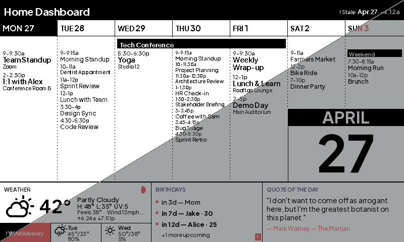](../assets/previews/theme_default_split.png)

#### agenda

High-visibility week view designed to be read from across a room. Dominant 7-day grid in heavy DM Sans Bold with a slim weather + birthdays strip at the bottom (no quote panel); red today/accent on Inky.

[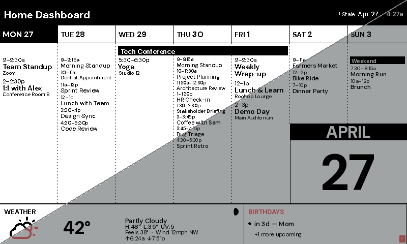](../assets/previews/theme_agenda_split.png)

#### terminal

High-contrast inverted week view with compact spacing and a retro terminal-inspired type system.

[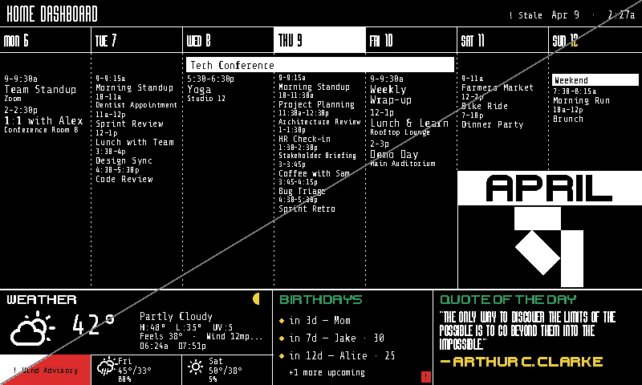](../assets/previews/theme_terminal_split.png)

#### minimalist

Border-light editorial layout focused on the calendar and weather, with birthdays hidden.

[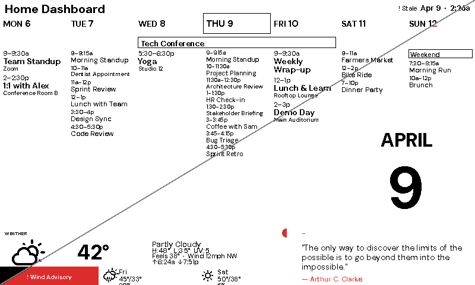](../assets/previews/theme_minimalist_split.png)

#### old_fashioned

Victorian broadsheet layout with serif typography and decorative rules.

[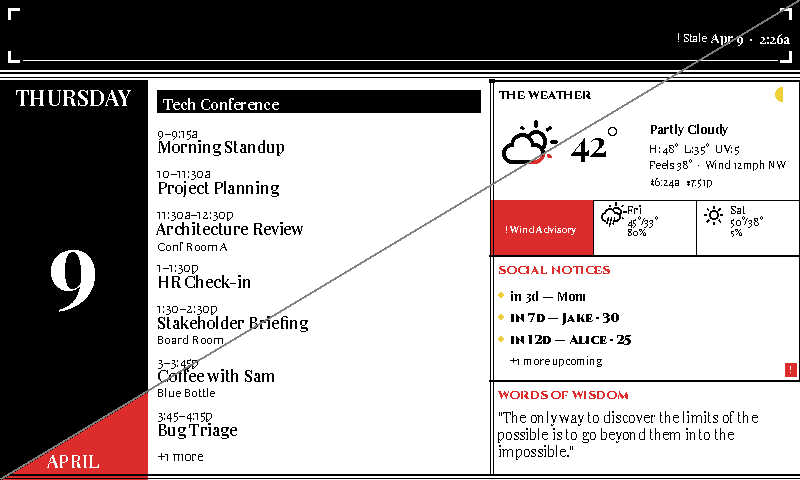](../assets/previews/theme_old_fashioned_split.png)

#### almanac

Old-Farmer's-Almanac front page in **Astloch** (blackletter masthead and dateline) + Playfair Display (body) + Cinzel (section labels and small caps). An ornamental masthead carries a Roman-numeral volume, day-of-year issue number, and the day's name; below it, the date is set in a large editorial line ("MAY 6, 2026") between two triple rules. The body splits into four bordered editorial sections in a 2×2 grid: **The Heavens** (sunrise/sunset, day length, today's lengthening or shortening, moon phase + illumination, next full moon), **From the Sky** (a short prose weather observation with wind direction, alerts, and high/low), **The Week Ahead** (today's first event plus the next few timed events and birthdays), and **Next in the Garden** (season + day-of-year, sun lengthening/shortening, next named meteor shower with ZHR). A triple rule and the day's quote close the page in italic small-caps; a row of small ornaments stamps the very bottom. Reuses every existing data source — weather, `src.astronomy`, `src.render.moon`, calendar, birthdays, quote — with no new fetcher. On Inky the rules, ornaments, bullets, and attribution all render in red.

[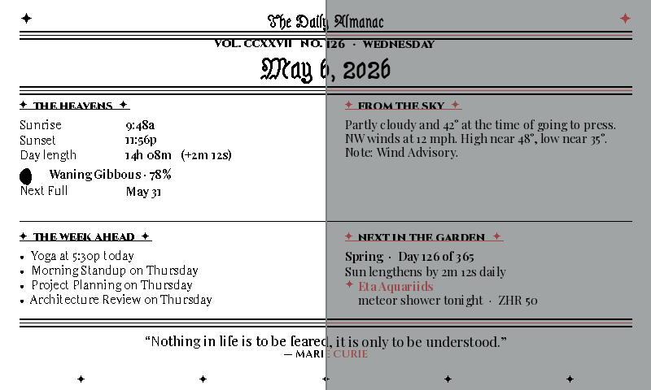](../assets/previews/theme_almanac_split.png)

#### halftone

Procedurally-drawn dithered weather plate evoking a 19th-century natural-history engraving. The 296-px hero region picks an illustration from the current OWM icon code: a rayed sun with halftone-graded sky (`01d`), a moon disc with smooth terminator shading and scattered stars (`01n`), overlapping cumulus for the partly-cloudy / overcast family (`02–04`), a dark cloud with stippled rain (`09`/`10`) or sharp lightning + heavy rain (`11`), a soft cloud with engraved snowflakes (`13`), or layered horizontal banding for fog (`50`). Below it, a 6-px ordered-Bayer rule separates a typeset margin band with a fixed-width left column for the temperature numeral plus a small "feels NN°" caption, and a right column split into three rows: **NOW** (condition in small caps + H + L), a hairline rule, **TODAY** (sunrise + sunset icons with times on the left, weekday · month · day · year on the right), and **NEXT** (the soonest upcoming non-all-day event). Every typeset element is set in **Righteous** so the engraved plate reads as one voice. Drawn in 8-bit greyscale and quantized to 1-bit via Floyd-Steinberg — the smooth gradients become the engraving's halftone texture. On Inky the sun and moon pick up a warm yellow accent ring. Pure-Python, no external assets.

[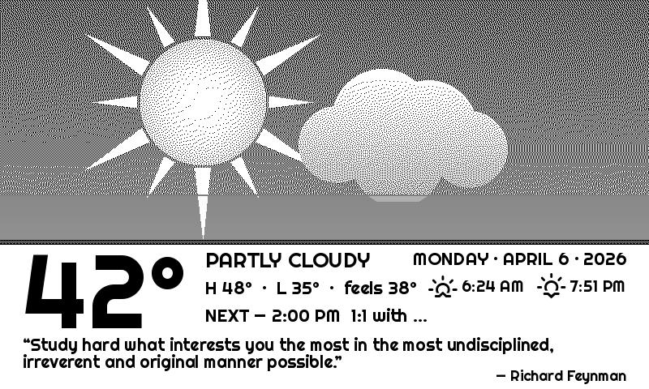](../assets/previews/theme_halftone_split.png)

#### trends

Stacked sparkline dashboard — the first chart/graph theme. A 32-px masthead carries today's date and current time; below it five evenly-stacked rows each visualise a different time series: **TEMP — 24h** (current observation + interpolated forecast across ±12 h), **AIR** (current AQI on a 6-zone health scale with progressive Bayer density per zone), **DAYLIGHT — 7d** (daily day-length for the next week, computed in-process via `src.astronomy`), **EVENTS — 14d** (per-day event count bars), and **MOON — 30d** (illumination curve through one synodic month, with the current phase glyph stamped at right). Each chart sits on a Bayer-filled area whose ordered dot pattern survives the eInk quantize step. Every row degrades gracefully when its data source is missing (no weather, no PurpleAir sensor, no lat/lon). On Inky the series render in blue with a yellow today-marker.

[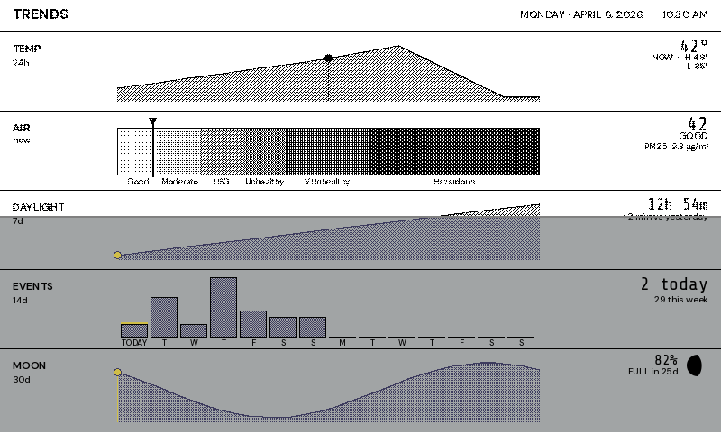](../assets/previews/theme_trends_split.png)

#### today

Single-day agenda with a large date panel and roomy event list.

[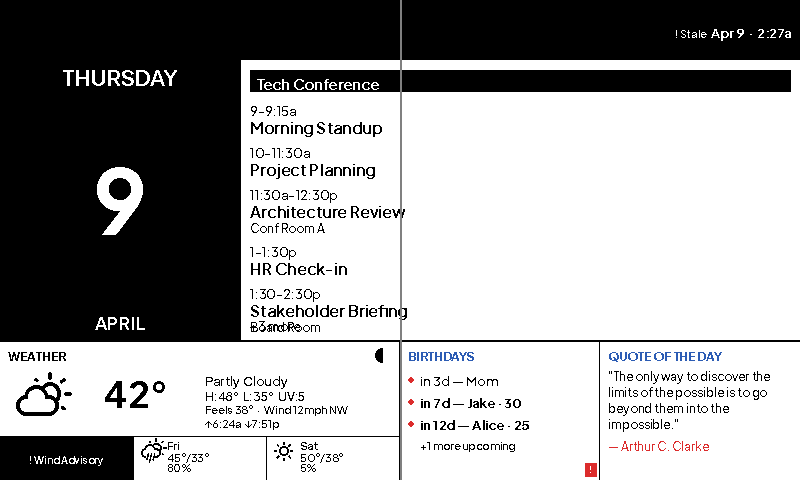](../assets/previews/theme_today_split.png)

#### fantasy

Ornamental black-canvas week view with a fantasy-inspired visual system.

[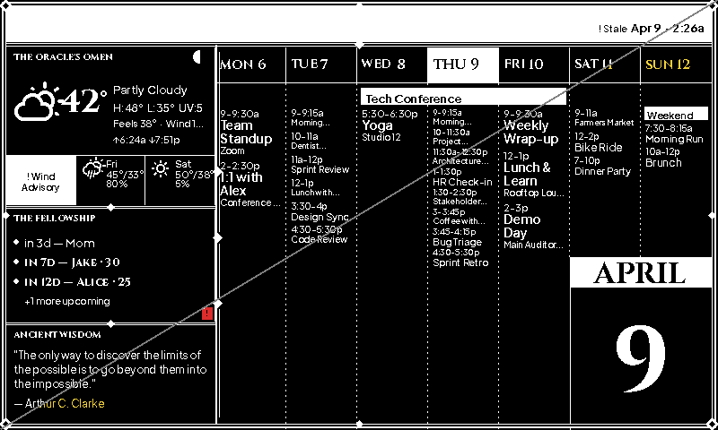](../assets/previews/theme_fantasy_split.png)

#### qotd

Full-screen quote layout with a compact weather strip across the bottom.

[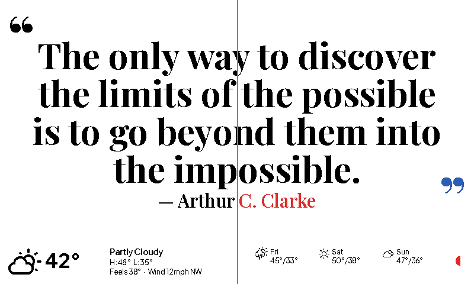](../assets/previews/theme_qotd_split.png)

#### qotd_invert

Inverted version of `qotd` with white quote text on black.

[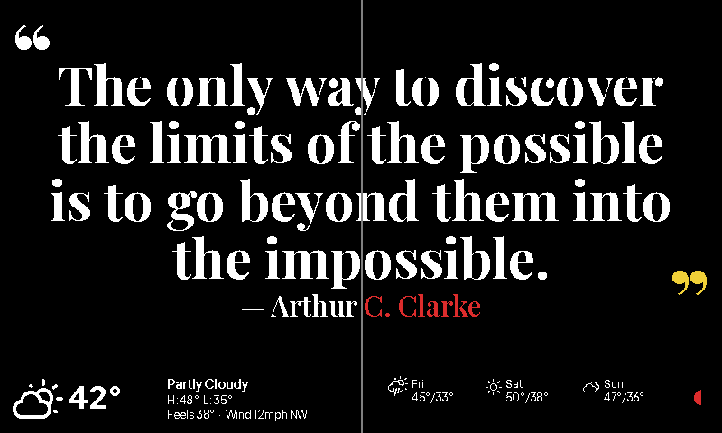](../assets/previews/theme_qotd_invert_split.png)

#### weather

Full-screen weather dashboard with current conditions, alerts, forecast, and optional AQI.

[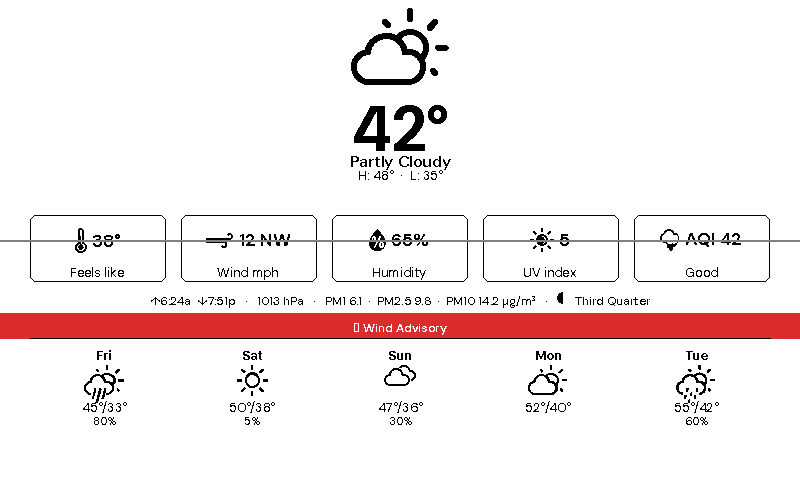](../assets/previews/theme_weather_split.png)

#### fuzzyclock

Natural-language clock with a compact weather strip and no calendar panels.

[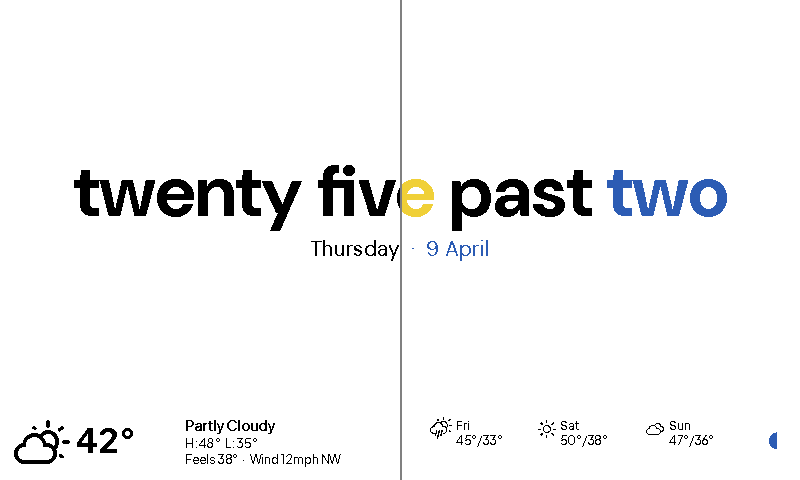](../assets/previews/theme_fuzzyclock_split.png)

#### fuzzyclock_invert

Inverted version of `fuzzyclock`.

[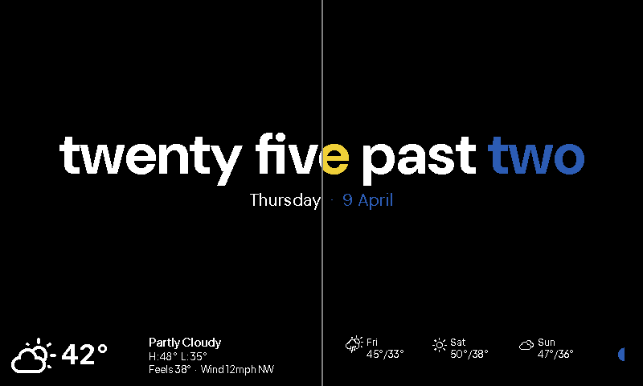](../assets/previews/theme_fuzzyclock_invert_split.png)

#### moonphase

Full-screen moon display built around a **procedurally-rendered lunar disc** —
a true phase terminator, maria, craters, and earthshine on the unlit limb,
rather than a flat font glyph. Flanked by a seven-day phase filmstrip and a
lunar-data block: illumination, moon age, moonrise/moonset (when
`weather.latitude`/`longitude` are set), sunrise/sunset, a compact weather
summary, and a countdown to the next full or new moon. A **supermoon badge**
appears when the full moon falls near perigee. Renders as smooth greyscale on
Waveshare and a warm-yellow moon with cool earthshine on Inky. Moon position
and phase are pure math (no API) via `src/render/moon.py` and `src/astronomy.py`.

[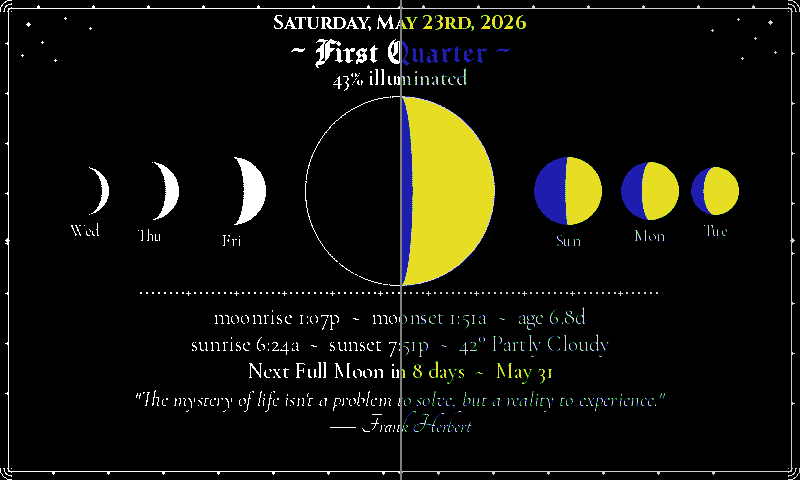](../assets/previews/theme_moonphase_split.png)

#### moonphase_invert

Parchment-engraving variant of `moonphase` — black ink on a light canvas, with
the same procedural moon and lunar-data block.

[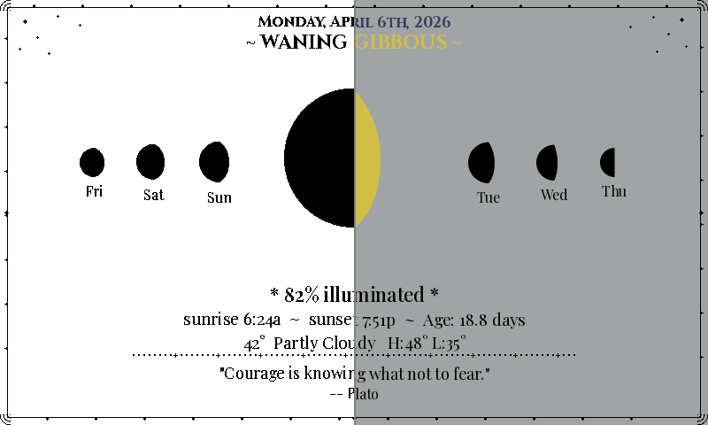](../assets/previews/theme_moonphase_invert_split.png)

#### moonphase_photo

Same layout, data block, and celestial border as `moonphase`, but the hero and
seven-day filmstrip discs are a **real moon photograph** (`assets/moon_full.png`)
occluded by the phase terminator instead of the procedural disc — the sunlit
region shows the photo while the shadowed side keeps a faint earthshine copy of
the same texture. Renders as a dithered photo on Waveshare and realistic
greyscale on Inky. Drop your own centred full-moon image in at
`assets/moon_full.png` to re-skin every disc (then regenerate the previews and
the pixel-snapshot baseline); it falls back to the procedural disc when the
asset is absent.

[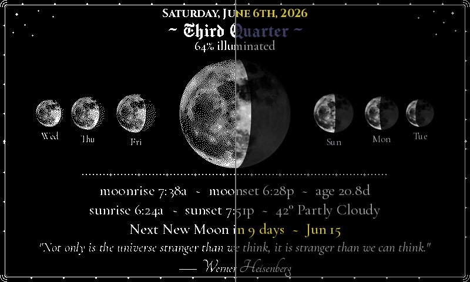](../assets/previews/theme_moonphase_photo_split.png)

#### photo

Full-canvas photo theme driven by `photo.path`. Intended for custom-image displays rather than calendar-heavy use.

[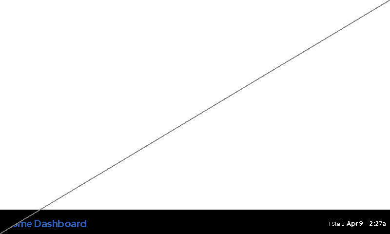](../assets/previews/theme_photo_split.png)

#### air_quality

Full-screen PurpleAir-oriented AQI dashboard with particulate, ambient, weather, and forecast sections.

[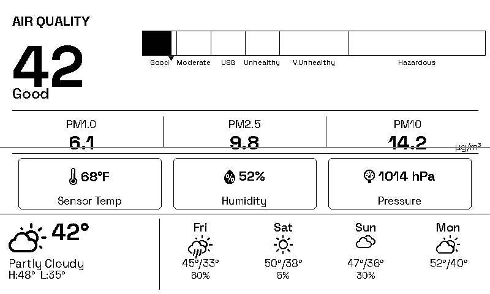](../assets/previews/theme_air_quality_split.png)

#### astronomy

Four-quadrant "sky tonight" layout plus a dark-sky-window footer: sunrise, solar noon, sunset, day-length delta, moon phase with illumination and next full/new dates, civil/nautical/astronomical dusk times, and the next annual meteor shower with its peak date and approximate zenithal hourly rate. All data is computed locally from `src.astronomy`; no API calls beyond weather lat/lon. When `weather.latitude` / `weather.longitude` are not configured, the theme falls back to OWM-reported sunrise/sunset and hides the twilight section.

[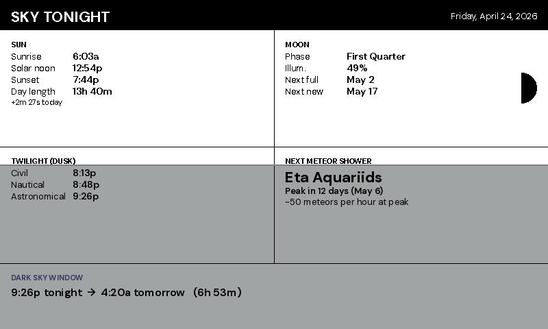](../assets/previews/theme_astronomy_split.png)

#### constellation_map

Dark-canvas star chart of tonight's sky, projected for the configured `weather.latitude` / `weather.longitude` using a "looking up" equidistant azimuthal projection — zenith at the centre, horizon at the rim, North at top, East to the **left**, South at bottom, West to the right. The disc is framed by a Cinzel-labelled cardinal ring with dotted altitude rings at 30° and 60°. About 45 bright named stars from a curated Bright Star subset are sized by visual magnitude; seven of the most recognisable northern constellations (Ursa Major, Cassiopeia, Orion, Lyra, Cygnus, Boötes, Leo) are joined by thin lines and labelled in italic small caps. The moon is plotted at its current altitude/azimuth using a simplified Schlyter ephemeris — when above the horizon it appears as the actual phase glyph in a halo. During daylight, the chart auto-projects for tonight's solar midnight so it stays informative. The footer shows location, the moon's current phase name, and the next named meteor shower. On Inky the rim, cardinal labels, and constellation names render in yellow with blue constellation lines and altitude rings; Waveshare stays clean monochrome white-on-black. All sky math is pure Python — no API calls.

[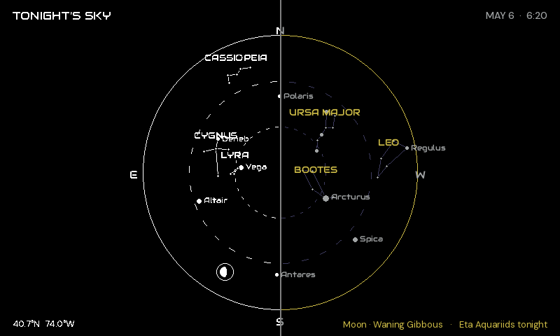](../assets/previews/theme_constellation_map_split.png)

#### timeline

Single-day hourly timeline that makes free blocks and overlaps easy to spot.

[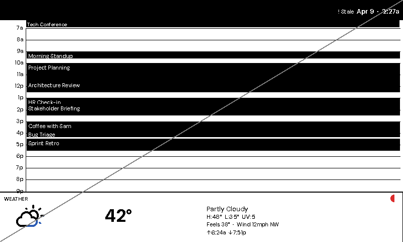](../assets/previews/theme_timeline_split.png)

#### year_pulse

Year progress plus a compact upcoming-items list for longer-horizon planning.

[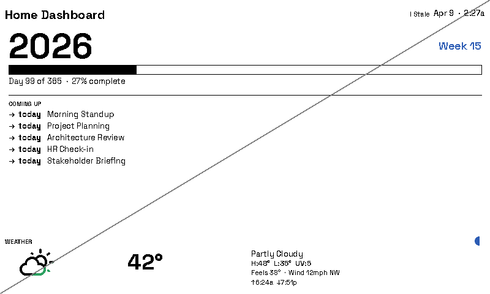](../assets/previews/theme_year_pulse_split.png)

#### monthly

Full-screen wall-calendar month view with day cells shaded by event density.
Waveshare uses a crisp monochrome month grid with compact density indicators; Inky uses a warm yellow-orange-red ramp.

[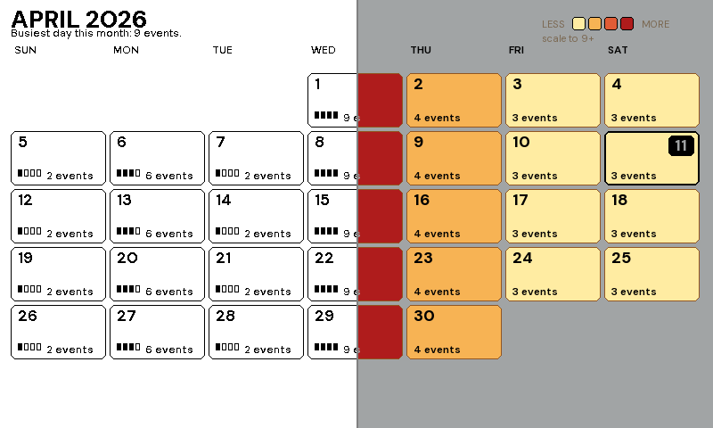](../assets/previews/theme_monthly_split.png)

#### sunrise

Sun arc and day/night split layout organized around daylight.

[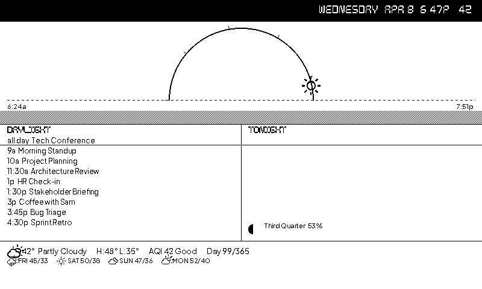](../assets/previews/theme_sunrise_split.png)

#### light_cycle

Full-canvas 24-hour radial clock with the entire day arranged around a single dial. The rim carries hour ticks and 00 / 06 / 12 / 18 numerals; the twilight ring fills with progressively denser radial dashes from civil to nautical to astronomical twilight, and a solid wedge for true night. Today's timed events appear as small ticks just inside the ring, a triangular needle marks the current moment, and a sun (or moon, when below the horizon) glyph rides the rim at the current-time position. The center disc shows day name, big date numeral, month, and weather summary; a footer reports rise / set / event count. On Inky the title and accents render in yellow with a blue needle. All sun-time math is computed locally from `src.astronomy` using `weather.latitude` / `weather.longitude` (falls back to OWM-reported sunrise/sunset when coordinates are absent — twilight bands collapse to a single night band).

[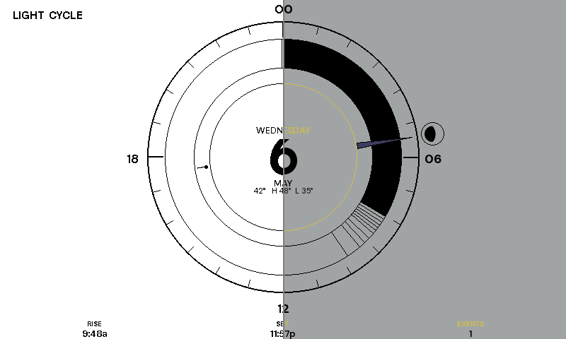](../assets/previews/theme_light_cycle_split.png)

#### scorecard

Big-number tile dashboard for weather, AQI, calendar, and system metrics.

[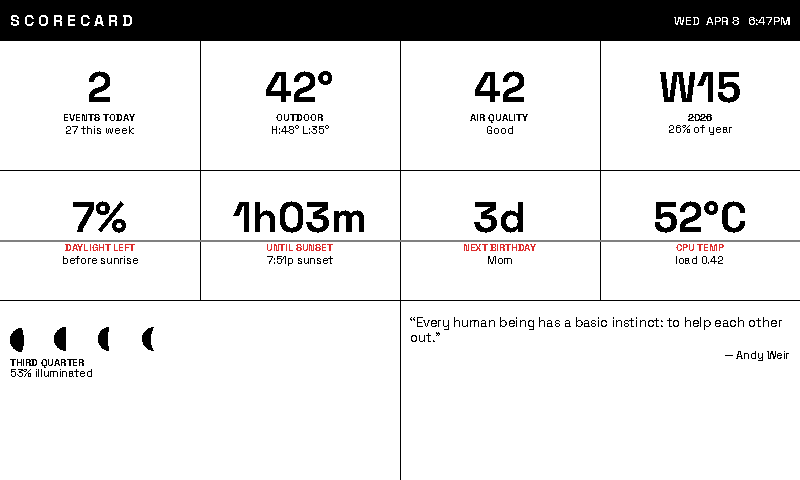](../assets/previews/theme_scorecard_split.png)

#### tides

Alternating horizontal bands with the densest multi-source layout in the theme set.

[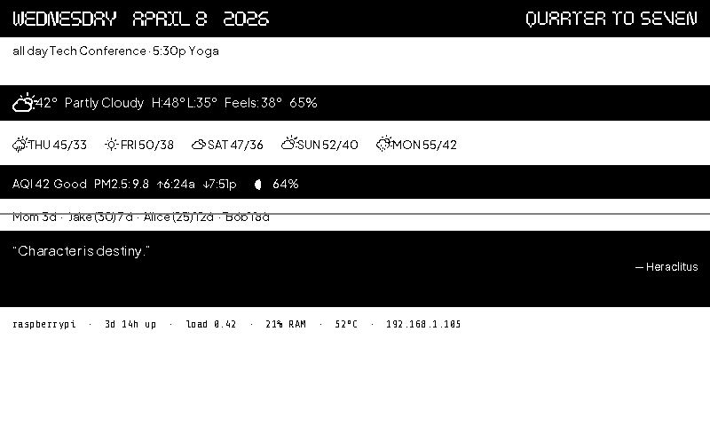](../assets/previews/theme_tides_split.png)

#### weatherglass

Victorian weather-station instrument deck — a full-canvas brass-and-mahogany panel of procedural analog gauges. A **Rye** Western-saloon masthead carries the date and location across the top; below it three hero instruments sit side by side: a hero thermometer with a mercury column scaled to the current temperature (cold scale in blue, comfort band in green on Inky) and a large numeral with a feels-like caption, a round barometer dial whose needle points to the current pressure with a second trend needle showing the change since the last reading (rising in green, falling in blue), and a stacked hygrometer arc + UV-index bar. A secondary row of four smaller instruments follows: a wind compass rose, a sun arc with twilight bands and sunrise/sunset times, a moon porthole with a procedural terminator and phase name, and an optional AQI badge. When a weather alert is active an alert cartouche overlays the masthead. The L-mode canvas is supersampled 2× (1600×960) so the LANCZOS downsample anti-aliases every dial rim, tick mark, and engraved label; the final 1-bit step uses `threshold` (not Floyd-Steinberg) so the antialiased edges snap to crisp solid black rather than dithering into speckle. The barometer keeps a tiny rolling pressure history in `state/weatherglass_pressure_history.json` to drive the trend needle (not persisted on dry-run / dummy previews). Pure-Python — no new fetcher. On Inky the brass rims render in yellow and the mercury column + alert text render in red.

[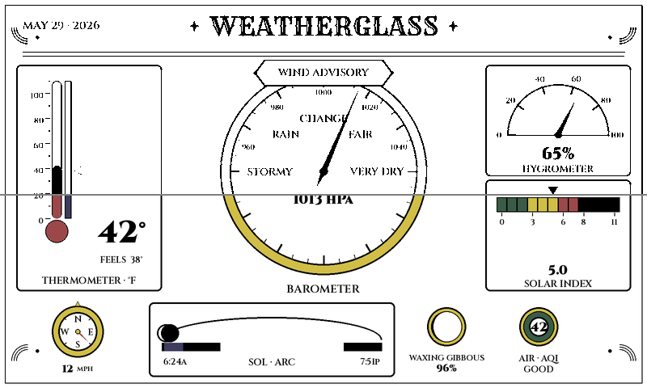](../assets/previews/theme_weatherglass_split.png)

#### postcard

Procedurally-drawn dithered postcard composed in two parts. The left two-thirds is a "view" scene picked from the current OWM icon and daypart — sky gradient, two-layer mountain silhouettes, water with ripple lines, foreground shore and reeds, plus sun, moon, clouds, rain streaks, lightning, snowflakes, or fog bands as the weather warrants. The right third is the postcard back: a cursive greeting, a circular red postmark with the current month and day, a perforated postage stamp carrying the moon-phase glyph, four ruled "address" lines listing today's events, and the daily quote as the signature. A 3 px white gutter with a dashed shadow forms the centre crease. Floyd-Steinberg quantization turns the procedural greyscale gradients into engraving-style halftone. On Inky the postmark and the stamp frame render in red.

[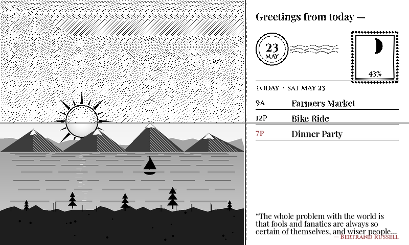](../assets/previews/theme_postcard_split.png)

#### naturalist

Victorian botanical plate. **Astloch** blackletter masthead — `PLATE [Roman]` left, `[YEAR-roman] · [MONTH]` right — sits above a triple rule, with a Cinzel small-caps Latin specimen name (`QUERCUS VERNALIS`, `AESTIVALIS`, `AUTUMNALIS`, `HIBERNALIS` keyed to the current season, plus weather suffixes `· sub pluvia / fulmine / nive / nebula / gelu` for rain, storm, snow, fog, and frost). The hero specimen is a procedurally-drawn branch with a solid black trunk, white engraving-style highlight strokes, curving roots, and mixed filled/outlined almond leaves whose count and treatment vary by season — bare in winter, buds in spring, lush canopy in summer, fallen leaves on the ground in autumn — plus weather overlays for rain, storm, snow, frost, and fog. Four leader-line callouts (`FIG. I EVENT`, `FIG. II LUNA`, `FIG. III SOL`, `FIG. IV AER`) pin today's first event, the moon's phase, sunrise/sunset, and the current weather to anatomical features on the specimen. A triple-rule footer carries the daily quote in Playfair with the author in red Cinzel small caps. The branch geometry is RNG-seeded from `(season, modifier, today)` so the same day always renders the same specimen. Floyd-Steinberg quantization. On Inky the masthead rules, callout lines, footer rules, and author small caps render in red.

[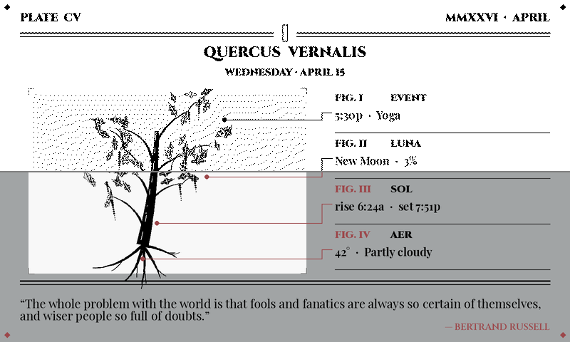](../assets/previews/theme_naturalist_split.png)

#### countdown

Full-canvas days-until tracker driven by `countdown.events` in `config.yaml`. A single event renders as a "hero" with a giant numeral and the event name; two to five events stack as rows, each with a prominent day count plus name and target date. Past events are dropped silently. No API calls.

```yaml
countdown:
  events:
    - name: "Paris Trip"
      date: "2026-06-04"
    - name: "Anniversary"
      date: "2026-08-12"
```

[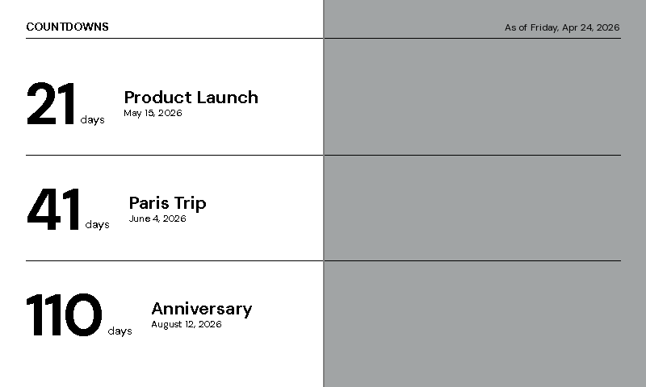](../assets/previews/theme_countdown_split.png)

#### message

Manual message display for reminders or announcements. Use:

```bash
venv/bin/python -m src.main --dry-run --dummy --theme message --message "Dentist at 3pm"
```

[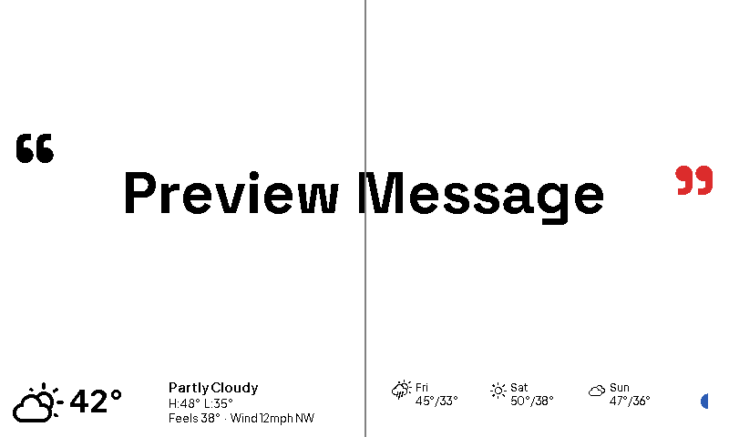](../assets/previews/theme_message_split.png)

#### diags

Structured diagnostic readout for validating live data and system state.

[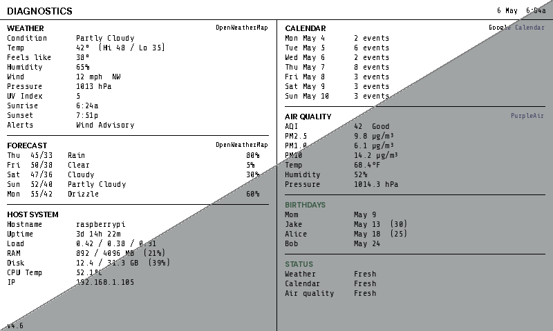](../assets/previews/theme_diags_split.png)

---

## Creating your own theme

Contributor-facing implementation details live in [CONTRIBUTING.md](../CONTRIBUTING.md) and [CLAUDE.md](../CLAUDE.md). The operator-facing rule is simple: custom themes must be registered in the theme registry before they can be referenced from `config.yaml`.

If you are authoring a greyscale custom theme, set `ThemeLayout.canvas_mode = "L"` and use `fg=0, bg=255` in `ThemeStyle`.

---

## Typography

Bundled font families used by the current built-in themes:

| Font | Used by |
|---|---|
| Plus Jakarta Sans | default and general fallback |
| DM Sans | `agenda`, `minimalist`, `weather`, `fuzzyclock`, `timeline`, `diags`, `monthly`, `countdown`, `astronomy`, `light_cycle`, `constellation_map` (margin), `trends` |
| Playfair Display | `old_fashioned`, `qotd`, `almanac`, `postcard`, `naturalist` |
| Cinzel | `fantasy`, `old_fashioned`, `almanac` (section labels + small caps), `postcard` (section labels + author small caps), `naturalist` (specimen name + author small caps) |
| Cormorant Garamond | `moonphase` (body, illumination, strips, quote) |
| Tangerine | `moonphase` (script quote attribution) |
| Manufacturing Consent | `moonphase` (Fraktur phase-name headline) |
| Righteous | `light_cycle` (centre date numeral), `halftone` (every typeset element) |
| Audiowide | `constellation_map` (cardinal letters, star + constellation labels) |
| Astloch | `almanac` (masthead + dateline character font), `naturalist` (masthead character font) |
| NuCore Condensed | `sunrise`, `tides` (high-contrast display numerals) |
| Space Grotesk | `air_quality`, `message`, `year_pulse`, `scorecard` |
| Share Tech Mono / terminal fonts | `terminal`, `diags`, `trends` (tabular numerals), select utility text |

To regenerate the Waveshare and Inky preview images embedded above, see [Previews](previews.md).
