← [README](../README.md)

# Themes

Use this page to pick a theme, set up scheduled or context-aware switching, or browse the catalog of built-in themes.

- [Switching themes](#switching-themes)
- [Random rotation](#random-rotation)
- [Time-of-day theme schedule](#time-of-day-theme-schedule)
- [Context-aware theme rules](#context-aware-theme-rules)
- [Built-in themes](#built-in-themes)
- [Creating your own theme](#creating-your-own-theme)
- [Typography](#typography)
- [Inky color previews](inky-previews.md)
- [Regenerating preview images](previews.md)

---

## Switching themes

Set one concrete theme in `config.yaml`:

```yaml
theme: terminal
```

Valid values:

- **Week-view**: `default`, `terminal`, `old_fashioned`, `fantasy`
- **Full-screen focused**: `qotd`, `qotd_invert`, `weather`, `fuzzyclock`, `fuzzyclock_invert`, `moonphase`, `moonphase_invert`, `moonphase_photo`, `photo`
- **Specialized**: `air_quality`, `almanac`, `astronomy`, `constellation_map`, `day_arc`, `halftone`, `halftone_agenda`, `trends`, `monthly`, `light_cycle`
- **Dithered art**: `postcard`
- **Utility**: `countdown`, `message`, `diags`
- **Rotation**: `random_daily` (alias `random`), `random_hourly`

Or override it from the CLI:

```bash
venv/bin/python -m src.main --dry-run --dummy --theme terminal
```

The `--theme` flag takes precedence over `config.yaml`.

Themes control layout, font system, panel visibility, and rendering style. Some are week-view layouts, some are full-screen focused displays, and some are operator utilities.

To regenerate the preview images embedded below after a theme edit, see [Previews](previews.md).

---

## Random rotation

Three theme values trigger rotation logic:

| Theme value | Rotates | State file |
|---|---|---|
| `random_daily` | Once per day, at first refresh after midnight | `state/random_theme_state.json` |
| `random_hourly` | Once per hour, at first refresh after the hour turns | `state/random_theme_hourly_state.json` |
| `random` | Alias for `random_daily` | `state/random_theme_state.json` |

```yaml
theme: random_daily
random_theme:
  include: []
  exclude: []
```

- `include` is an allowlist. Empty means all eligible themes.
- `exclude` is a denylist applied after `include`.
- `diags`, `message`, `photo`, and `countdown` are excluded from the random pool by design — they all need manual input (a message text, a photo path, or countdown events) and aren't useful as random picks.
- If the pool ends up empty, the app falls back to `default`.
- Run `make check` to validate theme names.

---

## Time-of-day theme schedule

Use `theme_schedule` to switch themes at specific local times:

```yaml
theme_schedule:
  - time: "06:00"
    theme: "default"
  - time: "20:00"
    theme: "moonphase"
  - time: "22:00"
    theme: "fuzzyclock_invert"
```

Priority order:
1. `--theme`
2. `theme_rules`
3. `theme_schedule`
4. `theme` in `config.yaml`

The active entry is the last row whose `time` is less than or equal to the current local time. When no row applies yet, normal fixed or random theme selection runs.

---

## Context-aware theme rules

`theme_rules` evaluates live context (weather, time-of-day, season, weekday, calendar) and picks a theme when a condition matches. Rules fire **before** `theme_schedule`, so they can override the time-of-day schedule when the conditions warrant it.

```yaml
theme_rules:
  - when: { weather_alert_present: true }
    theme: "message"
  - when: { calendar: "birthday_today" }
    theme: "day_arc"
  - when: { calendar: "upcoming_soon" }
    theme: "day_arc"
  - when: { calendar: ["empty", "done"] }
    theme: "qotd"
  - when: { weather: ["rain", "snow", "thunderstorm"] }
    theme: "weather"
  - when: { daypart: "night", weather: "clear" }
    theme: "moonphase"
  - when: { aqi_at_least: 100 }
    theme: "air_quality"
  - when: { temp_at_most: 32 }
    theme: "weatherglass"
  - when: { weekday: "weekend" }
    theme: "almanac"
```

Rules are evaluated top-to-bottom; the **first matching** rule wins. A rule matches when every `when:` field it sets evaluates true against the current context (AND semantics). Unset fields don't constrain.

Supported conditions:

| Field | Values | Notes |
|---|---|---|
| `weather` | OWM description substring (scalar or list) | `"rain"`, `"snow"`, `"clear"`, `"clouds"`, `"thunderstorm"`, `"fog"`, ... Matches against the current weather description — any listed token hitting as a substring counts as a match. |
| `weather_alert_present` | `true` / `false` | Fires when any OWM alert is active (or explicitly when no alert is active). |
| `daypart` | `"dawn"`, `"day"`, `"dusk"`, `"night"` (scalar or list) | With weather data: `dawn` = sunrise ±90min, `day` = after dawn until sunset−60min, `dusk` = sunset−60min through sunset, `night` = after sunset until the next dawn. Without weather data, fixed clock ranges anchored on a 06:30 / 18:30 sun cycle are used. |
| `season` | `"spring"`, `"summer"`, `"fall"`/`"autumn"`, `"winter"` (scalar or list) | N-hemisphere meteorological buckets by month. |
| `weekday` | `"weekend"`, `"weekday"`, or a day name (scalar or list) | E.g. `"monday"`. |
| `calendar` | `"empty"`, `"done"`, `"active"`, `"upcoming_soon"`, `"busy"`, `"birthday_today"` (scalar or list) | Today's calendar state — see below. States can overlap; a rule listing any matching state fires. |
| `temp_at_least` / `temp_at_most` | number | Current temperature bounds, inclusive, in your configured `weather.units` (°F for `imperial`, °C for `metric`). Set both for a band. |
| `aqi_at_least` | number | Minimum EPA AQI, inclusive. Needs PurpleAir configured — without it the source is never fetched, so the rule never fires. |

Calendar states:

| Value | Fires when… |
|---|---|
| `empty` | No events cover today (no timed events today, no all-day events spanning today). |
| `done` | There's at least one timed event today and all of them have ended. |
| `active` | Currently inside a timed event (`start <= now < end`). All-day events don't trigger this. |
| `upcoming_soon` | The next timed event starts within the next 30 minutes. |
| `busy` | 5 or more events cover today (timed + spanning all-day combined). |
| `birthday_today` | At least one birthday's month/day matches today. |

All-day events use the iCal inclusive-start / exclusive-end convention, so a vacation stored as `2026-04-22` → `2026-04-25` covers April 22, 23, and 24.

Conditions that need a data source skip silently when that source is unavailable, rather than matching. This applies to `weather`, `weather_alert_present`, `temp_at_least` / `temp_at_most`, `aqi_at_least`, and `calendar`, and it is what lets an offline boot fall through cleanly to `theme_schedule` / `theme`. It also applies to the pre-fetch resolution pass, which runs before any data is loaded.

A threshold the parser cannot read as a number drops the whole rule rather than widening it — a rule with an unreadable bound would otherwise match everything and shadow every rule below it. `make check` reports an inverted band (`temp_at_least` above `temp_at_most`), an AQI outside the EPA 0–500 scale, and an `aqi_at_least` rule on an install without PurpleAir.

Rules that reference weather or calendar data silently skip on the first boot (no cached data yet), so the system falls through to `theme_schedule` / `cfg.theme` until data is available. A calendar fetch failure with no usable cache is treated the same way — event-derived rules don't fire on false-positive "empty" days during outages. If any rule could resolve to `monthly`, the calendar event window is pre-sized for the month grid so the view has complete data whenever the rule fires.

---

## Built-in themes

### Week-view themes

| Theme | Best for | Notes |
|---|---|---|
| `default` | general family wall display | Classic 7-day layout with bottom weather, birthdays, and quote panels |
| `terminal` | high-contrast retro look | Inverted black canvas with a distinct multi-font system |
| `old_fashioned` | decorative print-inspired display | Serif-heavy broadsheet layout |
| `fantasy` | stylized themed display | Ornamental black-canvas week layout |

### Full-screen focused themes

| Theme | Best for | Notes |
|---|---|---|
| `qotd` | quote-first display | Full-screen quote plus compact weather strip |
| `qotd_invert` | dark quote display | Inverted variant of `qotd` |
| `weather` | weather station view | Current conditions, forecast, alerts, optional AQI |
| `fuzzyclock` | glanceable clock | Natural-language time plus weather strip |
| `fuzzyclock_invert` | dark clock display | Inverted variant of `fuzzyclock` |
| `moonphase` | moon and sky display | Procedurally-rendered lunar disc (true terminator, maria, craters, earthshine), 7-day progression, illumination, moonrise/moonset, sunrise/sunset, next full/new moon countdown, supermoon badge, weather, quote |
| `moonphase_invert` | bright moon display | Parchment-engraving variant of `moonphase` |
| `moonphase_photo` | photographic moon display | Same layout as `moonphase`, but the hero and filmstrip discs are a real moon photograph (`assets/moon_full.png`) occluded by the phase terminator. Replace the bundled photo with your own centred full-moon image to re-skin every disc; falls back to the procedural disc when the asset is absent. |
| `photo` | custom photo background | Full-canvas image, edge to edge with no header bar; requires `photo.path` |

### Specialized themes

| Theme | Best for | Notes |
|---|---|---|
| `air_quality` | indoor/outdoor AQI dashboard | PurpleAir-first full-screen layout |
| `almanac` | editorial daily reference | Old-Farmer's-Almanac front page: ornamental masthead with Roman-numeral volume, big editorial dateline, four bordered sections in a 2×2 grid (Heavens, From the Sky, Week Ahead, Next in the Garden), and a footer aphorism with author in small caps. Combines weather, astronomy, moon, calendar, birthdays, and quote — no new fetcher. |
| `day_arc` | today's calendar, front and centre | Calendar-forward sibling of `halftone`. A dithered ribbon draws today as a left-to-right arc keyed to real sunrise/sunset, with the sun (or moon, after dark) at the current time's true position; the ribbon's baseline is a time axis carrying hour ticks, a NOW caret and one pip per event. Below it, a full-height agenda where dithering means something — elapsed events are Bayer-screened, the event in progress is inverted, upcoming ones are crisp — plus a rail with temperature, conditions and birthdays. Adapts after dark and rolls over to tomorrow once the day is spent. Pure-Python — no external assets. |
| `halftone` | contemplative weather plate | Procedurally-drawn dithered weather illustration (sun, clouds, rain stipple, thunderstorm, snow, fog, or moon-at-current-phase) as a hero engraving; below it a typeset margin band with the temperature numeral + feels-like caption, a NOW row (condition + H/L), a TODAY row (sunrise/sunset + date), and a NEXT row (soonest upcoming timed event). Floyd-Steinberg quantization turns the procedural greyscale gradients into engraving-style halftone. Pure-Python — no external assets. |
| `halftone_agenda` | weather art beside the day's list | Split-plate variant of `halftone`: the engraving and the weather read-out take the left 372 px, a full-height ordered-Bayer rule divides the plate, and the right pane is given entirely to today's events. The agenda encodes each event's state in its rendering — elapsed rows perforated, the event in progress inverted, the next one up accented — and rolls over to tomorrow after dark once the day is spent. Pure-Python — no external assets. |
| `trends` | long-context dashboard | Five stacked sparkline rows: 24h temp, AQI scale, 7-day daylight, 14-day event density, 30-day moon. Bayer-filled area under each curve gives a clean halftone density read on eInk. First chart/graph theme; ordered-Bayer quantization preserves the regular dot pattern. |
| `astronomy` | sky-tonight dashboard | Sunrise/sunset, civil/nautical/astronomical twilight, moon phase + next full/new, next meteor shower, dark-sky window. Uses `weather.latitude` / `weather.longitude` for twilight math (falls back gracefully without them). Pure-Python — no API calls. |
| `constellation_map` | tonight's actual sky | Dark-canvas star chart projected for the user's location and the current moment. Renders ~45 named bright stars, seven recognisable northern constellations connected by lines, and the moon at its current alt/az. During daylight the chart auto-projects for tonight's solar midnight so it stays informative. Requires `weather.latitude` / `weather.longitude`; pure-Python sky math (no API). |
| `monthly` | month-at-a-glance planning | Traditional month grid with event-density heatmap |
| `light_cycle` | whole-day-at-a-glance | 24-hour radial clock with twilight bands on the rim, today's events as ticks inside the ring, needle and sun/moon glyph at the current moment, date and weather in the central disc. Uses `weather.latitude` / `weather.longitude` for full astronomical / nautical / civil twilight bands (falls back to OWM sunrise/sunset without them). Pure-Python — no API calls. |
| `weatherglass` | decorative weather station | Victorian brass-and-mahogany instrument deck: hero thermometer, round barometer dial with a pressure-trend needle, hygrometer + UV-index gauges, and a secondary row of wind compass, sun arc, moon porthole, and an optional AQI badge. Rye-masthead, fully procedural gauges, no new fetcher. |

### Dithered art themes

| Theme | Best for | Notes |
|---|---|---|
| `postcard` | nostalgic vista | Dithered postcard: left two-thirds is a photograph (a waterbuck in tall grass, `assets/postcard_photo.jpg`), with a procedural scene keyed to the OWM icon + daypart as the fallback when the file is missing; right third is the postcard back (cursive greeting, red postmark with month/day, postage stamp with moon glyph, ruled "address" lines listing today's events, daily quote as signature). Floyd-Steinberg quantization. |

### Panoramic themes

For a panel shaped like a strip — the Waveshare 10.85" (G) is 1360 × 480, nearly
three times as wide as it is tall. These themes declare a 1360 × 480 canvas and
draw at the panel's native size; the landscape themes above reach that panel
letterboxed instead (see [`display.scaling`](configuration.md#scaling)). On an
800 × 480 panel the panoramic themes letterbox the other way, as a band.

**[Panoramic Themes](wide-themes.md)** is the guide to this set: setting up the
10.85" panel, choosing between the eight, how often each repaints, and previews in
the panel's own four inks.

| Theme | Best for | Notes |
|---|---|---|
| `wide_week` | the week view, with an editorial rail | The standard week grid, unchanged, on the right at full height (seven columns of ~131 px), beside a broadsheet-style rail: the weekday masthead, the weather now, what is on or next, a short forecast beside the sky, birthdays, and the day's quote. |
| `wide_day` | today, hour by hour | A time axis across the whole middle of the strip with every timed event as a bar over its real span, packed into lanes with its name attached; date and weather at the left end, the next few events and the week's birthdays at the right. A NOW marker and the bar states follow the clock. |
| `halftone_agenda_wide` | the split-plate agenda on a strip | `halftone_agenda` drawn for the strip: the engraving and weather band at the left, today's agenda at half again its usual width in the middle, and a third pane for what the 800 × 480 plate leaves out — alerts, the next day's events, the forecast, birthdays, air quality and the moon. Same engraving, same treatments, same fonts. |
| `wide_forecast` | weather station on a strip | Current conditions as a hero block with a detail grid, five forecast cards in a row with precipitation bars, and a band beneath for alerts, air quality and the moon. |
| `wide_night` | a night mode for the strip | Almost all negative space: the moon's phase, the temperature, the air-quality index and the weather glyph at one shared height, evenly spaced across the middle with small letter-spaced labels beneath, in black on a solid red ground. Jura numerals, Oxanium ExtraBold labels. Not in the random rotation — schedule it for after dark. |
| `wide_night_invert` | the night mode, red on black | `wide_night` with ground and ink swapped: red marks and labels on a black ground (black on white on monochrome). |
| `wide_horizon` | the next three days at a glance | One 72-hour time axis shared by everything: a sky coloured by the sun's real altitude (day, dithered twilights, night with stars and the moon), clouds and rain drawn per forecast slot, the temperature as one line across it, rain chance hanging beneath, and the calendar beneath: a strip marking each event on the same hours, over a one-line-per-event list for each day. Conditions now and a three-line outlook in a hero block at the left. |

### Utility themes

| Theme | Best for | Notes |
|---|---|---|
| `countdown` | days-until tracker | User-configured target dates; one event = hero numeral, multiple = stacked list. Driven by `countdown.events` in `config.yaml`; excluded from random rotation |
| `message` | one-off reminders | Requires `--message`; excluded from random rotation |
| `diags` | debugging and validation | Structured data readout; excluded from random rotation |
| `wide_diags` | panel and pipeline check on the 1360 × 480 strip | The `diags` readout on the left 800 px beside a swatch plate: each ink the panel has, every pair of inks mixed in ordered-dither steps, fine test textures, and a gradient the backend dithers itself. Excluded from random rotation |

### Theme details and previews

Every preview below is a **Waveshare** render — 1-bit black and white, the
way the theme lands on a monochrome panel.

> **On an Inky Impression?** The same themes map to the Spectra 6 palette, and
> several of them carry a deliberate color story. See
> [Inky Previews](inky-previews.md) for the full catalog in color.

#### default

Classic layout. Black text on white with a 7-day calendar grid and three bottom panels.

[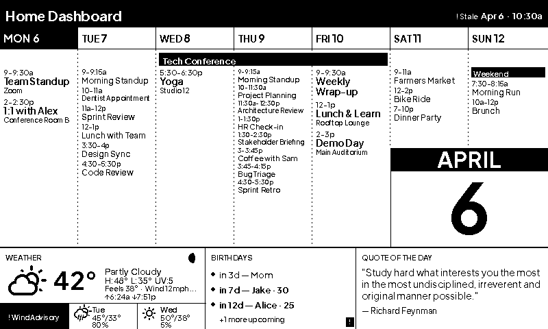](../assets/previews/theme_default.png)

#### terminal

High-contrast inverted week view with compact spacing and a retro terminal-inspired type system.

[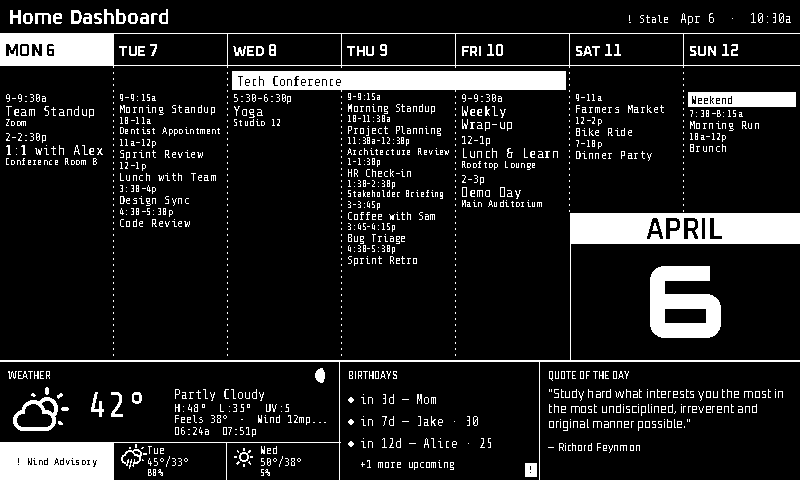](../assets/previews/theme_terminal.png)

#### old_fashioned

Victorian broadsheet layout with serif typography and decorative rules.

[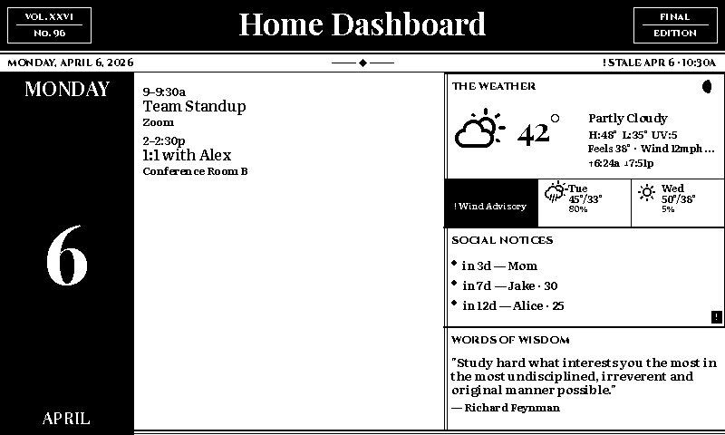](../assets/previews/theme_old_fashioned.png)

#### almanac

Old-Farmer's-Almanac front page in **Astloch** (blackletter masthead and dateline) + Playfair Display (body) + Cinzel (section labels and small caps). An ornamental masthead carries a Roman-numeral volume, day-of-year issue number, and the day's name; below it, the date is set in a large editorial line ("MAY 6, 2026") between two triple rules. The body splits into four bordered editorial sections in a 2×2 grid: **The Heavens** (sunrise/sunset, day length, today's lengthening or shortening, moon phase + illumination, next full moon), **From the Sky** (a short prose weather observation with wind direction, alerts, and high/low), **The Week Ahead** (today's first event plus the next few timed events and birthdays), and **Next in the Garden** (season + day-of-year, sun lengthening/shortening, next named meteor shower with ZHR). A triple rule and the day's quote close the page in italic small-caps; a row of small ornaments stamps the very bottom. Reuses every existing data source — weather, `src.astronomy`, `src.render.moon`, calendar, birthdays, quote — with no new fetcher. On Inky the rules, ornaments, bullets, and attribution all render in red.

[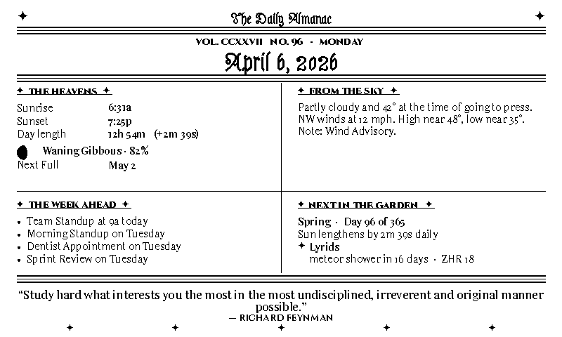](../assets/previews/theme_almanac.png)

#### halftone

Procedurally drawn weather plate in the style of a 19th-century natural-history engraving. The upper plate illustrates the current conditions from the OWM icon code: sun, moon and stars, cumulus, rain, lightning, snow or fog. Below a dithered rule, a typeset band carries the temperature with feels-like, the condition with high and low, sunrise and sunset, the date, and the next upcoming event. Set throughout in **Righteous**.

Needs weather; the NEXT line reads the calendar. Drawn in greyscale and dithered to 1-bit, so it always takes a full refresh. On Inky the sun and moon get a yellow ring. No external assets.

[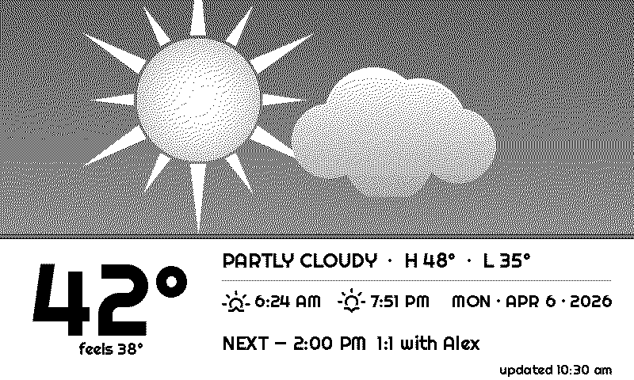](../assets/previews/theme_halftone.png)

#### halftone_agenda

The split-plate variant of [`halftone`](#halftone): the weather engraving and its reading on the left, the day's events on the right.

The **left pane** carries the procedural illustration for the current OWM icon code over a band with the temperature, condition, high and low, sunrise, sunset, date and feels-like. The **right pane** is today's agenda: a TODAY header with the event count, then as many rows as fit (with `+N more` beyond that), each with its start and end time. Past events are perforated, the one in progress is inverted, and the next one carries an accent tick. After sunset, once every timed event has ended, it rolls over to tomorrow behind a `TOMORROW` chip.

Needs weather and calendar; fetches one extra day of events for the rollover. The dithered plate always takes a full refresh (see [Themes that always refresh fully](configuration.md#themes-that-always-refresh-fully)). On Inky, yellow rings the sun and moon and red marks the running event and next-up tick.

[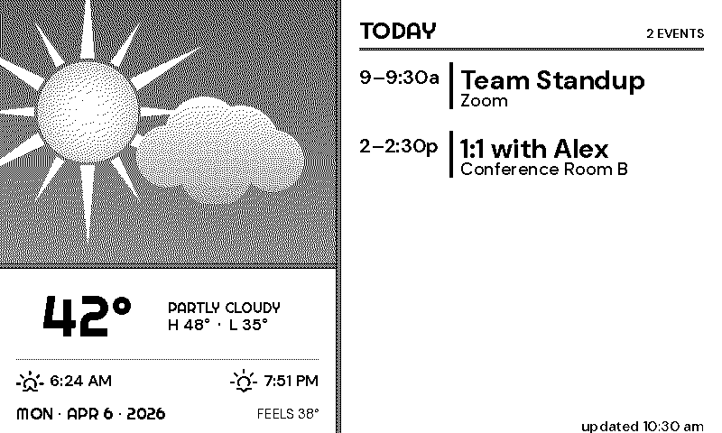](../assets/previews/theme_halftone_agenda.png)

#### trends

Stacked sparkline dashboard — the first chart/graph theme. A 32-px masthead carries today's date and current time; below it five evenly-stacked rows each visualise a different time series: **TEMP — 24h** (current observation + interpolated forecast across ±12 h), **AIR** (current AQI on a 6-zone health scale with progressive Bayer density per zone), **DAYLIGHT — 7d** (daily day-length for the next week, computed in-process via `src.astronomy`), **EVENTS — 14d** (per-day event count bars), and **MOON — 30d** (illumination curve through one synodic month, with the current phase glyph stamped at right). Each chart sits on a Bayer-filled area whose ordered dot pattern survives the eInk quantize step. Every row degrades gracefully when its data source is missing (no weather, no PurpleAir sensor, no lat/lon). On Inky the series render in blue with a yellow today-marker.

[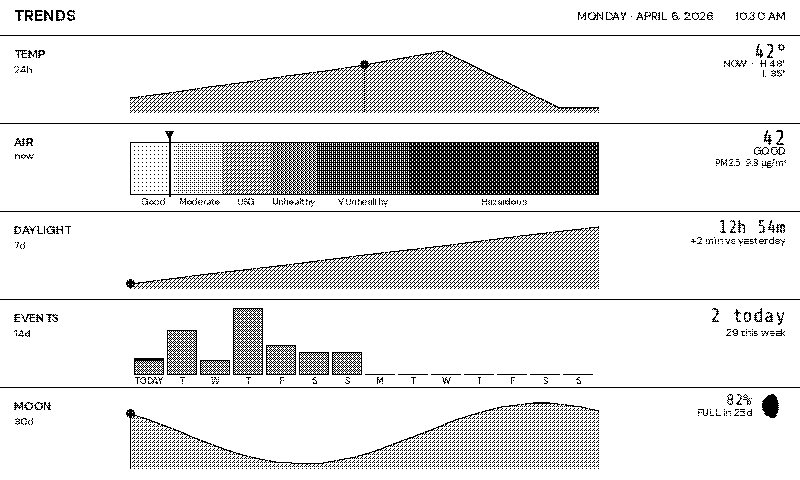](../assets/previews/theme_trends.png)

#### day_arc

The calendar-forward sibling of [`halftone`](#halftone): the artwork *is* the day.

The top of the plate is a **day ribbon**, a sky gradient keyed to the real sunrise and sunset with the sun (or the moon at its true phase, after dark) riding an arc at the current time, and the weather drawn around it. Beneath it a **time axis** carries daylight, hour ticks, a NOW caret and one pip per timed event. Below that, a full-height **agenda** marks past events as perforated, the current one as an inverted bar, and upcoming ones crisp; a narrow **rail** holds the temperature, conditions, high and low, and upcoming birthdays. After sunset, once today's events have ended, the agenda rolls over to tomorrow.

Needs calendar and weather. Set `weather.latitude` / `longitude` for true sun times; without them it uses the OWM times, then a fixed 05:00–23:00 window. Fetches one extra day of events. On Inky, yellow marks the sun, moon and daylight; red marks NOW, the running event and birthdays.

[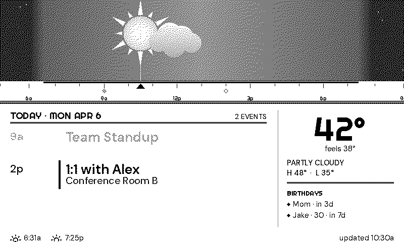](../assets/previews/theme_day_arc.png)

#### fantasy

Ornamental black-canvas week view with a fantasy-inspired visual system.

[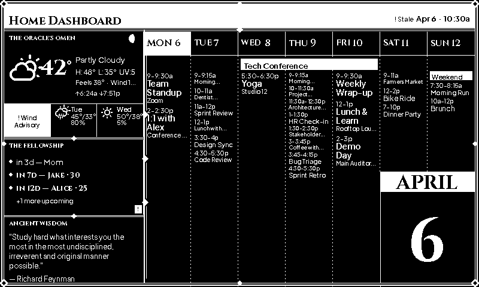](../assets/previews/theme_fantasy.png)

#### qotd

Full-screen quote layout with a compact weather strip across the bottom.

[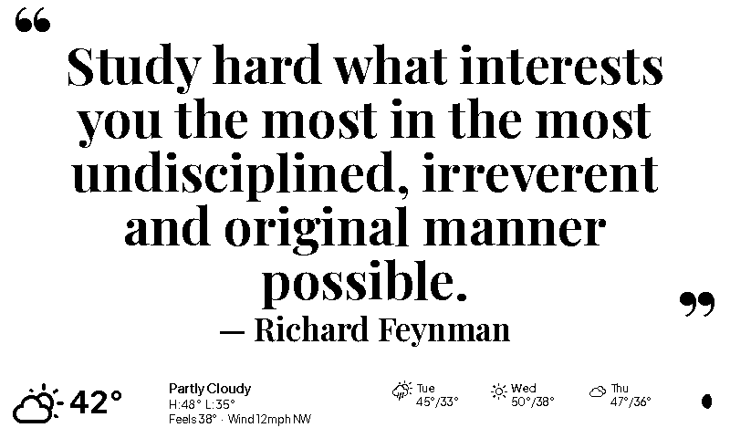](../assets/previews/theme_qotd.png)

#### qotd_invert

Inverted version of `qotd` with white quote text on black.

[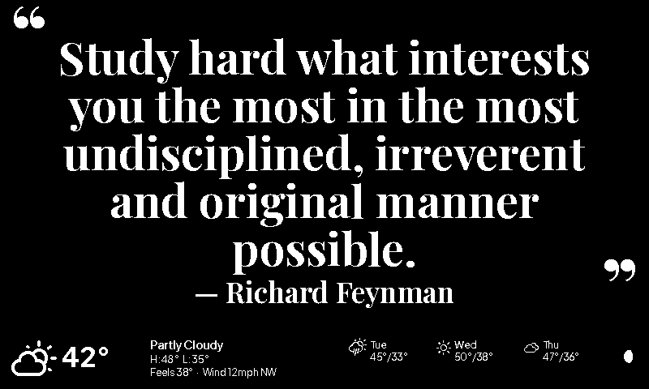](../assets/previews/theme_qotd_invert.png)

#### weather

Full-screen weather dashboard with current conditions, alerts, forecast, and optional AQI.

[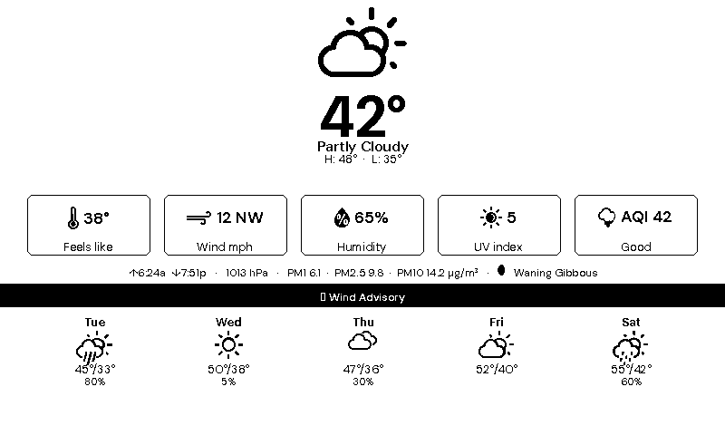](../assets/previews/theme_weather.png)

#### fuzzyclock

Natural-language clock with a compact weather strip and no calendar panels.

[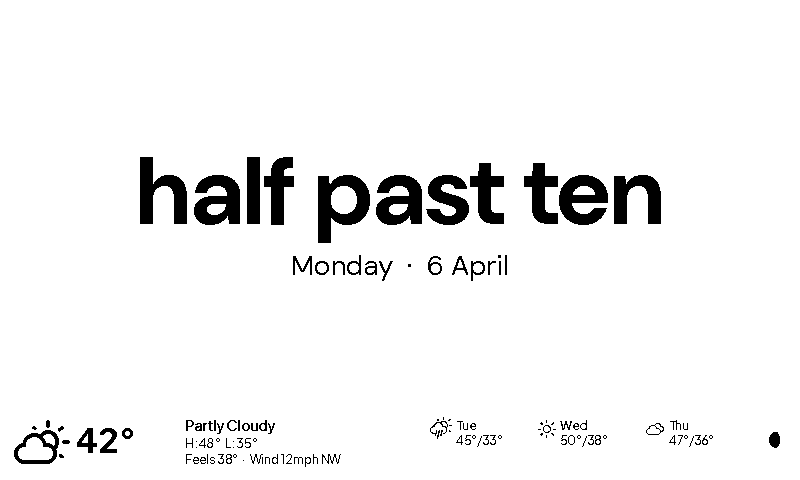](../assets/previews/theme_fuzzyclock.png)

#### fuzzyclock_invert

Inverted version of `fuzzyclock`.

[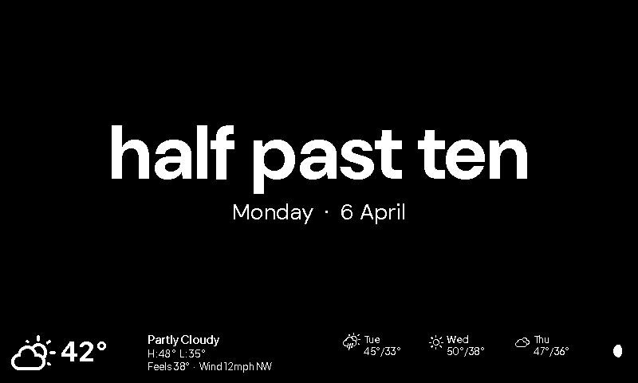](../assets/previews/theme_fuzzyclock_invert.png)

#### moonphase

Full-screen moon display built around a **procedurally-rendered lunar disc** —
a true phase terminator, maria, craters, and earthshine on the unlit limb,
rather than a flat font glyph. Flanked by a seven-day phase filmstrip and a
lunar-data block: illumination, moon age, moonrise/moonset (when
`weather.latitude`/`longitude` are set), sunrise/sunset, a compact weather
summary, and a countdown to the next full or new moon. A **supermoon badge**
appears when the full moon falls near perigee. Renders as smooth greyscale on
Waveshare and a warm-yellow moon with cool earthshine on Inky. Type is set in
semibold-to-bold Cormorant and rasterised bilevel so the hairlines survive the
threshold cut to 1-bit. Moon position
and phase are pure math (no API) via `src/render/moon.py` and `src/astronomy.py`.

[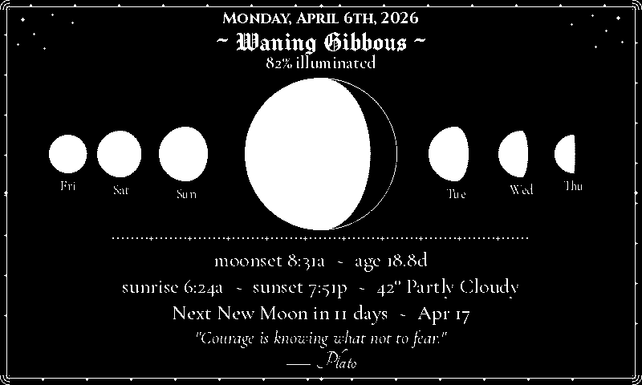](../assets/previews/theme_moonphase.png)

#### moonphase_invert

Parchment-engraving variant of `moonphase` — black ink on a light canvas, with
the same procedural moon and lunar-data block.

[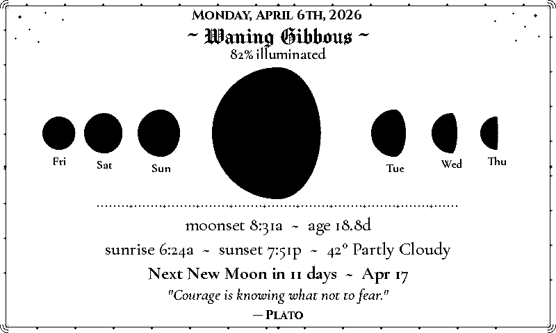](../assets/previews/theme_moonphase_invert.png)

#### moonphase_photo

Same layout, data block, and celestial border as `moonphase`, but the hero and
seven-day filmstrip discs are a **real moon photograph** (`assets/moon_full.png`)
occluded by the phase terminator instead of the procedural disc — the sunlit
region shows the photo while the shadowed side keeps a faint earthshine copy of
the same texture. Renders as a dithered photo on Waveshare and realistic
greyscale on Inky. Drop your own centred full-moon image in at
`assets/moon_full.png` to re-skin every disc (then regenerate the previews and
the pixel-snapshot baseline); it falls back to the procedural disc when the
asset is absent.

[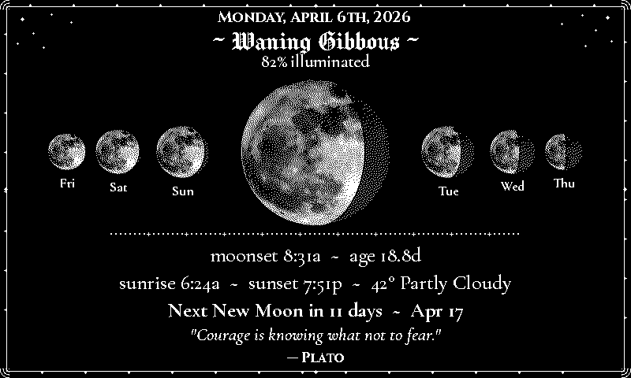](../assets/previews/theme_moonphase_photo.png)

#### photo

Full-canvas photo theme driven by `photo.path`. Intended for custom-image displays rather than calendar-heavy use.

[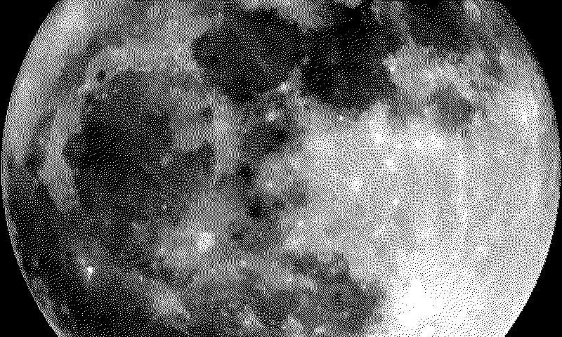](../assets/previews/theme_photo.png)

#### air_quality

Full-screen PurpleAir-oriented AQI dashboard with particulate, ambient, weather, and forecast sections.

[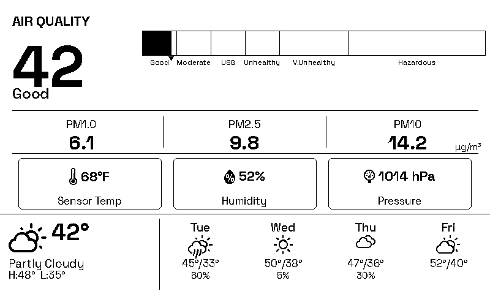](../assets/previews/theme_air_quality.png)

#### astronomy

Four-quadrant "sky tonight" layout plus a dark-sky-window footer: sunrise, solar noon, sunset, day-length delta, moon phase with illumination and next full/new dates, civil/nautical/astronomical dusk times, and the next annual meteor shower with its peak date and approximate zenithal hourly rate. All data is computed locally from `src.astronomy`; no API calls beyond weather lat/lon. When `weather.latitude` / `weather.longitude` are not configured, the theme falls back to OWM-reported sunrise/sunset and hides the twilight section.

[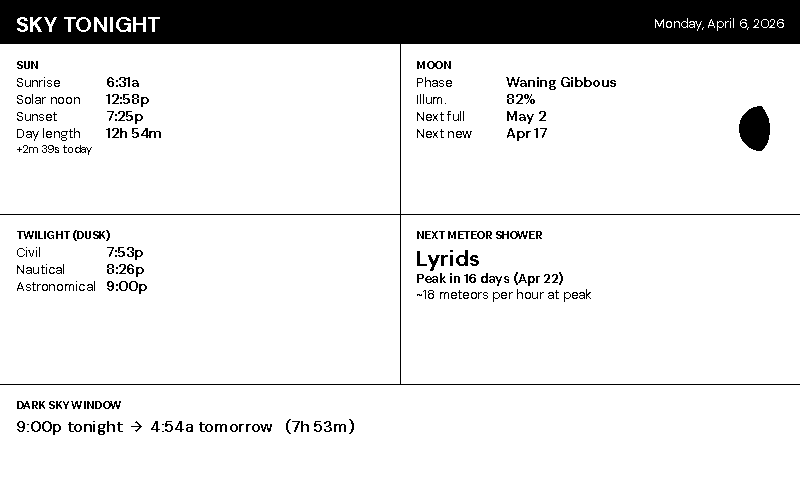](../assets/previews/theme_astronomy.png)

#### constellation_map

Dark-canvas star chart of tonight's sky, projected for the configured `weather.latitude` / `weather.longitude` using a "looking up" equidistant azimuthal projection — zenith at the centre, horizon at the rim, North at top, East to the **left**, South at bottom, West to the right. The disc is framed by a Cinzel-labelled cardinal ring with dotted altitude rings at 30° and 60°. About 45 bright named stars from a curated Bright Star subset are sized by visual magnitude; seven of the most recognisable northern constellations (Ursa Major, Cassiopeia, Orion, Lyra, Cygnus, Boötes, Leo) are joined by thin lines and labelled in italic small caps. The moon is plotted at its current altitude/azimuth using a simplified Schlyter ephemeris — when above the horizon it appears as the actual phase glyph in a halo. During daylight, the chart auto-projects for tonight's solar midnight so it stays informative. The footer shows location, the moon's current phase name, and the next named meteor shower. On Inky the rim, cardinal labels, and constellation names render in yellow with blue constellation lines and altitude rings; Waveshare stays clean monochrome white-on-black. All sky math is pure Python — no API calls.

[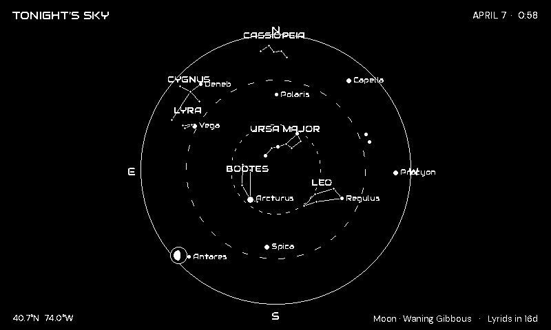](../assets/previews/theme_constellation_map.png)

#### monthly

Full-screen wall-calendar month view with day cells shaded by event density.
Waveshare uses a crisp monochrome month grid with compact density indicators; Inky uses a warm yellow-orange-red ramp.

[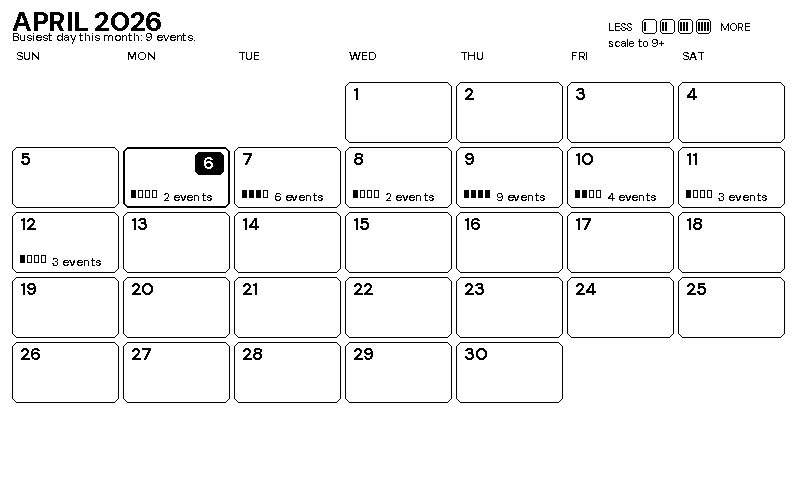](../assets/previews/theme_monthly.png)

#### light_cycle

Full-canvas 24-hour radial clock with the entire day arranged around a single dial. The rim carries hour ticks and 00 / 06 / 12 / 18 numerals; the twilight ring fills with progressively denser radial dashes from civil to nautical to astronomical twilight, and a solid wedge for true night. Today's timed events appear as small ticks just inside the ring, a triangular needle marks the current moment, and a sun (or moon, when below the horizon) glyph rides the rim at the current-time position. The center disc shows day name, big date numeral, month, and weather summary; a footer reports rise / set / event count. On Inky the title and accents render in yellow with a blue needle. All sun-time math is computed locally from `src.astronomy` using `weather.latitude` / `weather.longitude` (falls back to OWM-reported sunrise/sunset when coordinates are absent — twilight bands collapse to a single night band).

[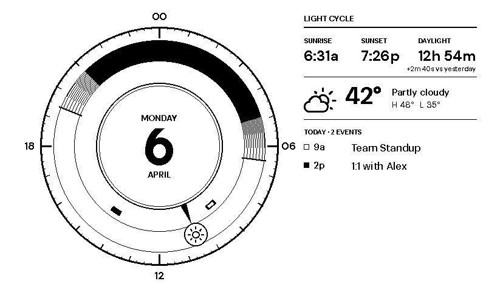](../assets/previews/theme_light_cycle.png)

#### weatherglass

Victorian weather-station instrument deck: a full-canvas panel of procedural analog gauges under a **Rye** masthead with the date and location. Three hero instruments: a thermometer with feels-like, a barometer whose second needle shows the pressure trend, and a hygrometer with a UV bar. A second row holds a wind compass, a sun arc with sunrise and sunset, a moon porthole, and an optional AQI badge (needs PurpleAir). An active weather alert overlays the masthead.

Needs weather; no extra fetcher. The barometer keeps a short pressure history in `state/weatherglass_pressure_history.json` for its trend needle (not written on dry-run or dummy previews). Rendered at 2× and thresholded, so edges stay crisp rather than dithered. On Inky the brass rims are yellow and the mercury and alert text red.

[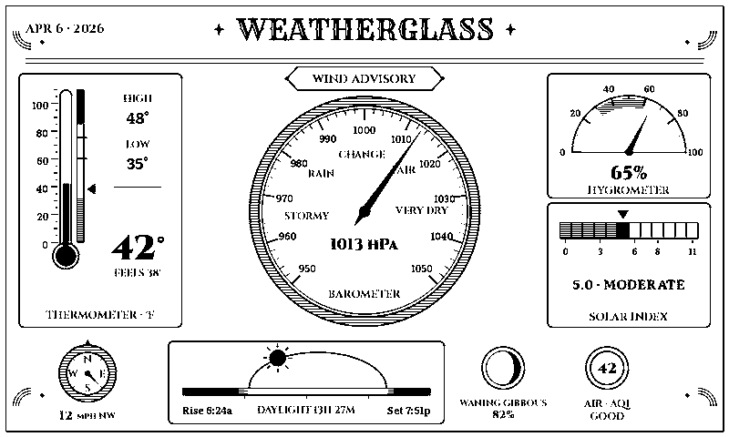](../assets/previews/theme_weatherglass.png)

#### postcard

Dithered postcard composed in two parts. The left two-thirds is the "view": a bundled photograph of a waterbuck (`assets/postcard_photo.jpg`), centre-cropped, autocontrasted and sharpened so it survives the dither. If the file is missing, a procedural scene keyed to the OWM icon and daypart (sky, mountains, water, shore, weather overlays) is drawn instead. The right third is the postcard back: a cursive greeting, a circular red postmark with the current month and day, a perforated postage stamp carrying the moon-phase glyph, four ruled "address" lines listing today's events, and the daily quote as the signature. A 3 px white gutter with a dashed shadow forms the centre crease. Floyd-Steinberg quantization turns the procedural greyscale gradients into engraving-style halftone. On Inky the postmark and the stamp frame render in red.

[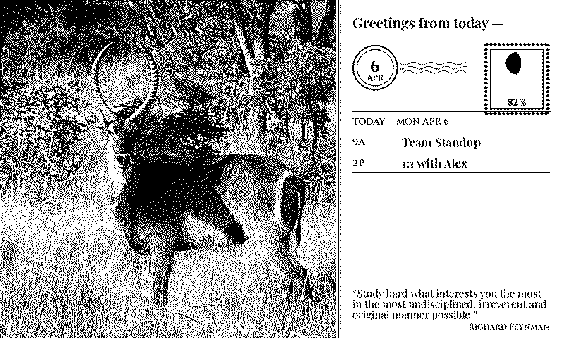](../assets/previews/theme_postcard.png)

#### wide_week

The default theme's week grid at the native size of a panoramic panel, on the right 920 px at full height with no header bar, beside a 440-px editorial rail. The rail holds, top to bottom:

- **Masthead:** the weekday, ISO week, day of the year and the "updated" stamp.
- **Weather now:** temperature, condition, high and low, feels-like, wind, and the first active alert.
- **NOW / NEXT:** the event in progress, or the next one to start.
- **Forecast and sky:** three forecast days beside sunrise, sunset, day length and the moon.
- **Birthdays** in the next two weeks, and the day's **quote**.

Needs calendar and weather; set `weather.latitude` / `longitude` for day length. Fetches one extra day of events. Red marks labels and warnings; yellow is only ever a highlighter behind black type, and drops out on monochrome. Letterboxes on an 800 × 480 panel. See [Panoramic Themes](wide-themes.md#wide_week) for the four-ink render.

[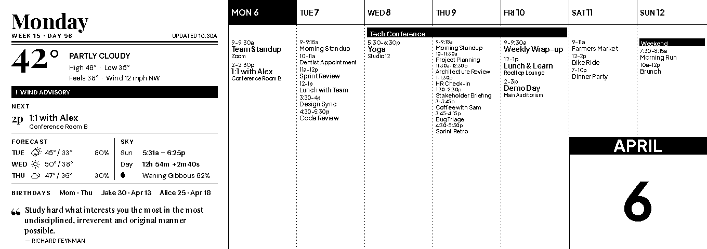](../assets/previews/theme_wide_week.png)

#### wide_day

Today as a timeline across the strip. An hour axis (6 a.m. to 10 p.m., widened to fit any event outside it) fills the middle, with every timed event drawn as a bar over its real span and packed into lanes with its title attached. Past events are dashed, the one in progress is solid in the alert accent, and upcoming ones are outlined. All-day events sit as chips; a marker shows the current time.

The left end carries the date and the weather now, with an alert bar when one is active. The right end is an UP NEXT rail, reaching into tomorrow once today is done, then the coming week's birthdays.

Needs calendar and weather; fetches one extra day of events. The marker follows the clock, so the plate changes every tick: on a colour panel, set `display.min_refresh_interval_seconds` (e.g. 900) to space out the full refreshes. See [Panoramic Themes](wide-themes.md#wide_day).

[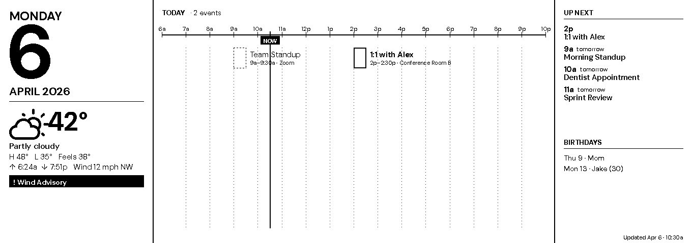](../assets/previews/theme_wide_day.png)

#### halftone_agenda_wide

[`halftone_agenda`](#halftone_agenda) drawn at the strip's own size, in three panes:

- **Art:** the procedural weather engraving over the same weather band as the original.
- **Agenda:** the whole day, headed by a count of events and booked time, with a schedule strip from 6 a.m. to 10 p.m. Each row shows times, title, location and duration, with free gaps of half an hour or more labelled. Unlike the original, rows carry no past / now / next treatments, so the plate repaints once a day rather than at every event boundary.
- **Rail:** weather alerts, tomorrow's first events, the forecast, upcoming birthdays, and air quality beside the moon's phase.

Needs calendar and weather; air quality needs PurpleAir. Fetches two extra days of events. Always takes a full refresh (the engraving dithers). On a colour panel yellow marks the sun and timed events, red the all-day events, alerts and an unhealthy AQI. Letterboxes on an 800 × 480 panel. See [Panoramic Themes](wide-themes.md#halftone_agenda_wide).

[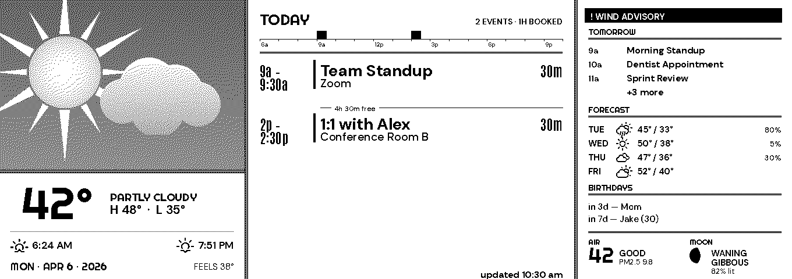](../assets/previews/theme_halftone_agenda_wide.png)

#### wide_forecast

A weather strip. The conditions now sit in a hero block at the left (location, icon, temperature, condition, high, low and feels-like, over a grid of humidity, wind, pressure, UV, sunrise and sunset), beside five forecast cards with weekday, icon, high and low, condition and a chance-of-precipitation bar. A band beneath holds active alerts, the air-quality index, and the moon's phase with the days to the next full moon.

Needs weather; air quality needs PurpleAir and reads "No sensor" without it. Nothing reads the clock, so an idle tick costs no panel write. On a colour panel red marks labels, today's chip, alerts and an unhealthy AQI, and yellow fills the precipitation bars. See [Panoramic Themes](wide-themes.md#wide_forecast).

[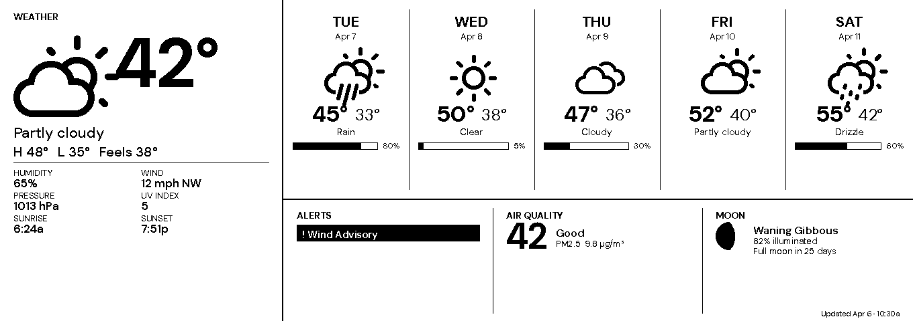](../assets/previews/theme_wide_forecast.png)

#### wide_horizon

The next three days on one time axis. The window starts at the current three-hour forecast slot and runs 72 hours, so weather and plans line up by eye: the dinner on Thursday is after dark, and it will be 38° and raining.

Top to bottom: each day's name; a **sky** coloured by the sun's real altitude (day, twilight, night with stars and the moon) with each slot's clouds, rain, snow or fog; the **temperature** as a line with each day's turning points; each slot's **chance of rain** as a bar; then the calendar: all-day events and birthdays as bands, a schedule strip of timed events, and a short list of each day's events. A hero block at the left carries the conditions now and the window's warmest, coldest and first rain. Overnight hours are compressed.

Needs weather and calendar; set `weather.latitude` / `longitude` for a true sky. Fetches three extra days of events. Repaints at most once an hour. See [Panoramic Themes](wide-themes.md#wide_horizon).

[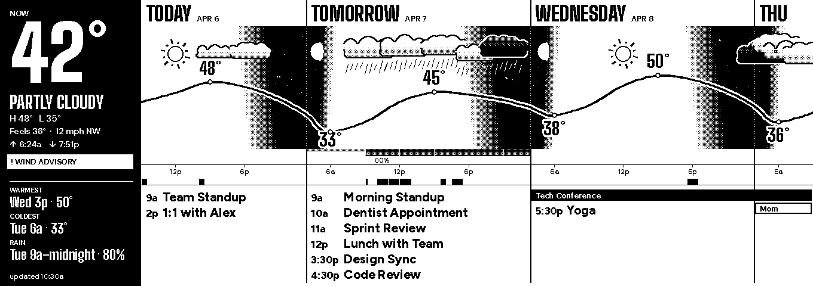](../assets/previews/theme_wide_horizon.png)

#### wide_night

A night mode for the strip, built to be left up in a dark room. Four marks and nothing else: the moon's phase, the temperature, the air-quality index and the current weather glyph, evenly spaced at one large height with a small label under each (`MOON`, `TEMP`, `AQI`, `SKY`). A mark without data is dropped and the rest re-spaced.

On a colour panel (and Inky) the marks are black on a solid red ground; on monochrome, white on black.

Needs weather; the AQI mark needs PurpleAir. Repaints at most once an hour and always takes a full refresh. It is **not** in the random rotation; put it up with `theme_schedule` (e.g. `wide_night` at `21:00`, back to a day theme at `06:30`) or a `theme_rules` entry with `daypart: night`. See [Panoramic Themes](wide-themes.md#choosing-a-theme).

[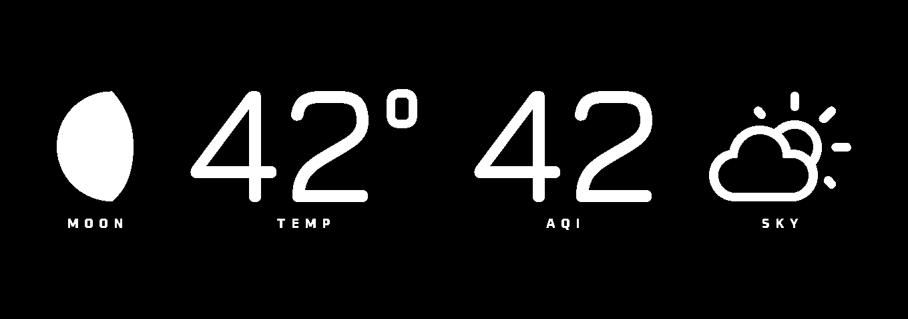](../assets/previews/theme_wide_night.png)

#### wide_night_invert

[`wide_night`](#wide_night) with ground and ink swapped: the same four marks, labels, spacing and hourly repaint limit, in red on a solid black ground on the four-ink panel and on Inky. A monochrome panel draws it black on white. Like its sibling it stays out of the random rotation and declines partial refresh.

[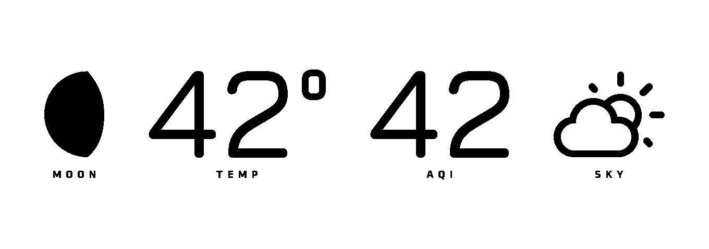](../assets/previews/theme_wide_night_invert.png)

#### countdown

Full-canvas days-until tracker driven by `countdown.events` in `config.yaml`. A single event renders as a "hero" with a giant numeral and the event name; two to five events stack as rows, each with a prominent day count plus name and target date. Past events are dropped silently. No API calls.

```yaml
countdown:
  events:
    - name: "Paris Trip"
      date: "2026-06-04"
    - name: "Anniversary"
      date: "2026-08-12"
```

[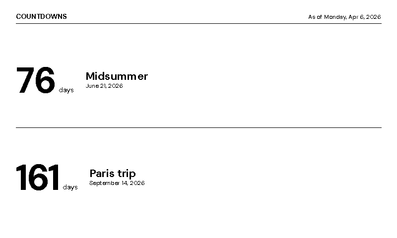](../assets/previews/theme_countdown.png)

#### message

Manual message display for reminders or announcements. Use:

```bash
venv/bin/python -m src.main --dry-run --dummy --theme message --message "Dentist at 3pm"
```

[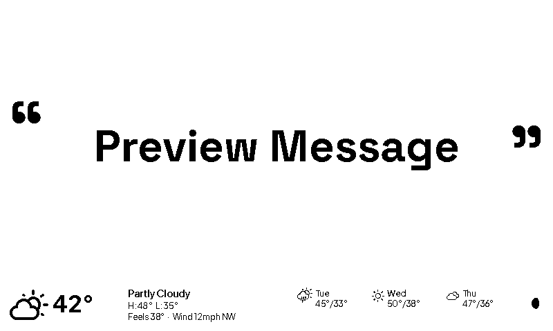](../assets/previews/theme_message.png)

#### diags

Structured diagnostic readout for validating live data and system state.

[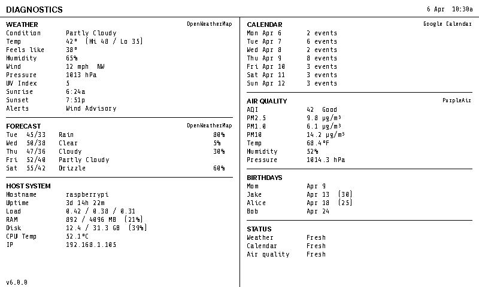](../assets/previews/theme_diags.png)

#### wide_diags

The [`diags`](#diags) readout, unchanged, on the left 800 px, beside a swatch plate for checking what a panel and the render pipeline can show:

- **Inks:** one swatch per ink the panel has (four on the Waveshare 10.85" G, six on Inky, two on monochrome).
- **Pair ramps:** every pair of inks mixed through an ordered screen in eighths.
- **Textures:** single-pixel test patterns.
- **Diffused:** a hue sweep and grey ramp, dithered by the pipeline itself.

A diagnostic, not a daily theme: it changes every tick, always takes a full refresh, and is excluded from random rotation. See [Panoramic Themes](wide-themes.md#wide_diags) for the four-ink render.

[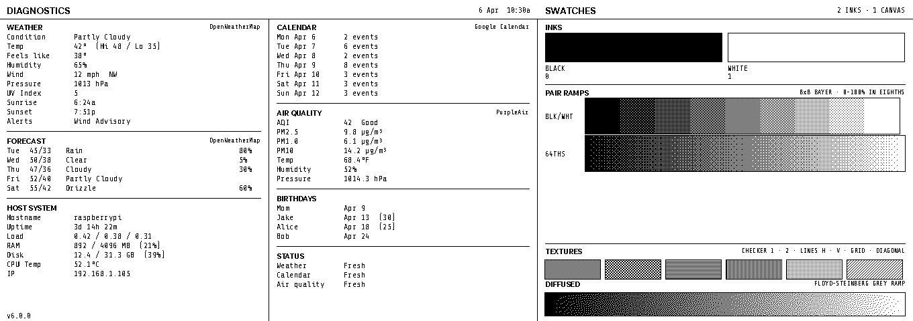](../assets/previews/theme_wide_diags.png)

---

## Creating your own theme

Contributor-facing implementation details live in [CONTRIBUTING.md](../CONTRIBUTING.md) and [CLAUDE.md](../CLAUDE.md). The operator-facing rule is simple: custom themes must be registered in the theme registry before they can be referenced from `config.yaml`.

If you are authoring a greyscale custom theme, set `ThemeLayout.canvas_mode = "L"` and use `fg=0, bg=255` in `ThemeStyle`.

---

## Typography

Bundled font families used by the current built-in themes:

| Font | Used by |
|---|---|
| Plus Jakarta Sans | default and general fallback |
| DM Sans | `weather`, `fuzzyclock`, `diags`, `monthly`, `countdown`, `astronomy`, `light_cycle`, `constellation_map` (margin), `trends`, `day_arc` (agenda rows), `halftone_agenda` (agenda rows) |
| Playfair Display | `old_fashioned`, `qotd`, `almanac`, `postcard` |
| Cinzel | `fantasy`, `old_fashioned`, `almanac` (section labels + small caps), `postcard` (section labels + author small caps), `moonphase` (dateline + quote attribution) |
| Cormorant Garamond | `moonphase` (body, illumination, strips, quote) |
| Manufacturing Consent | `moonphase` (Fraktur phase-name headline) |
| Righteous | `light_cycle` (centre date numeral), `halftone` (every typeset element), `day_arc` (chrome), `halftone_agenda` (weather pane + agenda chrome) |
| Audiowide | `constellation_map` (cardinal letters, star + constellation labels) |
| Astloch | `almanac` (masthead + dateline character font) |
| Antonio | `halftone_agenda_wide` (agenda time cells + duration column) |
| Oxanium | `terminal` (dashboard title, day column headers, quote body) |
| Rajdhani | `terminal` (month band, section labels, quote attribution) |
| Orbitron | `terminal` (large today date numeral) |
| Space Grotesk | `air_quality`, `message` |
| Share Tech Mono | `terminal` (all four base text slots — the theme's general body and data face: event rows, weather readings, birthday rows, header timestamp; the display faces above cover only the title, section-label, month-band, date-numeral and quote slots), `diags` (all data rows), `trends` (tabular numerals), select utility text |

For the same catalog rendered in Inky Spectra 6 color, see
[Inky Previews](inky-previews.md). To regenerate either set of preview images,
see [Previews](previews.md).
