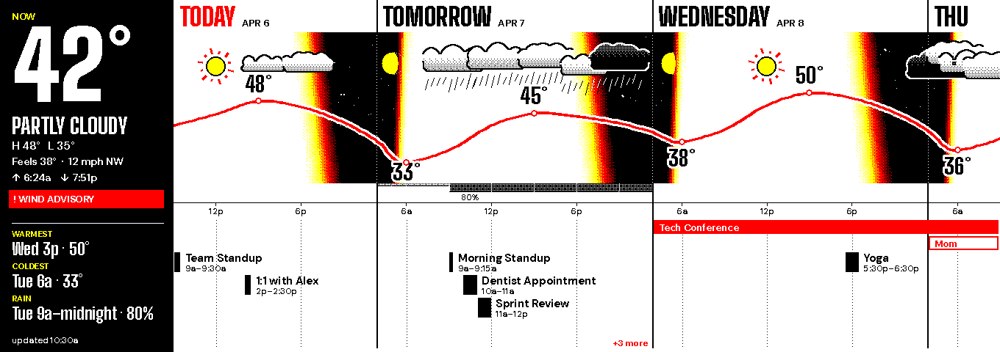
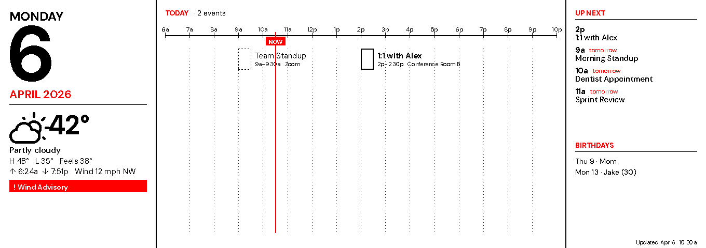
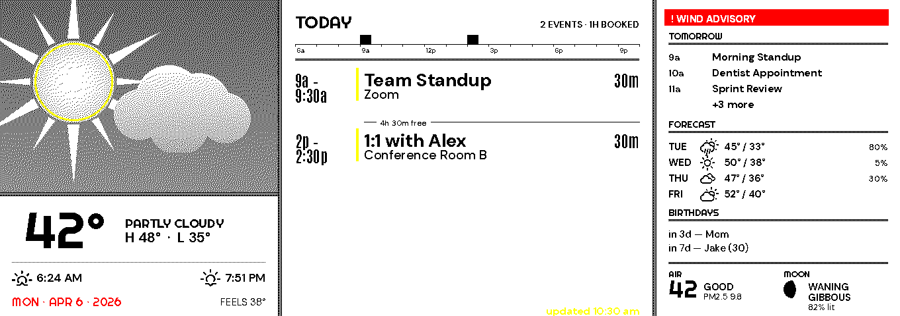
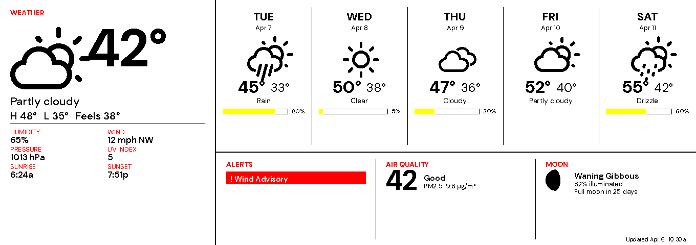
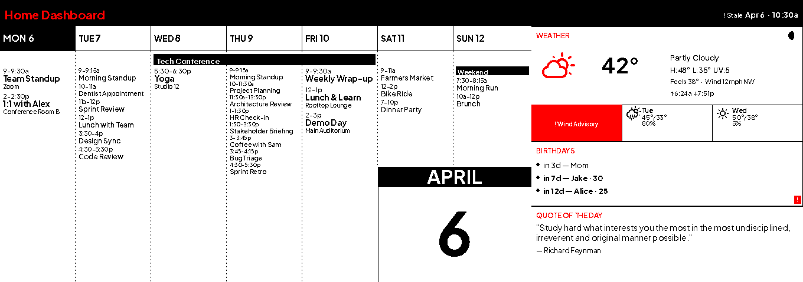

# Panoramic Themes

Five themes are drawn for a panel shaped like a strip rather than a page: the
Waveshare 10.85" e-Paper (G), 1360 × 480 pixels, nearly three times as wide as it
is tall, with four inks (black, white, yellow and red). This page covers what is
specific to that panel and to the five themes built for it: how to set it up, how
to choose between them, how often each one repaints, and what they look like in
the panel's own four inks.

The full description of each theme, with its monochrome preview, is in the
[Themes](themes.md#panoramic-themes) catalog; its Spectra 6 colour render is in
[Inky Previews](inky-previews.md#panoramic-themes). The previews on this page are
the four-ink renders the 10.85" panel actually shows.

- [At a glance](#at-a-glance)
- [Setting up the panel](#setting-up-the-panel)
- [Choosing a theme](#choosing-a-theme)
- [The themes](#the-themes)
- [Repaints and the refresh flash](#repaints-and-the-refresh-flash)
- [On other panels](#on-other-panels)
- [Data each theme needs](#data-each-theme-needs)
- [Regenerating these previews](#regenerating-these-previews)

## At a glance

| Theme | Shows | Time span | Moves on the clock | Extra calendar days |
|---|---|---|---|---|
| [`wide_horizon`](#wide_horizon) | Sky, weather, temperature, rain and events on one time axis | Next 72 hours | At most 8 times a day (each new 3-hour forecast slot) | 3 |
| [`wide_day`](#wide_day) | Today as an hour-by-hour timeline, with an up-next rail | Today | Every tick (NOW marker, event states) | 1 |
| [`halftone_agenda_wide`](#halftone_agenda_wide) | Weather engraving, today's agenda, and a rail for tomorrow, forecast, birthdays, air and moon | Today and tomorrow | Once a day (the after-dark rollover) | 2 |
| [`wide_forecast`](#wide_forecast) | Current conditions and a five-day forecast | Five days | Never | 0 |
| [`wide_week`](#wide_week) | The standard dashboard (header, week grid, weather, birthdays, quote) reflowed for the strip | This week | Never | 0 |

**Moves on the clock** counts the repaints the clock alone causes. Every theme
also repaints when its data changes, such as a new weather reading or a calendar
edit. "Never" means an idle tick with no new data renders the same image and costs
no panel write. **Extra calendar days** is how far past the standard Monday-to-Sunday
week the theme fetches events, so that on a Sunday it still has Monday onward.

## Setting up the panel

```yaml
display:
  provider: waveshare
  model: epd10in85g        # 1360 × 480, four inks
  scaling: auto            # the default; see below
  # min_refresh_interval_seconds: 900   # optional; see "Repaints" below

theme: wide_horizon        # or any theme from the table above

weather:
  latitude: 40.7128        # wide_horizon places the sun from these;
  longitude: -74.0060      # without them it falls back to sunrise/sunset times
```

The driver module is `waveshare_epd.epd10in85g`, installed with the rest of the
Waveshare library by `make install-display-drivers`. The panel has no partial
refresh, so `display.enable_partial_refresh` is ignored for it.

With `scaling: auto` (the default), the panoramic themes draw at the panel's
native size, and any other theme reaches it fitted: scaled to the panel's height
and centred, with the side margins padded in the theme's background. See
[`display.scaling`](configuration.md#scaling).

`theme: random_daily` and `random_hourly` pick only from these five on a panoramic
panel, because a landscape theme would be fitted with wide empty margins. The
[`random_theme.include` / `exclude`](themes.md#random-rotation) lists narrow the
pool further.

## Choosing a theme

- **You want to see how the next few days fit together** (weather against plans,
  what happens after dark): `wide_horizon`. It is the only theme that puts more
  than one day on a single time axis, which only a strip this wide can do at a
  readable scale.
- **Your days are meeting-heavy and today is what matters**: `wide_day`. It shows
  the day's shape at a glance and marks the event in progress. That marker is why
  it repaints on every tick.
- **You want the art theme**: `halftone_agenda_wide`, the split-plate agenda with
  a weather engraving. It repaints least of the calendar themes.
- **Weather first, calendar elsewhere**: `wide_forecast`.
- **You are moving from an 800 × 480 panel and want the familiar dashboard**:
  `wide_week`.

## The themes

### wide_horizon

The next three days on one time axis. The sky's colour at every column follows
the sun's real altitude: paper by day, then yellow, red and black through each
twilight, with stars and a phase-correct moon at night. Clouds, rain, snow,
lightning and fog are drawn over each three-hour forecast slot. The temperature
runs across the sky as one line, with each day's high and low marked. Each slot's
chance of rain hangs beneath the sky, and the calendar's events sit below on the
same hours. A hero block at the left carries the conditions now and an outlook for
the window: warmest, coldest and first rain.

On this panel the twilights are patterns mixing two inks at a time: white with
yellow, yellow with red, red with black. The panel shows pale yellow, orange and
maroon that it has no ink for. Every pixel is drawn as one of the four inks, so
the image reaches the panel exactly as rendered.
[Full description ↗](themes.md#wide_horizon)

[](../assets/previews/theme_wide_horizon_g.png)

### wide_day

Today as a timeline. An hour axis runs across the middle of the plate, with every
timed event drawn as a bar over its real span and packed into lanes with its name
attached. The weekday, date and weather now sit at the left end; an up-next rail
and the week's birthdays sit at the right. Red marks the current time, the event
in progress and the section labels. [Full description ↗](themes.md#wide_day)

[](../assets/previews/theme_wide_day_g.png)

### halftone_agenda_wide

The split-plate agenda drawn for the strip, in three panes. The weather engraving
and its reading are on the left. The day's agenda is in the middle, with a
schedule strip, durations and free-time markers. The right-hand rail holds alerts,
tomorrow's first events, the forecast, birthdays, air quality and the moon. Yellow
rings the sun and marks timed events; red marks all-day events, the date line and
alerts. The engraving is re-dithered in the panel's inks so it keeps its tone
rather than flattening to one colour. [Full description ↗](themes.md#halftone_agenda_wide)

[](../assets/previews/theme_halftone_agenda_wide_g.png)

### wide_forecast

A weather strip. The current conditions sit in a hero block with a detail grid,
next to five forecast cards and a band for alerts, air quality and the moon. Red
marks the section labels, today's chip and alerts; yellow fills the precipitation
bars. [Full description ↗](themes.md#wide_forecast)

[](../assets/previews/theme_wide_forecast_g.png)

### wide_week

The standard dashboard reflowed for the strip. It has seven week columns of 128 px
and a full-height rail of weather, birthdays and the daily quote beside the grid.
No new component: every region is one of the standard five at a new size.
[Full description ↗](themes.md#wide_week)

[](../assets/previews/theme_wide_week_g.png)

## Repaints and the refresh flash

A full refresh on the 10.85" panel takes about twenty seconds and flashes the
whole panel through its inks. There is no partial refresh to soften that, so how
often a theme changes matters more here than on any other supported panel.

The dashboard writes to the panel only when the rendered image differs from the
last one written. For the colour panels it also waits at least
`display.min_refresh_interval_seconds` between writes; the default is 60 seconds,
and a change arriving sooner is deferred, not dropped. In practice:

- `wide_forecast` and `wide_week` change only when their data does.
- `halftone_agenda_wide` adds one clock-driven change a day, when the agenda
  rolls over to tomorrow after dark.
- `wide_horizon` adds at most eight, when a new three-hour forecast slot begins.
  Its hero shows the current temperature, so a weather fetch that changes the
  reading also repaints it; that happens every 30 minutes by default
  (`cache.weather_fetch_interval`).
- `wide_day` changes on every tick, because its NOW marker and event states follow
  the clock.

If the flash is intrusive, raise `display.min_refresh_interval_seconds`. `900`
limits writes to one every quarter hour; `3600`, one an hour. Each write still
shows the latest render.

## On other panels

The panoramic themes can be selected on any panel. On an 800 × 480 panel they are
fitted as a band roughly 800 × 282 across the middle, with the rest padded. Small
type becomes hard to read at that size, and on a monochrome panel `wide_horizon`
screens it along with the sky. The random rotation never picks them on a panel of
that shape.

## Data each theme needs

- **`wide_horizon`** draws its temperature line, clouds and rain bars from the
  forecast's three-hour slots, which the weather fetcher keeps as
  `WeatherData.hourly`. A weather cache written before that data was kept shows
  the sky and events without the temperature line until the next weather fetch.
  With `weather.latitude` / `longitude` set, the sky follows the sun's real
  altitude for your location; without them, the day's reported sunrise and sunset
  stand in for every day in the window.
- **`wide_day`, `halftone_agenda_wide` and `wide_horizon`** fetch 1, 2 and 3 days
  of calendar events past the standard week, so their views of tomorrow and
  beyond are never empty on a Sunday. Nothing needs configuring; the event window
  widens automatically for the theme in use.
- **`wide_forecast` and `halftone_agenda_wide`** show air quality when a
  PurpleAir sensor is configured (`purpleair.api_key` and `purpleair.sensor_id`;
  see the [config reference](configuration.md#full-config-reference)). Without
  one, that cell reads "No sensor".

## Regenerating these previews

The four-ink previews on this page are rendered against dummy data with the same
pinned date as the other preview sets:

```bash
python3 scripts/build_previews.py --model epd10in85g \
  --theme wide_horizon --theme wide_day --theme halftone_agenda_wide \
  --theme wide_forecast --theme wide_week
```

This writes `assets/previews/theme_<name>_g.png`. See [Previews](previews.md) for
the monochrome and Inky sets.
