# Retired theme documentation

The entries below were cut from the live docs when these themes were retired.
Image links point at the previews preserved in `retired/assets/previews/`.

## From `docs/themes.md`

| `agenda` | high-visibility, legible from afar | Bold DM Sans, dominant 7-day grid, slim weather + birthdays strip; red Inky accent |
| `minimalist` | clean editorial layout | Border-light, dense, hides birthdays |
| `today` | single-day focus | Large date panel and spacious agenda |
| `timeline` | busy-day planning | Single-day hourly timeline |
| `year_pulse` | longer-horizon planning | Year progress plus upcoming events and birthdays |
| `sunrise` | daylight-oriented planning | Sun arc, day/night split, compact footer metrics |
| `scorecard` | big-number metrics | KPI tiles for weather, AQI, calendar, and system data |
| `tides` | maximum information density | Alternating horizontal bands spanning many data sources |
| `naturalist` | Victorian botanical plate | Astloch blackletter masthead with Roman-numeral plate / year / month; Cinzel small-caps Latin specimen name that shifts with season + weather; procedurally-drawn specimen branch with mixed filled/outlined leaves whose count and treatment vary by season (bare in winter, buds in spring, lush canopy in summer, fallen leaves in autumn) plus weather overlays (rain, snow, frost, fog). Four leader-line callouts pin event / moon / sun / weather data to anatomical features. Floyd-Steinberg quantization. |
#### agenda

High-visibility week view designed to be read from across a room. Dominant 7-day grid in heavy DM Sans Bold with a slim weather + birthdays strip at the bottom (no quote panel); red today/accent on Inky.

[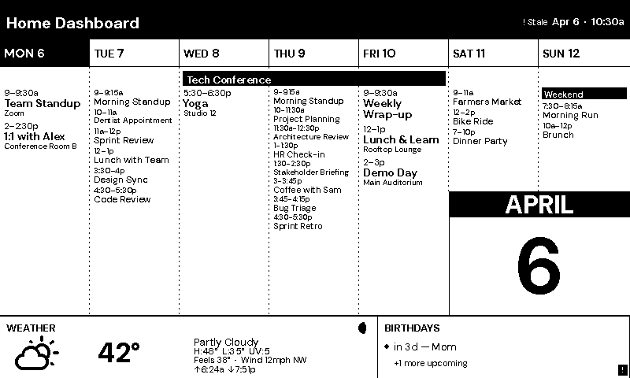](../assets/previews/theme_agenda.png)

#### minimalist

Border-light editorial layout focused on the calendar and weather, with birthdays hidden.

[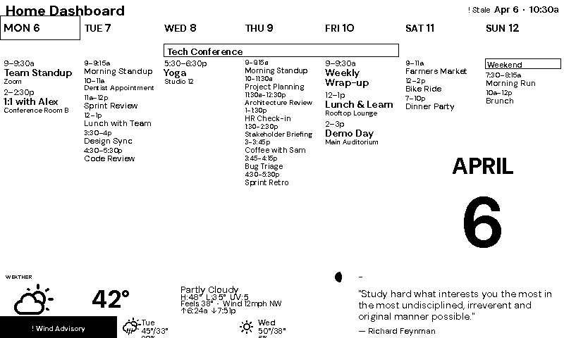](../assets/previews/theme_minimalist.png)

#### today

Single-day agenda with a large date panel and roomy event list.

[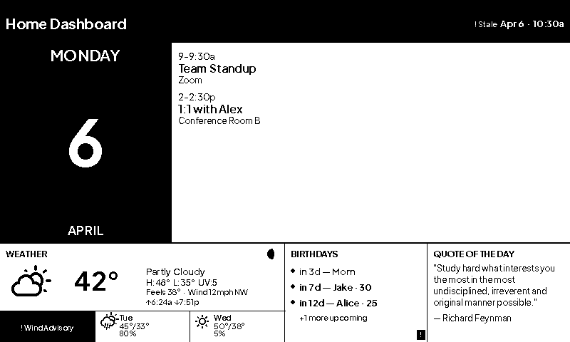](../assets/previews/theme_today.png)

#### timeline

Single-day hourly timeline that makes free blocks and overlaps easy to spot.

[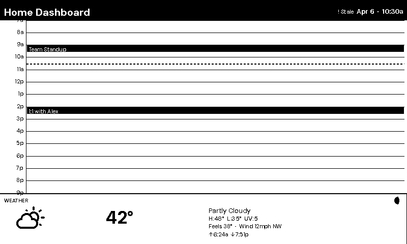](../assets/previews/theme_timeline.png)

#### year_pulse

Year progress plus a compact upcoming-items list for longer-horizon planning.

[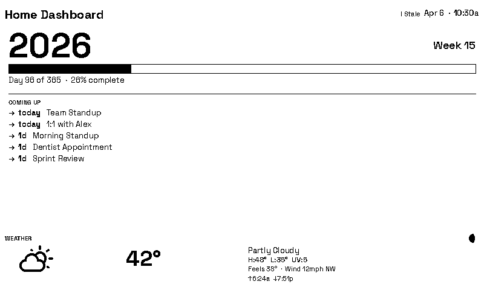](../assets/previews/theme_year_pulse.png)

#### sunrise

Sun arc and day/night split layout organized around daylight.

[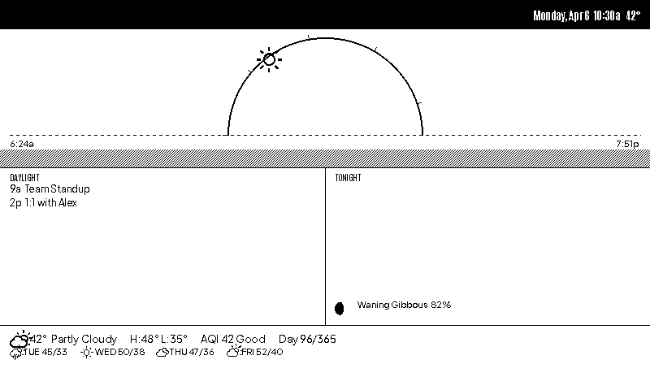](../assets/previews/theme_sunrise.png)

#### scorecard

Big-number tile dashboard for weather, AQI, calendar, and system metrics.

[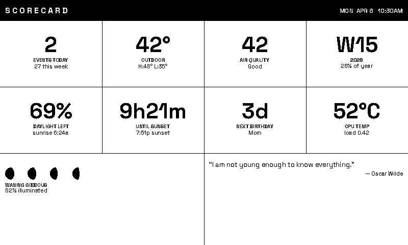](../assets/previews/theme_scorecard.png)

#### tides

Alternating horizontal bands with the densest multi-source layout in the theme set.

[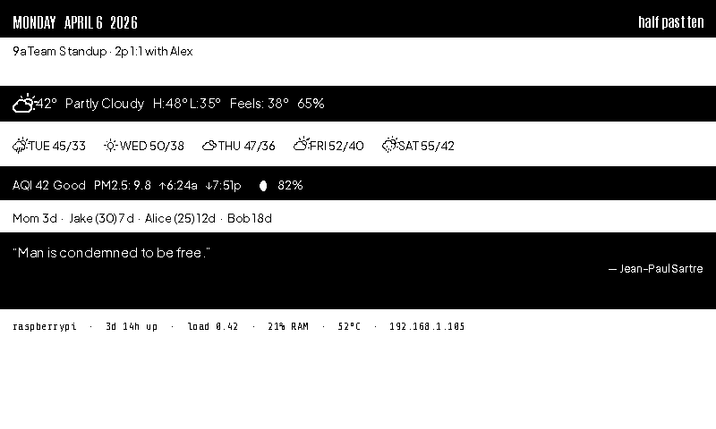](../assets/previews/theme_tides.png)

#### naturalist

Victorian botanical plate. A blackletter masthead with the plate number and date sits over a Latin specimen name keyed to the season, with a suffix for rain, storm, snow, fog or frost. The hero is a procedurally drawn branch whose leaves follow the season (bare in winter, buds in spring, full in summer, fallen in autumn) with weather overlays. Four leader-line callouts pin today's first event, the moon's phase, sunrise and sunset, and the current weather to the specimen. A footer carries the daily quote.

Needs weather and calendar; the same day and weather always draw the same specimen. Floyd-Steinberg dithered. On Inky the rules, callout lines and author small caps are red.

[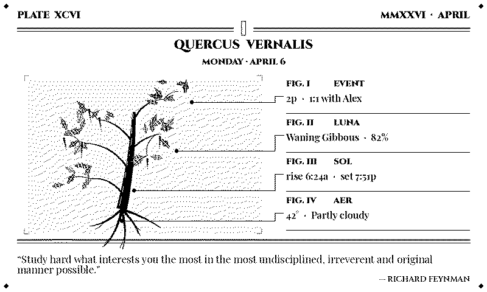](../assets/previews/theme_naturalist.png)

## From `docs/inky-previews.md`

#### agenda

Accents: **red** primary, **black** secondary · [description in Themes ↗](#agenda)

[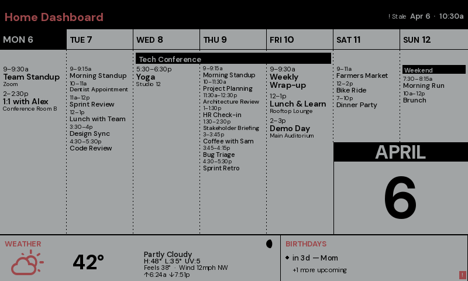](../assets/previews/theme_agenda_inky.png)

#### minimalist

Accents: **blue** primary, **red** secondary · [description in Themes ↗](#minimalist)

[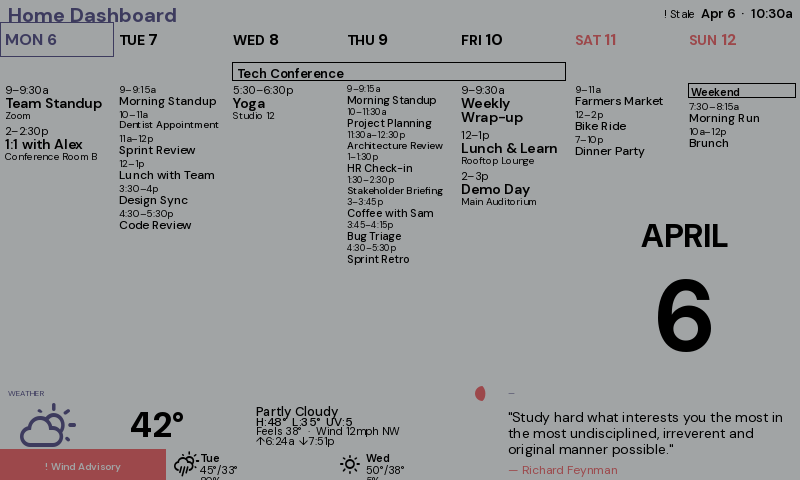](../assets/previews/theme_minimalist_inky.png)

#### today

Accents: **blue** primary, **red** secondary · [description in Themes ↗](#today)

[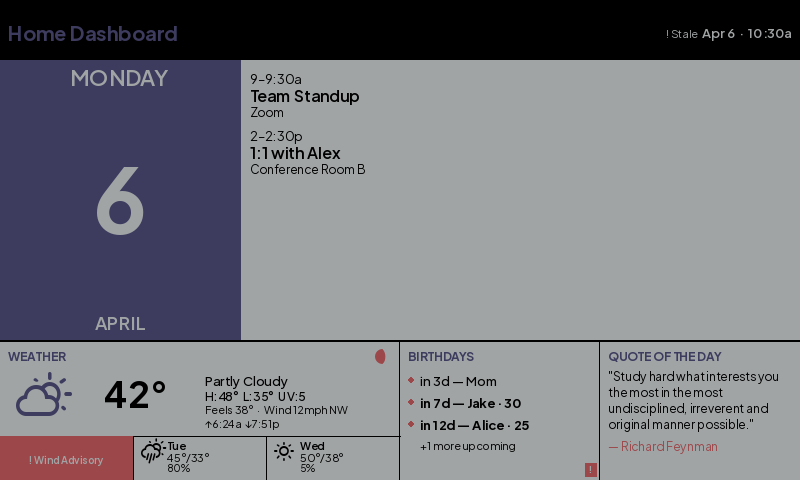](../assets/previews/theme_today_inky.png)

#### timeline

Accents: **blue** primary, **red** secondary · [description in Themes ↗](#timeline)

[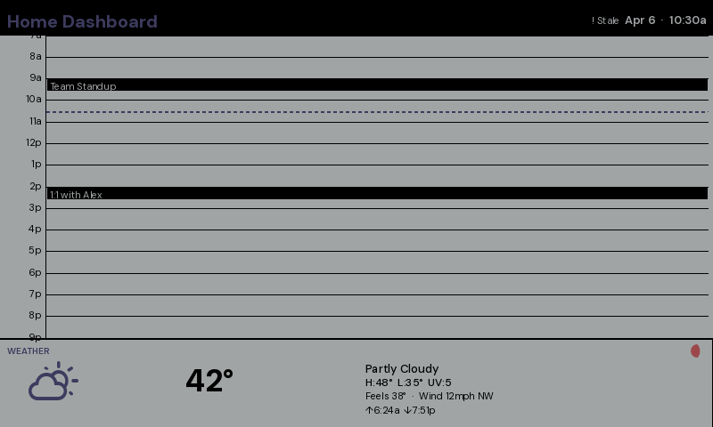](../assets/previews/theme_timeline_inky.png)

#### year_pulse

Accents: **green** primary, **blue** secondary · [description in Themes ↗](#year_pulse)

[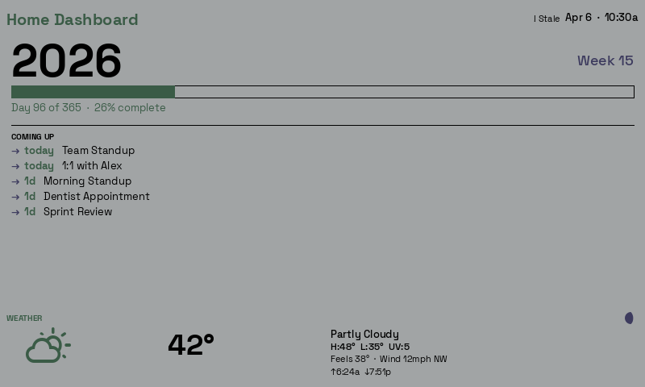](../assets/previews/theme_year_pulse_inky.png)

#### sunrise

Accents: **yellow** primary, **red** secondary · [description in Themes ↗](#sunrise)

[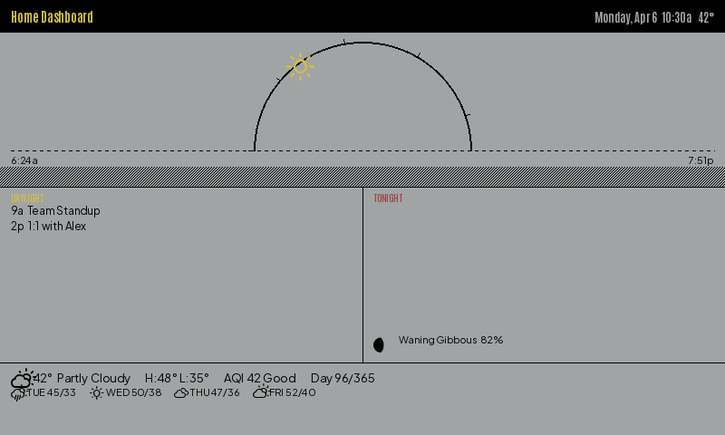](../assets/previews/theme_sunrise_inky.png)

#### scorecard

Accents: **red** primary, **blue** secondary · [description in Themes ↗](#scorecard)

[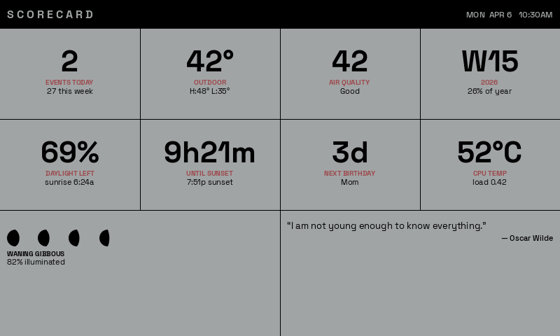](../assets/previews/theme_scorecard_inky.png)

#### tides

Accents: **blue** primary, **yellow** secondary · [description in Themes ↗](#tides)

[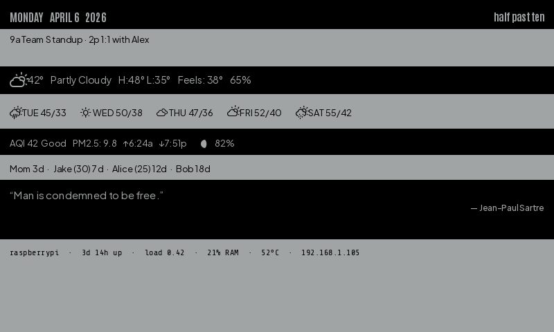](../assets/previews/theme_tides_inky.png)

#### naturalist

Accents: **red** primary, **black** secondary · [description in Themes ↗](#naturalist)

[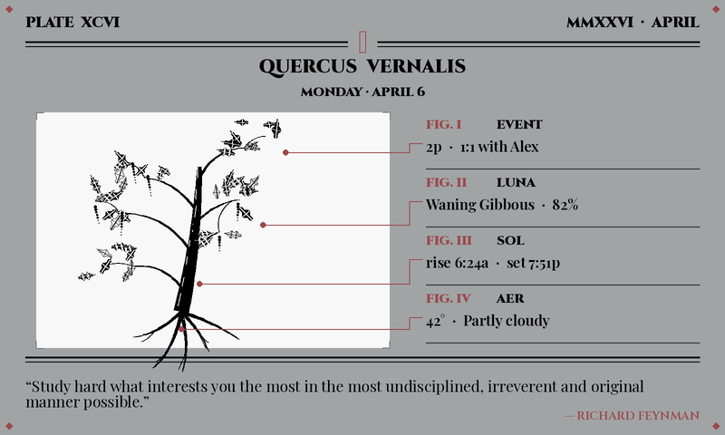](../assets/previews/theme_naturalist_inky.png)

